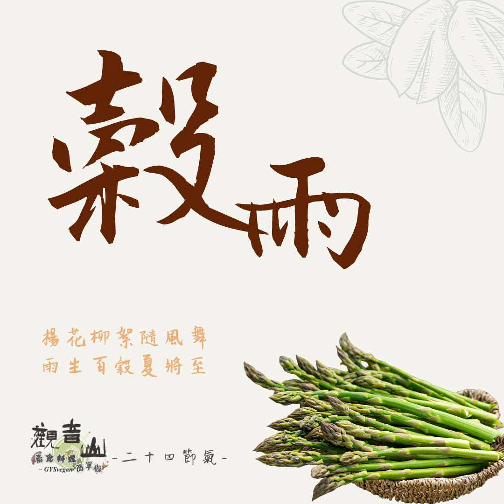

# 觀音山 二十四節氣 ​ 穀雨

## 📋 基本資訊 / Recipe Overview
- **料理名稱**：觀音山 二十四節氣 ​ 穀雨
- **原始標題**：觀音山 二十四節氣 ​ 穀雨
- **素食流派 / Diet**：全素 Vegan
- **來源平台 / Source**：[觀音山 · 素食料理簡單做](https://vegan.gys.org.tw/gu-yu20210412/)

## 📖 食譜圖文詳情 (中英雙語對照)

｜楊花柳絮隨風舞，雨生百穀夏將至
穀雨，二十四節氣中的第六個節氣，也是春季的最後一個節氣。​
今年的穀雨是4月20日，此時天氣溫和，雨水明顯增多，有利於穀類農作物的生長。​
​
春天是四季之首，春耕、夏耘、秋收、冬藏，各有各的意涵。​
在暮春穀雨時節，是審視一年之計的契機，立下善良的志向，斷惡修善，一步步朝目標前進，才能寫出精采動人篇章，活出意義無悔人生。​
​
｜跟著節氣養生​
榖雨，處於春夏之際，環境中的濕氣偏重，人體也較容易受到濕邪影響，而排濕最主要的器官就是脾，所以飲食應以「健脾化濕」為基本原則；俗話說藥補不如食補，食補不如運動補，在春暖花開的時節，保持心情舒暢，強化活動的好時機，能使氣血運行流暢，人也會跟著容光煥發✨。​
​
｜跟著節氣這樣吃​
飲食方面，保持清淡、多吃蔬果，可多吃山藥、薏仁、紅豆、小麥、蓮藕、冬瓜、扁豆、白蘿蔔、番茄等，忌吃生冷油膩食物。​
​
中醫的理論中，春天是養肝的最佳季節，可以多吃菠菜、花椰菜?、芹菜、空心菜、蘆筍等綠色蔬菜，適時地減少酸味、寒性食物的攝取，如冬瓜、鳳梨、檸檬、綠豆等。​
​
觀音山素食料理簡單做​
推薦當季 穀雨節氣料理食譜 ​
⭐️田園時蔬卷 ➡️
https://reurl.cc/zbL29a​
⭐️番茄沙拉盅 ➡️
https://reurl.cc/Gdvz3G
​
​
⭐️慈悲的 龍德上師成立「觀音山蔬食館」提倡健康素食、慈悲護生，以”觀音山素食料理簡單做”的理念，提供多款素食食譜，讓您一學就會！?
​
?觀音山 素食料理簡單做?
Facebook ｜好文按讚 ➤
http://www.facebook.com/GYSVegan​
Instagram ｜料理追蹤 ➤
http://www.instagram.com/gysvegan/​
Youtube ​ ​ ​ ｜加入訂閱 ➤
https://reurl.cc/q8VEqy
​
Telegram ​ ｜頻道推薦 ➤
https://t.me/GYSVegan​
​
​
—​
? 歡迎轉載，請註明出處：觀音山 素食料理簡單做 GYSVegan 素食環保愛地球，健康營養無負擔，慈悲護生一起來~?

---
*食譜歸檔時間：2026-08-20 · 來源：觀音山素食料理簡單做 (vegan.gys.org.tw)*