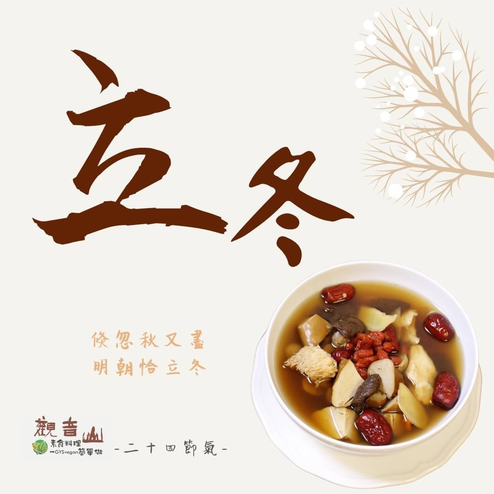

# 觀音山 二十四節氣 ​ 立冬​

## 📋 基本資訊 / Recipe Overview
- **料理名稱**：觀音山 二十四節氣 ​ 立冬​
- **原始標題**：觀音山 二十四節氣 ​ 立冬​
- **素食流派 / Diet**：全素 Vegan
- **來源平台 / Source**：[觀音山 · 素食料理簡單做](https://vegan.gys.org.tw/beginning-of-winter2021-11-1/)

## 📖 食譜圖文詳情 (中英雙語對照)

｜倏忽秋又盡，明朝恰立冬​
今年11月7日是立冬，是冬季的第一個節氣；「冬」，終也，萬物收藏也，表萬物蟄伏避寒，秋收的作物也收曬完畢，收藏入庫，人們經過一年的勞作，需要養精蓄銳，所以立冬是最佳的進補時節；冬季是人體免疫力較低的時期，應避免大魚?大肉給身體帶來的負擔，「素食」才是冬令進補最佳的養生選擇。​
​
｜跟著節氣養生​
冬天的來臨，身體新陳代謝降低，中醫：「春養生、夏養長、秋養生、冬養藏」，正常的作息、充足的睡眠可以養藏，讓自己微微出汗的運動，可以促進全身血液循環♻️；冬季養生應著重在驅寒、保暖，飲食方面以養腎、補氣血的食物為首選，讓身體暖暖的過冬。​
​
｜跟著節氣這樣吃​
中醫的觀點認為，冬主腎，腎是陽氣的根源，所以立冬進補調養身體，可增強抵抗力；此時節可以多食用健脾補腎的山藥、溢氣補腎的紫米、栗子、黑芝麻、黑豆、蘿蔔、油菜、芥菜、胡蘿蔔等，藉由溫補調整體質讓身體保持活力。​
​
​
觀音山素食料理簡單做​
推薦當季立冬 節氣料理 食譜 ​
​
⭐ 栗子菜脯素G湯 ➡
https://reurl.cc/6DGLrd​
⭐ 百匯煲湯 ➡
https://reurl.cc/95W1MO​
⭐ 素荷葉蒸飯 ➡
https://reurl.cc/0xm6Ll​
​
​
✨慈悲的龍德上師 成立「觀音山蔬食館」提倡健康素食、慈悲護生，以”觀音山素食料理簡單做”的理念，提供多款素食食譜，讓您一學就會！?​
​
​
★10月7日~12月4日 ​ 佛陀天降月：善惡業增長10億倍​
​
✨殊勝功德增長日✨​
觀音山邀請您於10月7日~12月4日，響應素食、廣修供養、戒殺護生、誦經修法、行持諸種善行，獲福無量。​
​
​
? 觀音山 素食料理簡單做 Follow us ? ​
◎Facebook ｜好文按讚​
http://www.facebook.com/GYSVegan​
​
◎lnstagram ｜料理追蹤​
http://www.instagram.com/gysvegan/​
​
◎Youtube ｜加入訂閱​
https://reurl.cc/q8VEqy​
​
◎Telegram ｜頻道推薦​
https://t.me/GYSVegan​
​
​
—​
? 歡迎轉載，請註明出處：觀音山素食料理簡單做 GYSVegan 素食環保愛地球，健康營養無負擔，慈悲護生一起來~?

---
*食譜歸檔時間：2026-08-20 · 來源：觀音山素食料理簡單做 (vegan.gys.org.tw)*