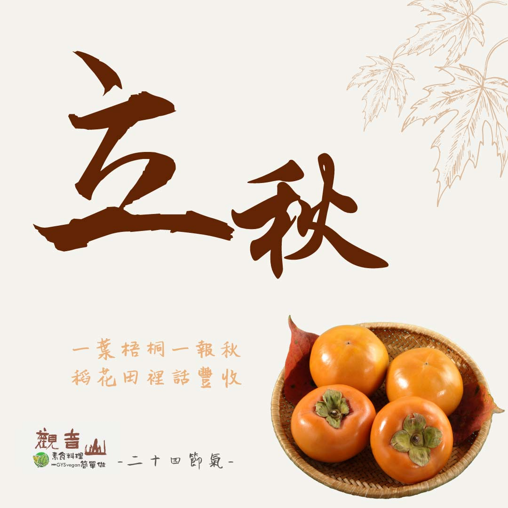

# 觀音山 二十四節氣 ​ 立秋

## 📋 基本資訊 / Recipe Overview
- **料理名稱**：觀音山 二十四節氣 ​ 立秋
- **原始標題**：觀音山 二十四節氣 ​ 立秋
- **素食流派 / Diet**：全素 Vegan
- **來源平台 / Source**：[觀音山 · 素食料理簡單做](https://vegan.gys.org.tw/beginning-of-autumn-20210801/)

## 📖 食譜圖文詳情 (中英雙語對照)

｜一葉梧桐一報秋，稻花田裡話豐收 ​
二十四節氣中的「立秋」是第十三個節氣，在今年的8月7日，是炎熱夏天邁入涼秋的預告，此時的作物已經漸漸成熟，準備迎接秋收的到來；俗諺「一場秋雨一場寒，十場秋雨要穿棉」，意指立秋之後每下一次雨，溫度就降一些⬇，直到冬天穿上棉襖。​
​
此節氣裡適逢父親節，趁著一年一度的節日，好好表達對父親的關懷與敬愛；此時節還有一個漢人社會非常重要的祭典「中元普度」盂蘭盆節，準備豐盛的素食供品，藉由佛法的加持，來利益、緬懷過世的親人，才是真正豐收的秋天。​
​
｜跟著節氣養生​
「立秋」是由熱轉涼的交替節氣，為各種疾病的好發時節，需多注意補充水分以及早晚衣物的保暖，飲食方面應以「滋陰潤肺」為原則，應多吃粥、山藥、蓮子、木耳、核桃、芝麻等對肺部有幫助的食材。​
​
｜跟著節氣這樣吃​
秋季空氣乾燥，中醫以「燥則潤之」的原則來食補，蔬菜方面可以多吃南瓜、黃瓜?、茄子?、秋葵、蘿蔔、蓮藕；水果類則可以選擇葡萄?、梨子?、香蕉?、柿子、柚子，如此可以緩解秋燥帶來的身體不適，而辛辣與油膩的食物則應盡量避免。​
​
​
觀音山素食料理簡單做​
推薦當季  立秋 節氣料理 食譜 ​
​
​
⭐ 五味手撕茄子 ➡
https://reurl.cc/ZGgX8g​
⭐ 私房醃漬黃瓜條 ➡
https://reurl.cc/kZbDLr​
⭐ 金瓜米粉 ➡ ​
https://reurl.cc/yE0kol​
​
​
✨慈悲的 龍德上師成立「觀音山蔬食館」提倡健康素食、慈悲護生，以”觀音山素食料理簡單做”的理念，提供多款素食食譜，讓您一學就會！?​
​
​
★8月3日 「明淨月．空行母薈供節日」：善惡業增長1000萬x10萬倍​
​
✨殊勝功德增長日✨​
觀音山邀請您於8月3日 響應素食、廣修供養、戒殺護生、誦經修法、行持諸種善行，獲福無量。​
​
​
​
? 觀音山 素食料理簡單做 ​ Follow us ?​
​
Facebook ｜好文按讚 ➤
http://www.facebook.com/GYSVegan​
Instagram ｜料理追蹤 ➤
http://www.instagram.com/gysvegan/​
Youtube ​ ​ ​ ｜加入訂閱 ➤
https://reurl.cc/q8VEqy​
官方Blog ​ ｜網站推薦 ➤
https://vegan.gys.org.tw/​
​
​
—​
? 歡迎轉載，請註明出處： # 觀音山素食料理簡單做 GYSVegan 素食環保愛地球，健康營養無負擔，慈悲護生一起來~?

---
*食譜歸檔時間：2026-08-20 · 來源：觀音山素食料理簡單做 (vegan.gys.org.tw)*