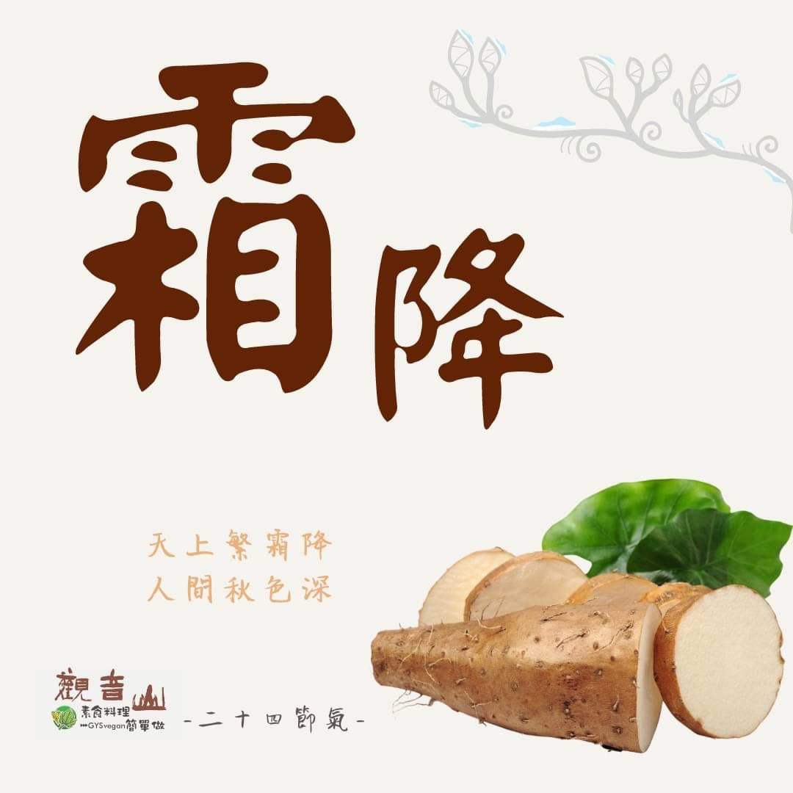

# 觀音山 二十四節氣 ​ 霜降

## 📋 基本資訊 / Recipe Overview
- **料理名稱**：觀音山 二十四節氣 ​ 霜降
- **原始標題**：觀音山 二十四節氣 ​ 霜降
- **素食流派 / Diet**：全素 Vegan
- **來源平台 / Source**：[觀音山 · 素食料理簡單做](https://vegan.gys.org.tw/frost20211018/)

## 📖 食譜圖文詳情 (中英雙語對照)

​｜天上繁霜降，人間秋色深​
霜降，是秋天最後一個節氣，亦即天氣將進入冬季❄️，晚秋時節草枯葉落，人容易因為季節的變化而感到憂傷，應多關心家中長輩的煩憂；俗話說一年補透透，不如補霜降，趁霜降時節，為家人身心健康而進補。​
​
英國醫學家曾進行一項實驗，研究結果顯示：​
人在憂鬱狀態下，呵氣到試管中，凝成灰白色沉澱物，能使小白鼠生病；如何使人走出憂鬱的狀態透過佛法的鍛鍊是最立竿見影的，因為佛法就是引導心的最佳法門。​
​
｜跟著節氣養生​
霜降時節是呼吸道疾病的好發期，此節氣首重在保暖，預防天氣變化而受涼，其次應防秋燥。《飲食正要》中說：秋氣燥，宜食麻以潤其燥。秋天空氣乾燥，身體容易上火?，故辛辣、烤炸與油膩的食物應該避免。​
​
｜跟著節氣這樣吃​
飲食調理方面，防秋燥的柔潤食材有芝麻、銀耳、百合、黃豆、山藥、當季蔬菜等；滋陰潤肺的水果有柿子、香蕉?、蘋果?、梨?、葡萄?、柑橘?；在預防感冒、咳嗽等呼吸道疾病，可以多吃生薑、紫蘇葉，來幫助祛寒，以食補調養身體，迎接冬季的到來。​
​
​
觀音山素食料理簡單做​
推薦當季霜降 節氣料理 食譜 ​
​
⭐ 紅棗銀耳八寶粥 ➡
https://reurl.cc/EZjjkR​
⭐ 溫梨豆奶 ➡
https://reurl.cc/MkOOnL​
⭐ 香蕉巧果厚片吐司 ➡
https://reurl.cc/L7WWv4​
​
​
✨慈悲的 龍德上師成立「觀音山蔬食館」提倡健康素食、慈悲護生，以”觀音山素食料理簡單做”的理念，提供多款素食食譜，讓您一學就會！?​
​
​
★10月19日 佛陀天降月．賢劫千佛節日：善惡業增長10億倍x10萬倍​
​
✨殊勝功德增長日✨​
觀音山邀請您於10月19日響應素食、廣修供養、戒殺護生、誦經修法、行持諸種善行，獲福無量。​
​
​
​
? 觀音山 素食料理簡單做 Follow us ? ​
◎Facebook ｜好文按讚
https://www.facebook.com/GYSVegan​
◎Instagram ｜料理追蹤
https://www.instagram.com/gysvegan/​
◎Youtube ​ ​ ​ ｜加入訂閱
https://reurl.cc/q8VEqy​
◎官方Blog ​ ​ ｜網站推薦
https://vegan.gys.org.tw/​
​
​
—​
?歡迎轉載，請註明出處：觀音山 素食料理簡單做 GYSVegan 素食環保愛地球，健康營養無負擔，慈悲護生一起來~?

---
*食譜歸檔時間：2026-08-20 · 來源：觀音山素食料理簡單做 (vegan.gys.org.tw)*