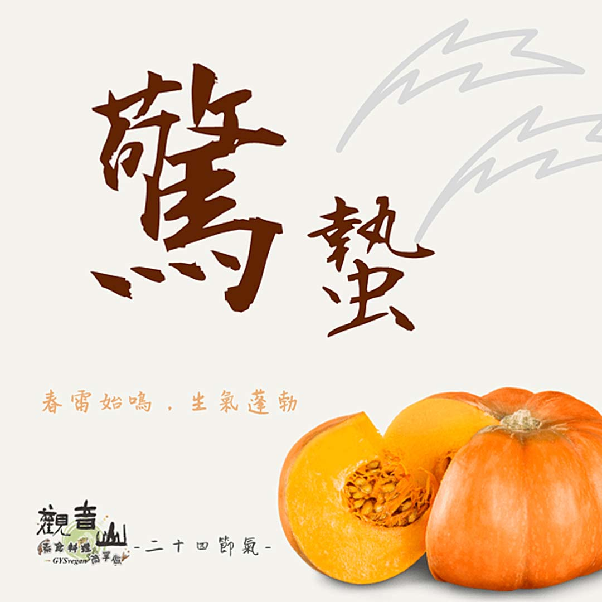

# 觀音山 二十四節氣 ​ 驚蟄 ​

## 📋 基本資訊 / Recipe Overview
- **料理名稱**：觀音山 二十四節氣 ​ 驚蟄 ​
- **原始標題**：觀音山 二十四節氣 ​ 驚蟄 ​
- **素食流派 / Diet**：全素 Vegan
- **來源平台 / Source**：[觀音山 · 素食料理簡單做](https://vegan.gys.org.tw/startle20210317/)

## 📖 食譜圖文詳情 (中英雙語對照)

｜春雷始鳴，生氣蓬勃​
驚蟄是二十四節氣裡的第三個節氣，在每年的國曆3月6日前後，此時季節春雷蠢動、雷聲隆隆，許多在冬眠蟄伏的生靈都紛紛被喚醒，因為春雷驚醒了這些蟄伏好一段時間的生靈，所以被稱為「驚蟄」，能在這樣的節氣，期許自己做很多利益他人的善事，能幫助自己思緒清晰、條理分明，有種甦醒後，氣力具足的順暢。​
​
｜跟著節氣養生​
有句話說：「春天後母臉。」，此時冷暖空氣交替、氣溫變化較大，晴雨不定，要注意預防風邪，驚蟄期間雨容易來得快，做好保暖比較不容易感冒受寒。有中醫認為春天養肝，以理氣、提神、解毒的花草茶，在春天最合適飲用，可以養肝、顧脾胃。​
​
｜跟著節氣這樣吃​
飲食方面，春天肝氣旺，飲食以清淡尤佳，綠色蔬菜很合適的春季食物，如此時出產的菠菜也非常鮮嫩美味；含多醣體的銀耳也有抗發炎的效果，可幫助肝臟蛋白質合成，其他如：南瓜、桂圓、糯米、豆腐、黑米，也都是對應時節的好食材。​
​
​
觀音山素食料理簡單做​
推薦當季 驚蟄節氣料理 ​
⭐焗烤南瓜 食譜連結
https://reurl.cc/Dv4VDE​
⭐時蔬豆腐煲 食譜連結
https://reurl.cc/rar7nr​
⭐紅棗銀耳八寶粥 食譜連結
https://reurl.cc/Gd43ly
​
​
⭐️慈悲的 龍德上師成立「觀音山蔬食館」提倡健康素食、慈悲護生，以”觀音山素食料理簡單做”的理念，提供多款素食食譜，讓您一學就會！?
​
? 觀音山 素食料理簡單做 ?
◎Facebook ｜好文按讚 ➤
http://www.facebook.com/GYSVegan​
◎Instagram ｜料理追蹤 ➤
http://www.instagram.com/gysvegan/​
◎Youtube   ｜加入訂閱 ➤
https://reurl.cc/q8VEqy​
◎Telegram ｜頻道推薦 ➤
https://t.me/GYSVegan ​
​
​
? 歡迎轉載，請註明出處： 觀音山 素食料理簡單做 GYSVegan 素食環保愛地球，健康營養無負擔，慈悲護生一起來~?

---
*食譜歸檔時間：2026-08-20 · 來源：觀音山素食料理簡單做 (vegan.gys.org.tw)*