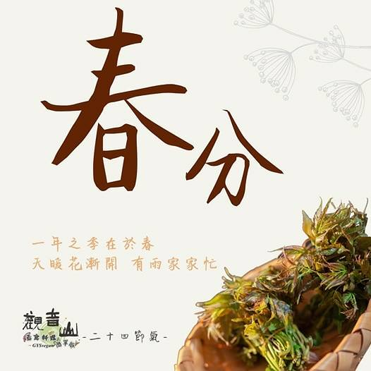

# 觀音山 二十四節氣 ​春分

## 📋 基本資訊 / Recipe Overview
- **料理名稱**：觀音山 二十四節氣 ​春分
- **原始標題**：觀音山 二十四節氣 ​春分
- **素食流派 / Diet**：全素 Vegan
- **來源平台 / Source**：[觀音山 · 素食料理簡單做](https://vegan.gys.org.tw/spring-equinox20210315/)

## 📖 食譜圖文詳情 (中英雙語對照)

｜天暖花漸開 ​ 有雨家家忙
國曆3月21日前後，是二十四節氣中的第四個節氣 春分。​
這天陽光直射赤道 ，南北半球晝夜平分，此日過完，☀️白晝時間會漸漸拉長。​
​
有句話說：「一年之季在於春」，一般務農之人會在春分有雨的時節，規劃好田地進行耕種，農民為了豐收都動起來了；我們也可以在此時立定志向，許下善願並做好規劃，積極行善利他，耕耘自心一畝良田，不停給予灌溉滋養 ，善根必能成長茁壯 。​
​
｜跟著節氣養生​
春分時晝夜等長、寒暖各半、陰陽平衡，進行飲食保健，可以防堵疾病上身。​
起居方面要適當的鍛鍊 、定量用餐、定時睡眠不熬夜，春天早晚依舊溫差大，要注意防風及保暖 ，預防感冒發生。​
​
｜跟著節氣這樣吃​
立春到清明前後是草木生長的萌芽期，也是人體血液旺盛時期 。​
此節氣的飲食調養，選擇飲食清淡、多吃當季鮮蔬， 避免吃寒涼、酸性、辛辣食物；可食用如：燕麥、核桃、蓮子、山藥、薏仁等，益於補脾的食材，也可多吃綠色養肝蔬菜，如：香椿、菠菜、花椰菜?、毛豆、高麗菜等食物。​
​​
觀音山素食料理簡單做 推薦當季 春分節氣料理 ​
​
⭐️香椿素燥 食譜連結 ➡️ https://youtu.be/jO-IdVxxIus ​
⭐️臭腐乳炒高麗 食譜連結 ➡️
https://youtu.be/AfvJnZlWoAc​
⭐️豆丁炒毛豆 食譜連結 ➡️
https://youtu.be/DJ-VuneEGVw​
​
⭐️慈悲的 龍德上師成立「觀音山蔬食館」提倡健康素食、慈悲護生，以”觀音山素食料理簡單做”的理念，提供多款素食食譜，讓您一學就會！?
​
?觀音山 素食料理簡單做?
Facebook ｜好文按讚 ➤
http://www.facebook.com/GYSVegan​
Instagram ｜料理追蹤 ➤
http://www.instagram.com/gysvegan/​
Youtube ｜加入訂閱 ➤
https://reurl.cc/q8VEqy​
Telegram ｜頻道推薦 ➤
https://t.me/GYSVegan​
​
​
?  歡迎轉載，請註明出處： 觀音山 素食料理簡單做 GYSVegan 素食環保愛地球，健康營養無負擔，慈悲護生一起來~?

---
*食譜歸檔時間：2026-08-20 · 來源：觀音山素食料理簡單做 (vegan.gys.org.tw)*