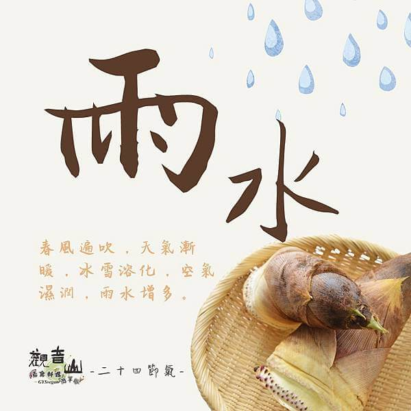

# 觀音山 二十四節氣 雨水

## 📋 基本資訊 / Recipe Overview
- **料理名稱**：觀音山 二十四節氣 雨水
- **原始標題**：觀音山 二十四節氣 雨水
- **素食流派 / Diet**：全素 Vegan
- **來源平台 / Source**：[觀音山 · 素食料理簡單做](https://vegan.gys.org.tw/rainwater20210317/)

## 📖 食譜圖文詳情 (中英雙語對照)

｜雨水澆灌，春回大地​
雨水是二十四節氣裡的第二個節氣，在每年的國曆2月18日到20日之間，代表雨水變多、氣溫回暖，農人紛紛於此時開始播種，春雨灌溉、春回大地。​
​
｜跟著節氣養生​
雨水時節，天氣多變乍暖還寒，氣溫溫差大，要適時增添衣物。 忌吃寒冷的食物、喝涼茶，辛辣、油膩食物也應避免。 ☑️可吃較溫的甜品養脾胃。​
​
｜跟著節氣這樣吃​
飲食方面，春季轉暖，可食熱粥調養脾胃，多吃新鮮蔬菜?、水果以補充水分。 料理食材可以多選當季的蘿蔔、山藥、紅棗、波菜、紅菜苔、芋頭、蓮藕、百合、甘蔗、春筍…等。​
​
​
觀音山素食料理簡單做 推薦當季 雨水節氣料理 ✨春筍✨​
​
⭐竹筍高麗菜捲 ​ 食譜連結➡️
https://reurl.cc/KxXmLp​
⭐福慧吉祥羹 食譜連結➡️
https://reurl.cc/e9We7M​
⭐吉祥福袋 食譜連結➡️
https://reurl.cc/V3RrQQ​
​
⭐️慈悲的 龍德上師成立「觀音山蔬食館」提倡健康素食、慈悲護生，以”觀音山素食料理簡單做”的理念，提供多款素食食譜，讓您一學就會！?
​
? 觀音山 素食料理簡單做 ?
◎Facebook ｜好文按讚 ➤
http://www.facebook.com/GYSVegan​
◎Instagram ｜料理追蹤 ➤
http://www.instagram.com/gysvegan/​
◎Youtube ​ ​ ｜加入訂閱 ➤
https://reurl.cc/q8VEqy​
◎Telegram ｜頻道推薦 ➤
https://t.me/GYSVegan
​
​
​
? 歡迎轉載，請註明出處： 觀音山 素食料理簡單做 GYSVegan 素食環保愛地球，健康營養無負擔，慈悲護生一起來~?

---
*食譜歸檔時間：2026-08-20 · 來源：觀音山素食料理簡單做 (vegan.gys.org.tw)*