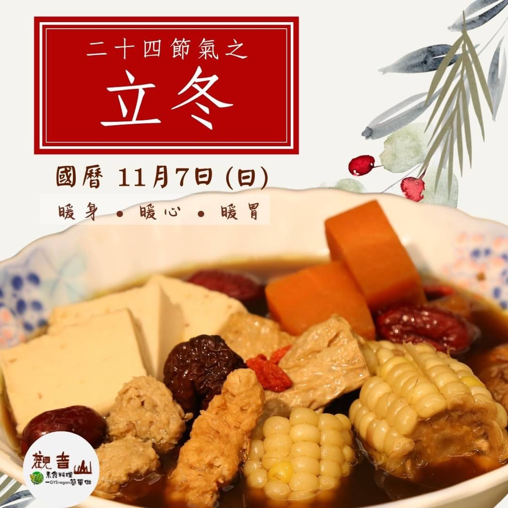

# 觀音山 立冬進補暖人心

## 📋 基本資訊 / Recipe Overview
- **料理名稱**：觀音山 立冬進補暖人心
- **原始標題**：【觀音山 立冬進補暖人心】
- **素食流派 / Diet**：全素 Vegan
- **來源平台 / Source**：[觀音山 · 素食料理簡單做](https://vegan.gys.org.tw/beginning-of-winter20211107/)

## 📖 食譜圖文詳情 (中英雙語對照)

今日(11/7)立冬代表著冬季節氣開始，氣候漸冷❄️。在中醫的養生觀點，有四季五補：春升補、夏清補、長夏淡補、秋平補、冬溫補。​
​
冬天進補可以增加血液的循環，避免天冷時手腳冰冷，身體的免疫力功能也會提高，預防疾病的發生。​
​
現代人多半外食，飲食重口味，高油、高鹽、高糖，身體負擔大。吃得好不如吃得巧。吃對食物，才會真進補！​
​
立冬補冬建議以蔬食代替肉類，才會對身體更排毒，減少負擔，讓您吃得暖身又養生。​
​
蔬食可以怎麼吃
​
工作壓力大、忙碌的上班族：多些堅果類。堅果富含omega3脂肪酸、維生素E以及礦物質鋅，讓您好紓壓。​
​
☕️準備考試、念書的學生：冷冷的冬天，泡一壺洋甘菊茶。洋甘菊富含芹菜素，而芹菜素屬於類黃酮類，有抗氧化的功效，有助於睡眠改善，放鬆紓壓。​
​
體寒的長輩、婦幼：豆類、香菇、黑木耳。此類食物富含豐富的鐵質，可以和與富含維生素C的水果一起食用，可以讓營養素充分氧化，讓身體產生熱量。​
​
想排濕溫補的朋友：多吃黑豆、四神。黑豆與四神湯中的芡實、薏仁、蓮子都能強健脾臟，幫助排濕，有助改善冬日昏沉的無力感。​
​
觀音山蔬食館 義工們今日特地用心烹調養身素食藥膳補湯、健康長壽麵供養慈悲的 龍德上師及諸佛菩薩，也與同修善信結緣，讓大家在觀音山道場度過一個美好溫暖的立冬，強健身體，補身暖心，修行更進道！​
​
觀音山中好修行 ：​
【歡迎加入觀音山會員】​
為您點亮濁世中的一盞明燈，登上前往淨土的法船，歡迎您一起加入大悲法藏極樂家族！​
​
▣ 會員專屬「入會祈福禮」
​
https://bit.ly/3CyIYAl​
​
▣ 如何加入觀音山會員?​
https://bit.ly/3BjuaUs​
​
▣ 免費註冊觀音山會員​
https://bit.ly/3bcZolN​
​
✨慈悲的 龍德上師成立「觀音山蔬食館」提倡健康素食、慈悲護生，以”觀音山素食料理簡單做”的理念，提供多款素食食譜，讓您一學就會！?​
​
​
★10月7日~12月4日 ​ 佛陀天降月：善惡業增長10億倍​
​
✨殊勝功德增長日✨​
觀音山邀請您於10月7日~12月4日，響應素食、廣修供養、戒殺護生、誦經修法、行持諸種善行，獲福無量。​
​
​
? 觀音山 素食料理簡單做 ?
◎Facebook ｜好文按讚​
http://www.facebook.com/GYSVegan​
​
◎lnstagram ｜料理追蹤​
http://www.instagram.com/gysvegan/​
​
◎Youtube ｜加入訂閱​
https://reurl.cc/q8VEqy​
​
◎Telegram ｜頻道推薦​
https://t.me/GYSVegan​
​
—​
?歡迎轉載，請註明出處： 觀音山 素食料理簡單做 GYSVegan 素食環保愛地球，健康營養無負擔，慈悲護生一起來~?

---
*食譜歸檔時間：2026-08-20 · 來源：觀音山素食料理簡單做 (vegan.gys.org.tw)*