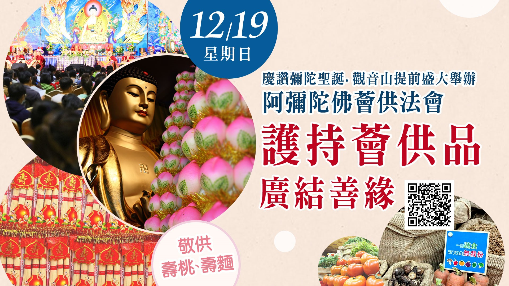

# 觀音山12月19日「阿彌陀佛薈供法會」──供壽桃、壽麵 提前慶讚彌陀聖誕

## 📋 基本資訊 / Recipe Overview
- **料理名稱**：觀音山12月19日「阿彌陀佛薈供法會」──供壽桃、壽麵 提前慶讚彌陀聖誕
- **原始標題**：觀音山12月19日「阿彌陀佛薈供法會」──供壽桃、壽麵 提前慶讚彌陀聖誕
- **素食流派 / Diet**：全素 Vegan
- **來源平台 / Source**：[觀音山 · 素食料理簡單做](https://vegan.gys.org.tw/amitabha-christmas20211219/)

## 📖 食譜圖文詳情 (中英雙語對照)

◾觀音山12月19日「阿彌陀佛薈供法會」──供壽桃、壽麵 提前慶讚彌陀聖誕 ​ ​
​
◕護持「薈供供品」➤
https://bit.ly/3cg8z5j​
(開放登記至12/19下午2:30)​
​
許多祖師大德皆云：「供佛功德無量，是累積福德最快的方法。」我們要趁活著的時候，每天都供佛，因為佛在經中說，若能至誠心供養佛法僧三寶或諸佛形像，不論佛陀有沒有在世都一樣功德很大。​
​
慈悲 龍德上師開示：「不管是佛的形像、舍利、塔廟我們都應該要供養，也要勸導眾生一起來作供養，因為供佛福德無量無邊，所以一定要親手去做，就算時間不允許，也要用其它方式盡量參與，把握這樣的修福機會。」​
​
12月20日欣逢殊勝的「阿彌陀佛聖誕吉祥日」，觀音山提前於12月19日星期日，恭請慈悲 龍德嚴淨仁波切 (龍德上師) 主法薈供法會，以虔誠心向 阿彌陀佛獻上廣大的供養。​
​
此場法會特於佛前敬供壽桃、壽麵，祈願佛力加持每一位參加之同修、法友善信，慧命綿長、如意滿願；長壽健康、福慧圓滿。​
​
可以為現世親友、公司行號、閤家、個人，或先亡祖先、冤親債主、無緣水兒、地基主等登記護持：​
​
1.薈供法會供品，共同修積供佛的功德。​
​
2.登記「除障祿位」、「超薦蓮位」，藉此殊勝因緣與阿彌陀佛締結甚深法緣，發願求生西方極樂淨土，解脫輪迴諸苦。​
►
https://bit.ly/30rD9qz​
​
3.倘若，真的是錢財不具足，經濟拮据者，可以參加全球線上直播法會，以自身參加的功德來迴向。​
​
​
▌現場法會Live直播​
◾觀音山法藏YouTube​
https://bit.ly/2BB175Z​
◾觀音山 法藏吉祥洲-好文分享Facebook​
https://bit.ly/2AutG4B​
​
只要虔心而修，都能得到阿彌陀佛靈感的加持！​
​
✨慈悲的龍德上師 成立「觀音山蔬食館」提倡健康素食、慈悲護生，以”觀音山素食料理簡單做”的理念，提供多款素食食譜，讓您一學就會！?​
​
​
? 觀音山 素食料理簡單做 ?​
◎Facebook ｜好文按讚​
http://www.facebook.com/GYSVegan​
​
◎lnstagram ｜料理追蹤​
http://www.instagram.com/gysvegan/​
​
◎Youtube ｜加入訂閱​
https://reurl.cc/q8VEqy​
​
◎Telegram ｜頻道推薦​
https://t.me/GYSVegan​
​
​
—​
? 歡迎轉載，請註明出處：觀音山素食料理簡單做 GYSVegan 素食環保愛地球，健康營養無負擔，慈悲護生一起來~?

---
*食譜歸檔時間：2026-08-20 · 來源：觀音山素食料理簡單做 (vegan.gys.org.tw)*