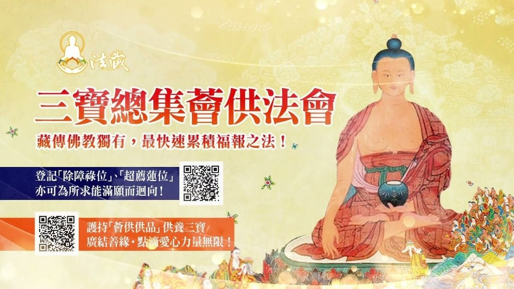

# 觀音山1月15日 三寶總集薈供法會

## 📋 基本資訊 / Recipe Overview
- **料理名稱**：觀音山1月15日 三寶總集薈供法會
- **原始標題**：觀音山1月15日【三寶總集薈供法會】
- **素食流派 / Diet**：全素 Vegan
- **來源平台 / Source**：[觀音山 · 素食料理簡單做](https://vegan.gys.org.tw/tsog-offerings-ceremony20211230/)

## 📖 食譜圖文詳情 (中英雙語對照)

✨觀音山1月15日【三寶總集薈供法會】—除障祿位、超薦蓮位、護持薈供品 開放登記中​
▍法會日期：2022年1月15日(六)​
▍法會時間：晚上7:30－9:30 (GMT+8)​
​
◕登記「除障祿位」、「超薦蓮位」：​
https://bit.ly/3FcC1pI​
◕護持「薈供供品」廣結善緣 ：​
https://bit.ly/3Fh3AhP​
(登記1月15日晚上7:00截止)​
​
薈供為快速聚福之法，古德云：「參加一次如法的薈供法會，所產生的功德相當於自己獨立修持三十年而獲得的功德與福德。」而薈供亦是具足「息災、增益、懷愛、降伏」四種事業的殊勝修法，更是金剛乘行者懺悔酬補、維繫三昧耶戒的主要法門。​
​
?藏傳佛教獨有．最快速累積福慧之法 ​
恭請慈悲 龍德上師主法 率出家法師迴向一 祈請本尊加持新冠肺炎疫情平息，世界和平、國泰民安，社會光明和諧。​
​
?薈供一功德利益 ​
一、薈供可延長壽命、祛除壽障。​
二、可消除事業或人緣等等的障礙。​
三、當有人以誅法或符咒加害時，能回遮無礙。​
四、可回遮地基主或天龍八部的加害。​
五、作薈供等同供養一切諸佛菩薩。​
​
​
可為現世親友、公司行號、閤家、個人登記「除障祿位」；為先亡祖先、冤親債主、無緣水兒、地基主等登記「超薦蓮位」。​
​
​
更多最新消息，請見「觀音山 全球資訊網」​
►
https://www.fazang.org/info/events.php​
​
▍觀音山中華大悲法藏佛教會​
►全球資訊網：
http://fazang.org/​
►吉祥洲LINE@：
https://line.me/ti/p/%40loc6698t​
​
▍觀音山素食料理簡單做​
►
https://vegan.gys.org.tw/​
​
▍龍德上師法語甘露​
►
https://video.gys.org.tw/
​
觀音山 素食料理簡單做
◎Facebook ｜好文按讚​
http://www.facebook.com/GYSVegan​
​
◎lnstagram ｜料理追蹤​
http://www.instagram.com/gysvegan/​
​
◎Youtube ｜加入訂閱​
https://reurl.cc/q8VEqy​
​
◎Telegram ｜頻道推薦​
https://t.me/GYSVegan​
​
—​
歡迎轉載，請註明出處： 觀音山 素食料理簡單做 GYSVegan 素食環保愛地球，健康營養無負擔，慈悲護生一起來~

---
*食譜歸檔時間：2026-08-20 · 來源：觀音山素食料理簡單做 (vegan.gys.org.tw)*