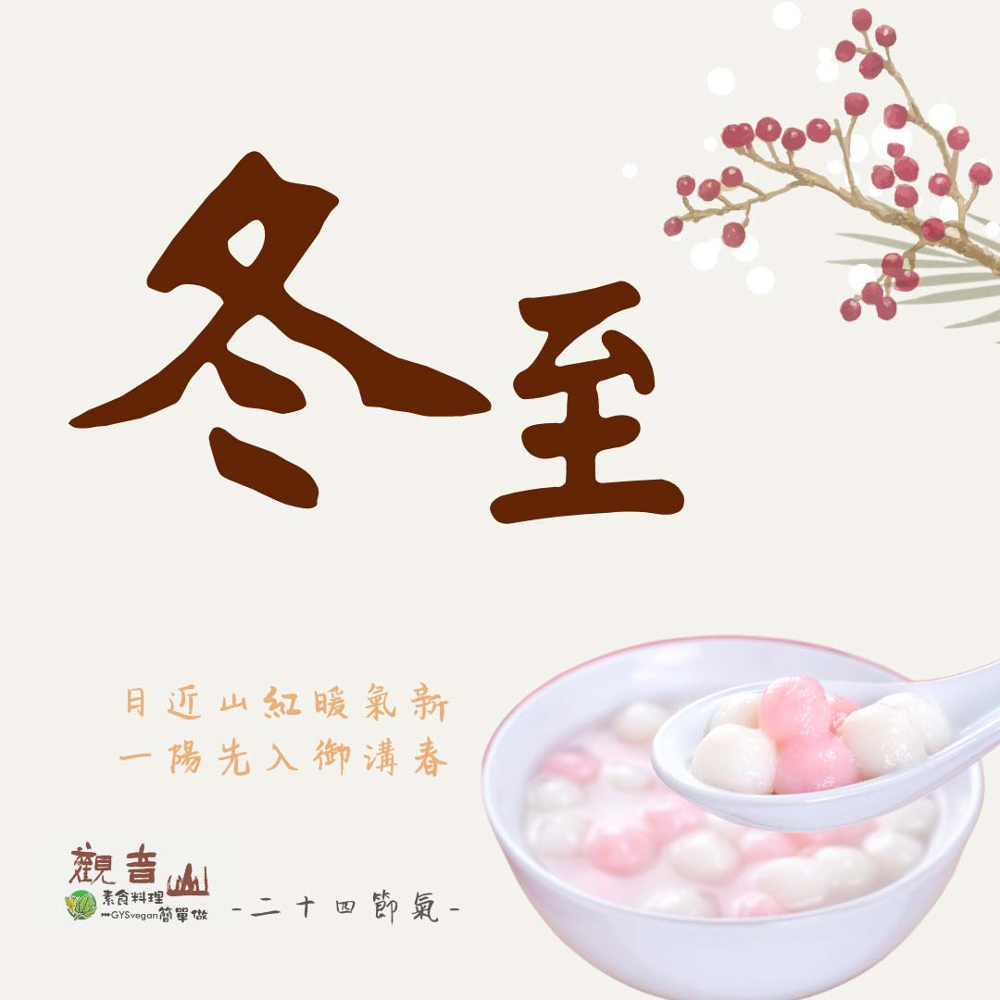

# 觀音山二十四節氣  冬至

## 📋 基本資訊 / Recipe Overview
- **料理名稱**：觀音山二十四節氣  冬至
- **原始標題**：觀音山二十四節氣  冬至
- **素食流派 / Diet**：全素 Vegan
- **來源平台 / Source**：[觀音山 · 素食料理簡單做](https://vegan.gys.org.tw/winter-solstice20211220/)

## 📖 食譜圖文詳情 (中英雙語對照)

｜日近山紅暖氣新，一陽先入御溝春​
二十四節氣中的「冬至」，是國人相當重視的一個傳統節日，冬至又稱為「冬節」❄️，早在二千五百年前就測定出冬至節氣，冬至是北半球白晝最短、黑夜最長的一天。​
​
在這一天，重視家族團圓，各地有吃湯圓、水餃、祭祖等習俗，象徵團圓、圓滿之意，冬至前欣逢阿彌陀佛聖誕，觀音山各地蔬食館也備辦了吉祥象徵的壽桃、壽麵、薈供品來供佛，並將在供佛後分享給各地民眾廣結善緣，讓冬至更顯吉祥圓滿！​
​
｜跟著節氣養生​
冬至後，陽氣緩緩回升☀️，白天逐漸變長，是夏病冬防、冬病冬治的好時機；「冬至一陽生」，也喻意為新生命的開始，滋補養身的重要時節；中醫認為「冬主腎」，所以冬至是補腎、養氣血的好時機，而脾腎喜溫惡冷，飲食以溫熱、清淡為主，避免辛辣、燒烤油炸食物，生活保持規律，適度保暖以及運動，多吃水果，讓身體保持充滿活力的狀態。​
​
｜跟著節氣這樣吃​
飲食方面可以選擇清除體內虛火、潤肺的蘿蔔、幫助消化的山藥、補腎健腦的堅果、有長壽米之稱的黑米，預防心血管疾病的黑木耳，搭配當季的蔬果茼蒿、菠菜、甜椒、胡蘿蔔、大白菜、番茄、柳橙、橘子、甜柿等，符合「秋冬養陰」健康養生的觀念，提升身體免疫力，迎接新春的到來。​
​
觀音山素食料理簡單做​
推薦當季 冬至 節氣料理 食譜 ​
​
⭐ 當歸大補湯​
➡
https://reurl.cc/NZVk0k​
​
⭐百匯煲湯​
➡
https://reurl.cc/Ok9lED​
​
⭐ 素食補肉骨茶湯​
➡
https://reurl.cc/pxOzZQ​
​
​
✨慈悲的龍德上師 成立「觀音山蔬食館」提倡健康素食、慈悲護生，以”觀音山素食料理簡單做”的理念，提供多款素食食譜，讓您一學就會！
​
觀音山 素食料理簡單做
◎Facebook ｜好文按讚
​http://www.facebook.com/GYSVegan​
​
◎lnstagram ｜料理追蹤​
http://www.instagram.com/gysvegan/​
​
◎Youtube ｜加入訂閱​
https://reurl.cc/q8VEqy​
​
◎Telegram ｜頻道推薦​
https://t.me/GYSVegan
​
​
​
—​
歡迎轉載，請註明出處：觀音山素食料理簡單做 GYSVegan 素食環保愛地球，健康營養無負擔，慈悲護生一起來~

---
*食譜歸檔時間：2026-08-20 · 來源：觀音山素食料理簡單做 (vegan.gys.org.tw)*