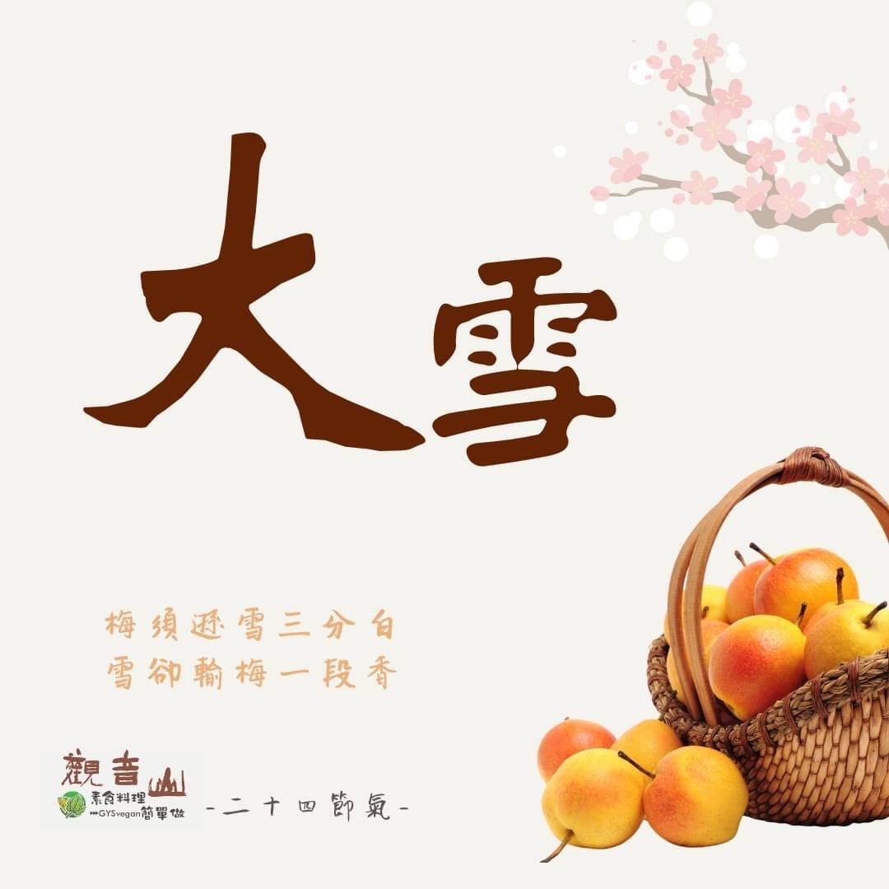

# 觀音山二十四節氣  大雪​ ​

## 📋 基本資訊 / Recipe Overview
- **料理名稱**：觀音山二十四節氣  大雪​ ​
- **原始標題**：觀音山二十四節氣  大雪​ ​
- **素食流派 / Diet**：全素 Vegan
- **來源平台 / Source**：[觀音山 · 素食料理簡單做](https://vegan.gys.org.tw/heavy-snow%e2%80%8b20211206/)

## 📖 食譜圖文詳情 (中英雙語對照)

觀音山二十四節氣-大雪​
​
｜梅須遜雪三分白，雪卻輸梅一段香​
今年二十四節氣中的「大雪」是國曆12月7日，《月令七十二候集解》：「十一月節，大者盛也，至此而雪盛矣。」天氣變得寒冷❄️，農民們正著手為菜苗、果樹做好保暖工作，此時空氣乾燥，是呼吸道疾病的好發期，應做好身體保暖以抵禦寒冬。​
​
「梅須遜雪三分白，雪卻輸梅一段香」，每個人來到世間必定有其使命，為社會、人民貢獻一己之力，才不枉費生命的意義價值，如同佛法教導我們，要去行持利益眾生的事，將眾生帶往解脫生、老、病、死的方向，才能讓生命真正的發光發熱✨。​
​
｜跟著節氣養生​
大雪節氣，溫差變化大、氣候乾燥，容易導致心血管疾病，根據統計18歲以上國人的高血壓盛行率達25.82% ，亦即平均4人就有1人罹患高血壓，所以飲食調理應以「低油、糖、鹽及高纖的植物性飲食」為主。保暖的部分，應特別著重在頭頸部、腹部、腳部三處，也要適時的補充身體的水分?，喝粥是秋冬很好的養生之道。​
​
｜跟著節氣這樣吃​
根據中醫理論，此時節調理原則為補肝益腎、清瀉內火，多選擇食用當季的蔬果得到冬補的食療功效，如大白菜、山藥、白蘿蔔、花椰菜、南瓜，葡萄柚、橘子、雪梨、木瓜等，避免油膩、辛辣的食物，亦可多選擇黑色食材，如黑豆、黑芝麻、黑木耳等，適當的溫補來調整體質提升免疫力，讓身體保持在充滿活力的狀態。​
​
​
觀音山素食料理簡單做​
推薦當季大雪 節氣料理 食譜 ​
​
⭐ 綠花椰拿鐵​
➡
https://reurl.cc/2oq8NX​
​
⭐ 雪梨銀耳露​
➡
https://reurl.cc/Rbom5x​
​
⭐ 吉祥福慧羹​
➡
https://reurl.cc/1oR0zQ​
​
​
✨慈悲的龍德上師 成立「觀音山蔬食館」提倡健康素食、慈悲護生，以”觀音山素食料理簡單做”的理念，提供多款素食食譜，讓您一學就會！?​
​
​
? 觀音山 素食料理簡單做 ?​
◎Facebook ｜好文按讚​
http://www.facebook.com/GYSVegan​
​
◎lnstagram ｜料理追蹤​
http://www.instagram.com/gysvegan/​
​
◎Youtube ｜加入訂閱​
https://reurl.cc/q8VEqy​
​
◎Telegram ｜頻道推薦​
https://t.me/GYSVegan​
​
​
—​
?歡迎轉載，請註明出處：觀音山素食料理簡單做 GYSVegan 素食環保愛地球，健康營養無負擔，慈悲護生一起來~?

---
*食譜歸檔時間：2026-08-20 · 來源：觀音山素食料理簡單做 (vegan.gys.org.tw)*