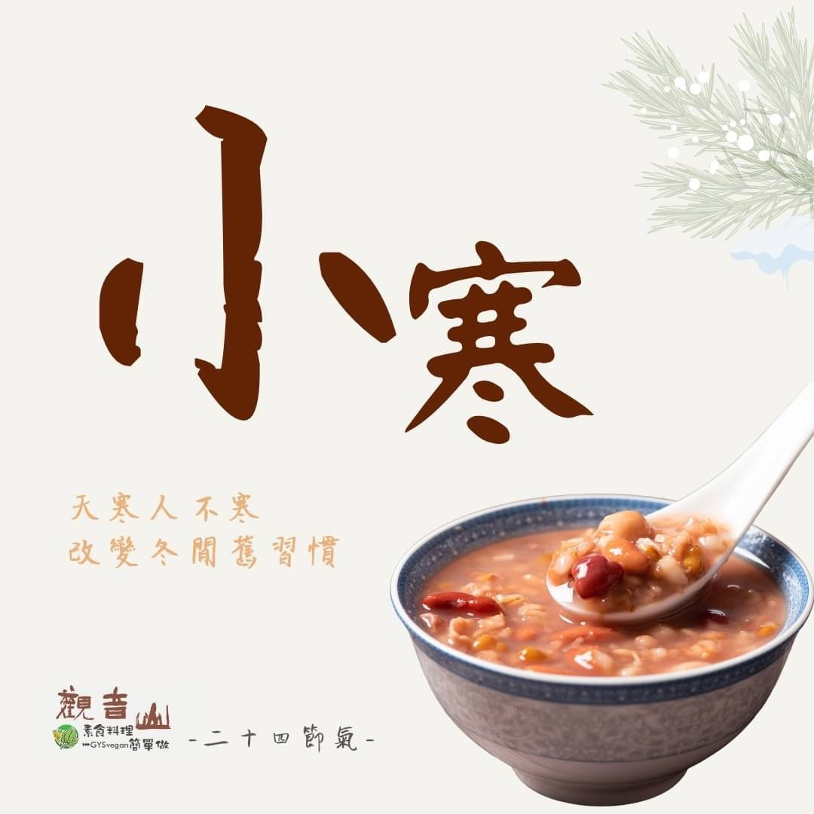

# 觀音山二十四節氣  小寒

## 📋 基本資訊 / Recipe Overview
- **料理名稱**：觀音山二十四節氣  小寒
- **原始標題**：觀音山二十四節氣 ｜小寒
- **素食流派 / Diet**：全素 Vegan
- **來源平台 / Source**：[觀音山 · 素食料理簡單做](https://vegan.gys.org.tw/osamu20220103/)

## 📖 食譜圖文詳情 (中英雙語對照)

｜天寒人不寒，改變冬閒舊習慣​
今年的1/5日是二十四節氣中的小寒，是表示氣溫冷暖的節氣，此時冷空氣頻繁南下，在小寒、大寒之際是一年氣溫最低的時刻❄️，此時最重要的就是做好保暖，對於年紀大的長輩噓寒問暖，給予更多的關懷問候。​
​
1/10(臘月初八)是佛教重要節日，欣逢偉大 釋迦牟尼佛成道紀念日，往年觀音山各地蔬食館，也會在佛陀成道紀念日這天，準備熱騰騰象徵平安吉祥的「臘八粥」，為社會傳遞溫暖，暖心又暖胃。​
​
｜跟著節氣養生​
冬日養生首重「養腎防寒」，固養精氣，可食用黑米、黑豆、蓮子、栗子、桂圓、杏仁、核桃，以達到補腎益腎的作用；頭頸部的保暖相當重要，特別需注意心血管疾病❣️以及呼吸道的問題，其次手足四肢也需特別注意保暖，適當的運動，讓身體保持良好的循環。​
​
｜跟著節氣這樣吃​
從飲食養生的角度而言，小寒適合以溫熱食物來補益身體，如芥菜、南瓜、生薑、蘆筍、九層塔、茼蒿、杏仁、金棗、桃子、櫻桃等等；在料理中加入✅正確的辛香料，如薑、胡椒、花椒、八角、辣椒等，有助於血管擴張、促進循環，還可以驅除體內的寒氣。​
​
觀音山素食料理簡單做​
推薦當季小寒 節氣料理 食譜 ​
​
⭐栗子菜脯素G湯​
➡
https://reurl.cc/qODyjD​
​
⭐ 五彩素雞丁​
➡
https://reurl.cc/pWD7br​
​
⭐ 菱角蓮子當歸湯​
➡
https://reurl.cc/8WlQZb​
​
​
✨慈悲的龍德上師 成立「觀音山蔬食館」提倡健康素食、慈悲護生，以”觀音山素食料理簡單做”的理念，提供多款素食食譜，讓您一學就會！?​
​
​
★1月3日 禪定勝王佛節日：善惡業增長一百倍​
​
✨殊勝功德增長日✨​
觀音山邀請您於今日響應素食、廣修供養、戒殺護生、誦經修法、行持諸種善行，獲福無量。​
​
​
? 觀音山 素食料理簡單做 ?
◎Facebook ｜好文按讚
http://w​ww.facebook.com/GYSVegan​
​
◎lnstagram ｜料理追蹤​
http://www.instagram.com/gysvegan/​
​
◎Youtube ｜加入訂閱​
https://reurl.cc/q8VEqy​
​
◎Telegram ｜頻道推薦​
https://t.me/GYSVegan​
​
​
—​
?歡迎轉載，請註明出處：觀音山素食料理簡單做 GYSVegan 素食環保愛地球，健康營養無負擔，慈悲護生一起來~?

---
*食譜歸檔時間：2026-08-20 · 來源：觀音山素食料理簡單做 (vegan.gys.org.tw)*