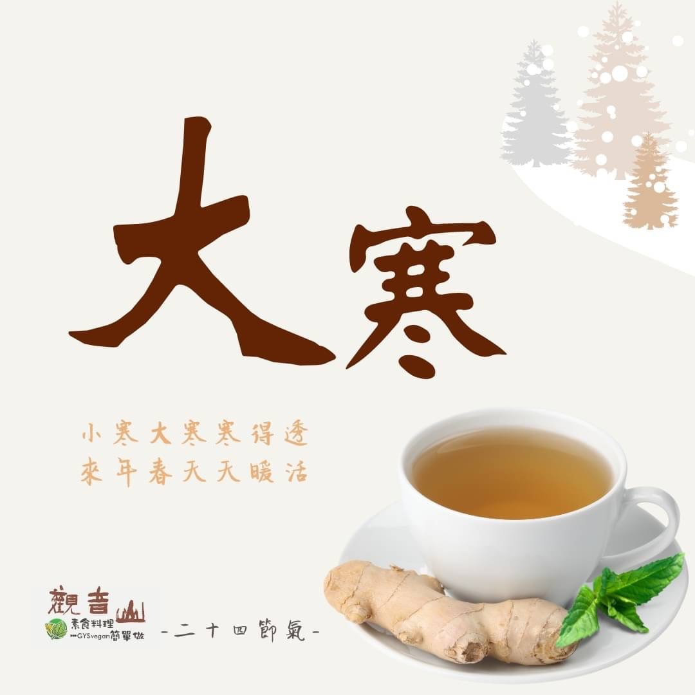

# 觀音山二十四節氣 大寒​ ​

## 📋 基本資訊 / Recipe Overview
- **料理名稱**：觀音山二十四節氣 大寒​ ​
- **原始標題**：觀音山二十四節氣｜大寒​ ​
- **素食流派 / Diet**：全素 Vegan
- **來源平台 / Source**：[觀音山 · 素食料理簡單做](https://vegan.gys.org.tw/%e8%a7%80%e9%9f%b3%e5%b1%b1%e4%ba%8c%e5%8d%81%e5%9b%9b%e7%af%80%e6%b0%a3%ef%bd%9c%e5%a4%a7%e5%af%92%e2%80%8b-%e2%80%8b/)

## 📖 食譜圖文詳情 (中英雙語對照)

｜小寒大寒寒得透，來年春天天暖和​
二十四節氣中，最後一個節氣「大寒」❄️，為一年中極冷的時期，同時也代表新的一年即將到來✨，在這除舊布新的時節，除了要清掃外在的環境，更要洗滌內心的塵垢，讓新的一年充滿光明☀️。​
​
｜跟著節氣養生​
嚴寒低溫，人體的新陳代謝也相對緩慢，俗話說「暖身先暖心，心暖則身暖」，此時節應保持身心平衡、心情舒暢，加上衣物的保暖，才能提升免疫力✅，此時節飲食養生應以「減鹹增苦」為原則，?避免生冷食物；大寒節氣亦是進補的好時機，?可多食用山藥、桂圓、蓮子、紅棗等來溫補。​
​
｜跟著節氣這樣吃​
多食用苦味食材，可以滋養心氣，如苦瓜、芹菜、小白菜、萵筍、杏仁、蓮子，可搭配少許辛香料，如胡椒、薑、花椒來預防風寒，在蔬果的選擇方面，有胡蘿蔔、油菜、白菜、南瓜、菠菜、白蘿蔔、橘子?、柳丁、蘋果等，均衡飲食增強抵抗力?，迎接新年的到來。​
​
​
觀音山素食料理簡單做​
推薦當季大寒 節氣料理 食譜 ​
​
⭐梅干苦瓜​
➡
https://reurl.cc/AK1xEK​
​
⭐蜜糖杏仁小于乾​
➡
https://reurl.cc/EpKkqm​
​
⭐ 素食補肉骨茶湯​
➡
https://reurl.cc/Opbxby​
​
​
✨慈悲的龍德上師 成立「觀音山蔬食館」提倡健康素食、慈悲護生，以”觀音山素食料理簡單做”的理念，提供多款素食食譜，讓您一學就會！
​
​
觀音山 素食料理簡單做
◎Facebook ｜好文按讚​
http://www.facebook.com/GYSVegan​
​
◎lnstagram ｜料理追蹤​
http://www.instagram.com/gysvegan/​
​
◎Youtube ｜加入訂閱​
https://reurl.cc/q8VEqy
​
​
◎Telegram ｜頻道推薦​
https://t.me/GYSVegan​
​
​
—​
歡迎轉載，請註明出處：觀音山素食料理簡單做 GYSVegan 素食環保愛地球，健康營養無負擔，慈悲護生一起來~

---
*食譜歸檔時間：2026-08-20 · 來源：觀音山素食料理簡單做 (vegan.gys.org.tw)*