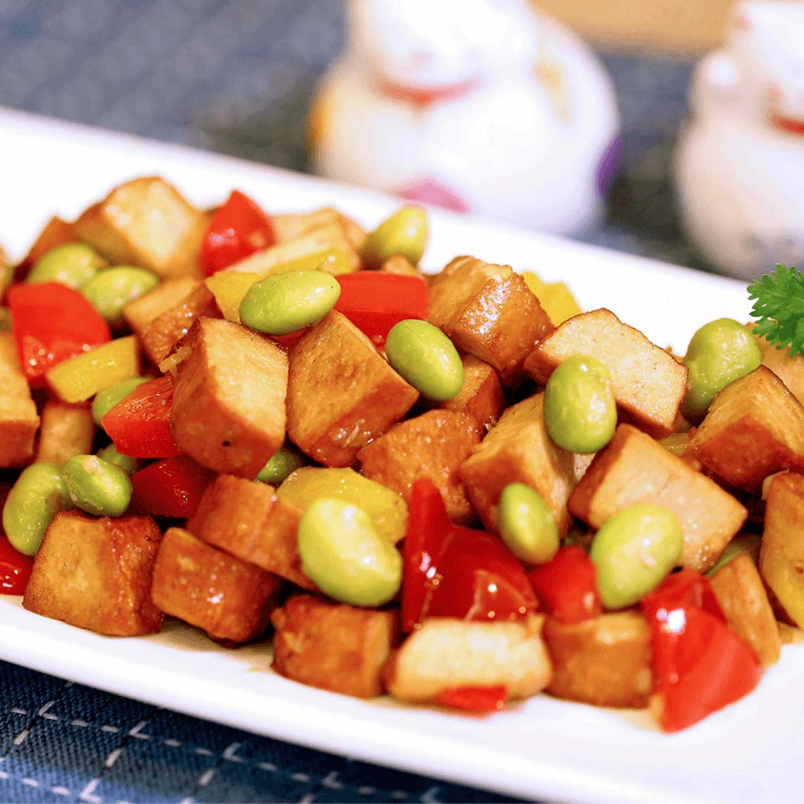

# 豆丁炒毛豆

## 📋 基本資訊 / Recipe Overview
- **料理名稱**：豆丁炒毛豆
- **原始標題**：豆丁炒毛豆｜全素
- **素食流派 / Diet**：全素 Vegan
- **來源平台 / Source**：[觀音山 · 素食料理簡單做](https://vegan.gys.org.tw/edamame20210313/)

## 📖 食譜圖文詳情 (中英雙語對照)

毛豆有「植物之肉」美稱，含非常豐富的蛋白質及大量膳食纖維，搭配紅黃椒、豆干切丁烹煮，一道美味營養的家常菜就出爐啦！
快跟著觀音山主廚，一起素食料理簡單做吧！
?食材及佐料〔Ingredients〕：(4人份)
▪️毛豆 約1碗飯
▪️方型豆干 8塊
▪️紅黃彩椒 各1顆
▪️薑末、香菇粉 少許
▪️素蠔油 適量
?烹飪步驟：
1.將豆干切丁；紅黃椒洗淨切丁，毛豆洗淨，分別汆燙備用。
2.熱鍋倒入油，爆香薑末，放入豆干丁拌炒，再加入紅黃椒和毛豆拌炒均勻。
3.放入香菇粉及素蠔油炒至入味即可盛盤。
??本食譜提供：台中 觀音山蔬食館 主廚 樂熹
⭐️慈悲的 龍德上師成立「觀音山蔬食館」提倡健康素食、慈悲護生，以”觀音山素食料理簡單做”的理念，提供多款素食食譜，讓您一學就會！?
【recipe】
?  Edamame is known as the “meat of plants”. It is rich in protein and dietary fiber. When cooked with red and yellow bell peppers and diced dried tofu, it’s a delicious and nutritious homemade dish! Quickly follow the chef of Guanyinshan, let’s cook simple vegetarian dishes together!
?Ingredients : (For 4 people)
▪About a bowl of rice of Edamame
▪Eight pieces of Dried tofu
▪A Red bell pepper , A Yellow bell pepper
▪Minced ginger、Shiitake mushroom powder , a little
▪Vegetarian mushroom soy sauce , adequate amount
?Cooking steps:
1. Dice dried tofu & wash edamame; wash and dice red & yellow bell peppers. Blanch each ingredient separately.
2. Preheat the pan with oil. Saute minced ginger; add dried tofu to stir fry, and then red & yellow bell pepper and edamame fry evenly.
3. Add shiitake mushroom powder and vegetarian oyster sauce to fry until fragrant.
??This recipe is provided by Chef Le Xi, Taichung Guanyinshan Green Restaurant
?觀音山 素食料理簡單做?
​
◎Facebook ｜好文按讚​
https://www.facebook.com/GYSVegan​​
​
◎Instagram ｜料理追蹤​
https://www.instagram.com/gysvegan/​​
​
​
◎Youtube ​ ​ ​ ｜加入訂閱​
https://reurl.cc/q8VEqy​​​
​
​
◎Telegram ​ ｜頻道推薦​
https://t.me/GYSVegan
​
—​
? 歡迎轉載，請註明出處： 觀音山 素食料理簡單做 GYSVegan 素食環保愛地球，健康營養無負擔，慈悲護生一起來~?

---
*食譜歸檔時間：2026-08-20 · 來源：觀音山素食料理簡單做 (vegan.gys.org.tw)*