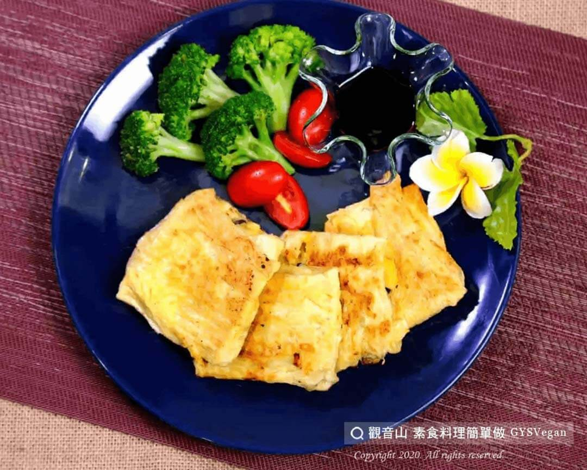

# 豆包地瓜煎餅

## 📋 基本資訊 / Recipe Overview
- **料理名稱**：豆包地瓜煎餅
- **原始標題**：豆包地瓜煎餅｜全素
- **素食流派 / Diet**：全素 Vegan
- **料理分類 / Category**：主食種類 / 米麵主食 (Staple Food)
- **來源平台 / Source**：[觀音山 · 素食料理簡單做](https://vegan.gys.org.tw/%e8%b1%86%e5%8c%85%e5%9c%b0%e7%93%9c%e7%85%8e%e9%a4%85%ef%bd%9c%e5%85%a8%e7%b4%a0/)

## 📖 食譜圖文詳情 (中英雙語對照)

甘甜地瓜搭配豆包，淋上微鹹醬油，第一口咬下去，綿密的地瓜在嘴中化開來；腰果顆粒和葡萄乾豐富了口感與層次。​
這是一道健康又有“微微飽足感”的料理，很適合當早餐或下午茶點心哦！?​
​
?準備食材與佐料(可依個人口味調整)​
1.地瓜1-2斤、腰果30克、葡萄乾20克、豆包5-6片。​
2.鹽巴少許、橄欖油2大匙、素蠔油少許。​
​
?#素食料理簡單做，開始：​
1.地瓜切片放入電鍋蒸熟後，趁熱將地瓜拿出來搗碎壓成泥。​
2.腰果打碎或切細，將葡萄乾、碎腰果放入地瓜泥攪拌均勻，加入少許鹽巴。​
3.豆包攤開，將地瓜泥抓等量的鋪成四方形後，將豆包捲起來，把尾部零碎的豆包切掉，輕輕壓一下，讓形狀定型。​
4.熱油鍋，將包好的豆包煎至金黃色，即可起鍋。​
​
淋上少許素蠔油或醬油膏，完成囉！！?​
​
⭐️特別說明：​
1.將地瓜泥鋪到豆包上捲成四方形時，請將地瓜泥與豆包兩側保留一點距離，避免包的過程中，地瓜泥從兩側跑出來。​
2.包好後記得輕輕壓一壓，讓形狀更美，地瓜泥與豆包也會黏得更緊。​
​
?‍?本食譜提供：台中 #觀音山蔬食館 主廚 樂卿​
​
✨慈悲的 龍德上師成立「觀音山蔬食館」提倡健康素食、慈悲護生，以”觀音山素食料理簡單做”的理念，提供多款素食食譜，讓您一學就會！?​
​
​
?觀音山 素食料理簡單做 ​ Follow us?​
Facebook ｜好文按讚
http://www.facebook.com/GYSVegan​
Instagram ｜料理追蹤
http://www.instagram.com/gysvegan/​
Youtube ​ ​ ​ ｜加入訂閱
https://reurl.cc/q8VEqy​
Telegram ​ ｜頻道推薦
https://t.me/GYSVegan​
​
​
? 歡迎轉載，請註明出處： ​ ​ 觀音山 素食料理簡單做GYSVegan按讚、留言設定搶先看! 素食環保愛地球，健康營養無負擔，慈悲護生一起來~?

---
*食譜歸檔時間：2026-08-20 · 來源：觀音山素食料理簡單做 (vegan.gys.org.tw)*