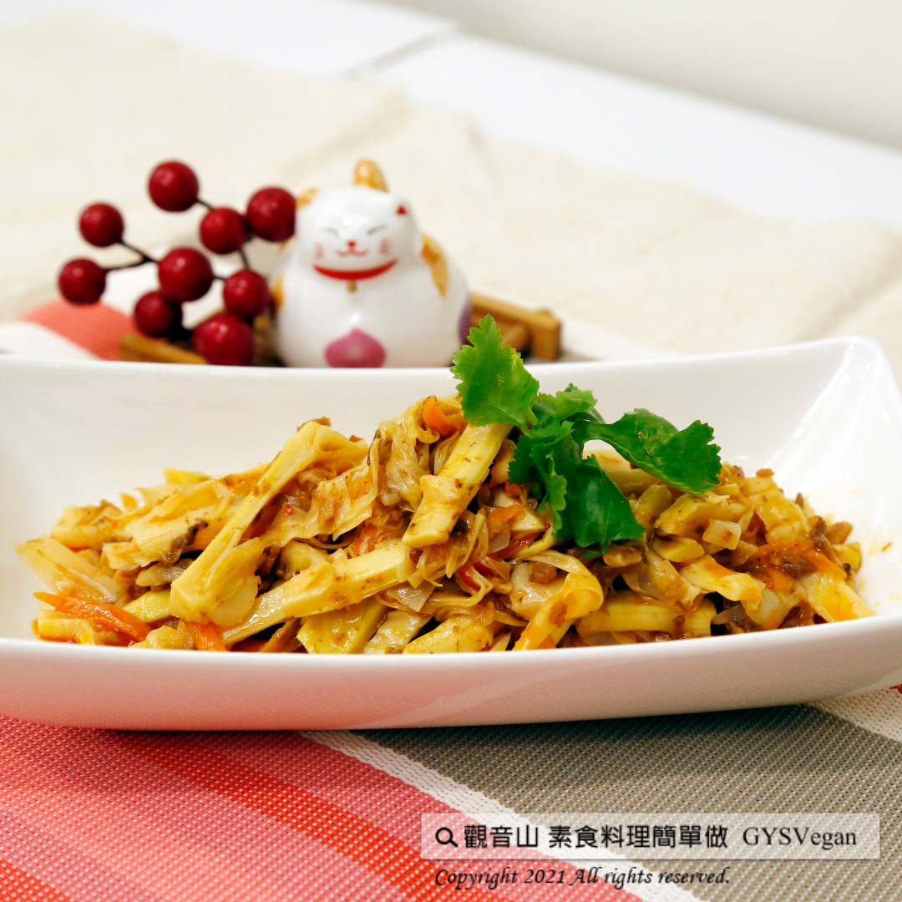

# 豆瓣悶桂筍

## 📋 基本資訊 / Recipe Overview
- **料理名稱**：豆瓣悶桂筍
- **原始標題**：豆瓣悶桂筍｜全素
- **素食流派 / Diet**：全素 Vegan
- **來源平台 / Source**：[觀音山 · 素食料理簡單做](https://vegan.gys.org.tw/%e8%b1%86%e7%93%a3%e6%82%b6%e6%a1%82%e7%ad%8d%e5%85%a8%e7%b4%a0/)

## 📖 食譜圖文詳情 (中英雙語對照)

今天觀音山主廚要和大家分享一道超下飯料理，✨豆瓣悶桂筍 ✨。​
桂竹筍除具有一般筍子低熱量、高纖維的特性，此外也富含維生素B群喔。​
是人人都能學會的一道家常料理，快跟著觀音山主廚，一起素食料理簡單做吧！​
​
?食材及佐料〔Ingredients〕：(4人份)​
▪桂竹筍 300克​
▪素燥 5克​
▪醬油 10克​
▪辣豆瓣 30克​
​
?烹飪步驟：​
1.將桂竹筍洗淨燙過。​
2.剝成一條一條約0.5公分，切段約2.5-3公分。​
3.熱油鍋，將桂竹筍放入鍋子炒，大約5分鐘。​
4.加入素燥、辣豆瓣醬、醬油拌炒，加30c.c水，悶3-4分鐘，即可完成！​
​
【特別說明】​
如果鹹度不夠，可加入適量素蠔油或鹽巴調味​
​
??本食譜提供：彰化 #觀音山蔬食館 主廚 慧娥​
​
?慈悲的 龍德上師成立「觀音山蔬食館」提倡健康素食、慈悲護生，以”觀音山素食料理簡單做”的理念，提供多款素食食譜，讓您一學就會！?​
​
​
?觀音山 素食料理簡單做 ​ Follow us?​
Facebook ｜好文按讚
http://www.facebook.com/GYSVegan​
Instagram ｜料理追蹤
http://www.instagram.com/gysvegan/​
Youtube ​ ​ ​ ｜加入訂閱
https://reurl.cc/q8VEqy
​
Telegram ​ ｜頻道推薦
https://t.me/GYSVegan
​
​
​
? 歡迎轉載，請註明出處： ​ ​ 觀音山 素食料理簡單做GYSVegan按讚、留言設定搶先看! 素食環保愛地球，健康營養無負擔，慈悲護生一起來~?

---
*食譜歸檔時間：2026-08-20 · 來源：觀音山素食料理簡單做 (vegan.gys.org.tw)*