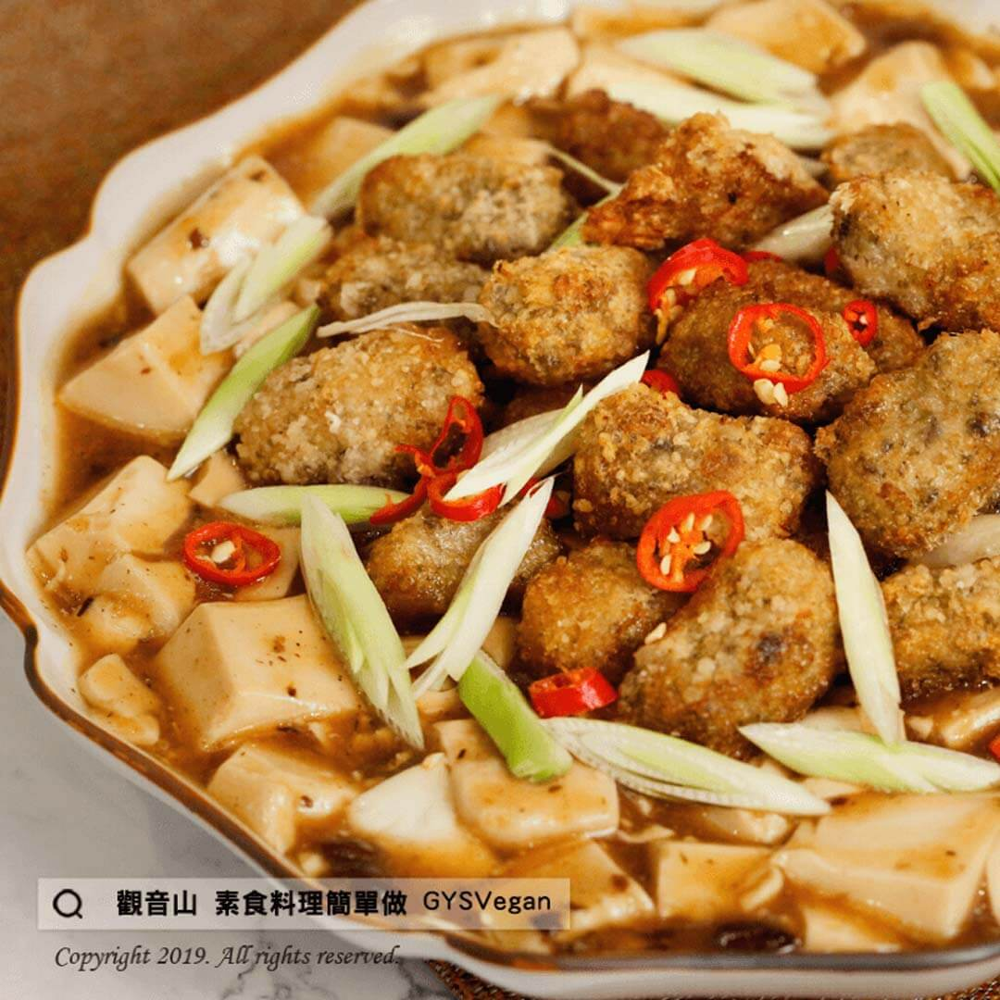

# 豆鼓蚵仔酥

## 📋 基本資訊 / Recipe Overview
- **料理名稱**：豆鼓蚵仔酥
- **原始標題**：豆鼓蚵仔酥｜全素
- **素食流派 / Diet**：全素 Vegan
- **料理分類 / Category**：中式料理
- **來源平台 / Source**：[觀音山 · 素食料理簡單做](https://vegan.gys.org.tw/%e8%b1%86%e9%bc%93%e8%9a%b5%e4%bb%94%e9%85%a5%ef%bd%9c%e5%85%a8%e7%b4%a0/)

## 📖 食譜圖文詳情 (中英雙語對照)

觀音山蔬食館主廚提供這道散發著豆鼓香氣，酥炸口感的「素蚵仔酥」伴著Q嫩滑順的豆腐，搭配清甜又富含膳食纖維的碧玉筍，配飯吃，讓人忍不住一碗接著一碗！一定要學起來的家常菜，現在一起料理簡單做吧！​
​
?食材及佐料〔Ingredients〕：(4人份)​
▪素蚵仔酥 150g​
▪嫩豆腐 1盒​
▪紅辣椒 1條​
▪乾豆鼓 少量​
▪薑末 15g​
▪碧玉筍 20g​
▪素蠔油 2大匙​
▪白胡椒粉 1/4小匙​
▪太白粉 2小匙​
▪水 1.5大匙​
​
?烹飪步驟：​
1. 嫩豆腐切丁；紅辣椒、薑切末，備用。​
2. 將素蚵仔酥油炸至酥脆，起鍋備用。​
3. 熱鍋，將豆鼓、薑末、素蠔油、白胡椒粉拌炒。​
4. 加入嫩豆腐丁、水煮至入味。​
5. 續入碧玉筍、太白粉水、素蚵仔酥勾芡拌煮。​
6. 撒上辣椒，完成!!!✅。​
​
?特別說明​
素蚵仔酥也可用草菇代替，不用擔心會有普林過高影響健康。​
​
??本食譜提供：台中 #觀音山蔬食館 主廚 樂卿​
​
✨慈悲的 龍德上師成立「觀音山蔬食館」提倡健康素食、慈悲護生，以”觀音山素食料理簡單做”的理念，提供多款素食食譜，讓您一學就會！?​
​
​
?觀音山 素食料理簡單做 ​ Follow us?​
Facebook ｜好文按讚
http://www.facebook.com/GYSVegan
​
Instagram ｜料理追蹤
http://www.instagram.com/gysvegan/​
Youtube ​ ​ ​ ｜加入訂閱
https://reurl.cc/q8VEqy​
Telegram ​ ｜頻道推薦
https://t.me/GYSVegan​
​
​
? 歡迎轉載，請註明出處： ​ ​ 觀音山 素食料理簡單做GYSVegan按讚、留言設定搶先看! 素食環保愛地球，健康營養無負擔，慈悲護生一起來~?

---
*食譜歸檔時間：2026-08-20 · 來源：觀音山素食料理簡單做 (vegan.gys.org.tw)*