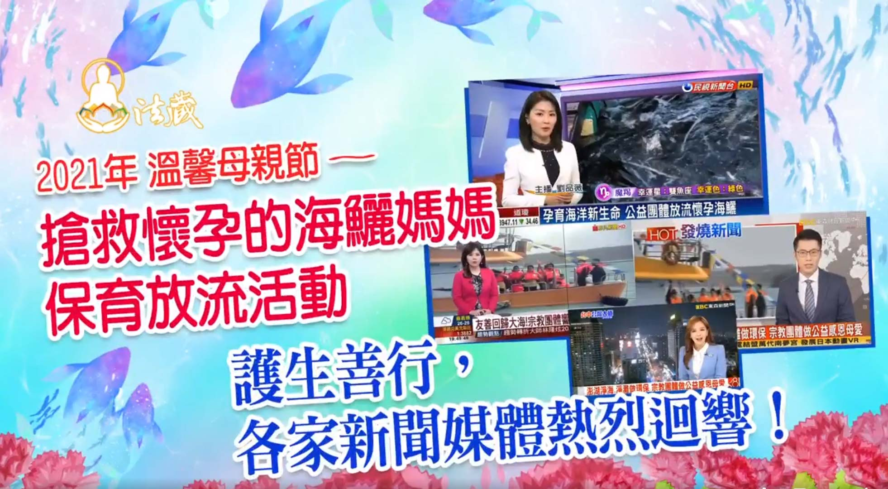

# 賀！電視、網路、報章雜誌各大媒體，熱烈報導

## 📋 基本資訊 / Recipe Overview
- **料理名稱**：賀！電視、網路、報章雜誌各大媒體，熱烈報導
- **原始標題**：賀！電視、網路、報章雜誌各大媒體，熱烈報導
- **素食流派 / Diet**：全素 Vegan
- **來源平台 / Source**：[觀音山 · 素食料理簡單做](https://vegan.gys.org.tw/network20210502/)

## 📖 食譜圖文詳情 (中英雙語對照)

賀！東森新聞、民視新聞、民視台語新聞、非凡新聞、聯合報…等電視、網路、報章雜誌各大媒體，熱烈報導「觀音山 搶救懷孕的海鱺媽媽保育放流活動」護生善行！​
​
每年四、五月為海鱺的繁殖季節，每隻成年的海鱺約有300萬顆的魚卵，可孕育相當多的新生命，但不幸的是海鱺為饕客的最愛，過度捕撈及海洋生態遭到破壞，更讓海鱺難以繼續繁殖下一代。觀音山 中華大悲法藏佛教會特別選在母親節前夕，邀請各界民眾一同至澎湖放生懷孕的海鱺媽媽，順利孕育出更多新生命，讓海洋資源可以生生不息，送給地球送最好的母親節禮物。​
​
為守護澎湖海域的環境，觀音山 中華大悲法藏佛教會於放生活動結束後前往桶盤嶼碼頭進行淨灘活動，清理沙灘上的垃圾還給海洋一個乾淨的家，希望能夠拋磚引玉，呼籲更多民眾重視海洋環保議題，一起來親海、知海、愛海。疼惜海洋生態與重視與關心海廢的問題，彎腰為環境永續善盡微薄的心力。​
​
「蔬食傳愛，健康樂活」，經過一整天放生海鱺及淨灘活動，觀音山 中華大悲法藏佛教會特別準備了相當豐盛的蔬食菜餚，不僅淨海、淨灘也要淨身，藉此機會推廣蔬食，打破許多人對於吃素的錯誤迷思，正確蔬食飲食習慣不僅能體內環保，減少地球的負擔，也讓更多動物免於宰殺長養我們慈悲懷愛之心，進而有更多的糧食可以做有效的運用，透過蔬食讓公益、環保結合。​
​
適逢慈愛的母親節，我們選擇了釋放海鱺、淨化海域及推廣蔬食一系列的環保議題相關活動，希望能夠送給我們的地球母親一份最誠摯的母親節禮物。同為觀音山 中華大悲法藏佛教會的住持，天喜文教公益基金會的董事長 龍德嚴淨仁波切指出，希望能將環境保育、尊重生命、愛物惜福等觀念落實在日常生活之中，也更期待藉由「善」的力量，邀請更多人一同加入愛護地球的行列。​
​
2021母親節 搶救懷孕的海鱺媽媽 ​
【溫馨五月─愛護海洋‧保育放流活動 】​
▸https://www.fazang.org/liferelease/​
​
今年施放的種類包含海鱺、魚苗…等急需救助的生靈，將舉辦四場放流，海洋生態復育活動： ​
① 5月上旬 │ 台中 麗水港 ​
② 5月中旬 │ 高雄 中芸沙灘 ​
③ 5月中旬 │ 台南 安平漁港附近 ​
④ 5月下旬 │ 台北 沙崙海灘​
恭請慈悲 龍德上師於5月23日(日)「全球護生•保育放流 消災延壽護生法會」主法迴向。​
​
更多請見「觀音山 全球資訊網」​
http://www.fazang.org/index.php?ID=92​
​
【竭誠邀請您護持觀音山弘法聖業】​
▶ https://reurl.cc/NalE6n​
讓更多人改變命運得妙智慧！​
​
?觀音山 素食料理簡單做 ​ Follow us?
Facebook ｜好文按讚 ➤
http://www.facebook.com/GYSVegan​
Instagram ｜料理追蹤 ➤
http://www.instagram.com/gysvegan/​
Youtube ​ ​ ​ ｜加入訂閱 ➤
https://reurl.cc/q8VEqy​
官方Blog ​ ​ ｜網站推薦 ➤
https://vegan.gys.org.tw/​
​
​
–​
? 歡迎轉載，請註明出處：觀音山 素食料理簡單做 GYSVegan 素食環保愛地球，健康營養無負擔，慈悲護生一起來~?

---
*食譜歸檔時間：2026-08-20 · 來源：觀音山素食料理簡單做 (vegan.gys.org.tw)*