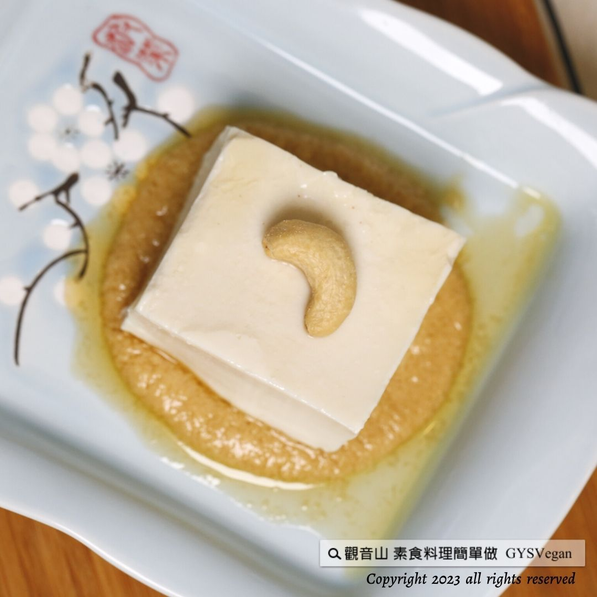

# 輕食料理  堅果醬涼拌豆腐

## 📋 基本資訊 / Recipe Overview
- **料理名稱**：輕食料理  堅果醬涼拌豆腐
- **原始標題**：輕食料理 ｜堅果醬涼拌豆腐｜全素
- **素食流派 / Diet**：全素 Vegan
- **來源平台 / Source**：[觀音山 · 素食料理簡單做](https://vegan.gys.org.tw/cold-tofu20230721/)

## 📖 食譜圖文詳情 (中英雙語對照)

創新涼拌豆腐新吃法，具有濃郁香氣的黑芝麻、營養滿分的堅果醬，與豆腐清爽口感成為最佳搭配，更是炎炎夏日消暑的好料理。
​
黑芝麻不僅補血，加上堅果可預防心血管疾病，且富含鈣、鐵、纖維質、維生素E等礦物質，還有素食者最需要的Omega-3脂肪酸，快跟著觀音山主廚，一起素食料理簡單做吧！
​
◎食材及佐料〔Ingredients〕：
▪️市售涼拌豆腐 ​ 2盒
▪️熟堅果 ​ 200克
▪️黑芝麻油 ​ 40克
▪️鹽、砂糖 ​ 適量
​
◎烹飪步驟：
【前製作業】
1.豆腐倒在盤子上，1切成6塊，靜置出水， 再將水分瀝乾備用。
​
【調理作法】
1.堅果醬:
​ ​ 準備果汁機，擦乾水份，倒入堅果、黑芝麻油、鹽、糖，打勻備用。
2. 將打好的堅果醬淋在豆腐上，即可享用。
​
【特別說明】
1.熟堅果的種類可以依喜好選擇搭配。
2.堅果醬亦可製作起來冷藏，當抹醬運用。
​
本食譜提供：台中 觀音山蔬食館
​
​
▌慈悲的 龍德上師 成立「觀音山蔬食館」提倡健康素食、慈悲護生，以”觀音山素食料理簡單做”的理念，提供多款素食食譜，讓您一學就會！
​
觀音山相關連結
➠
https://www.fazang.org/link/
​ ​
​
▌觀音山近期活動
8月23日 蓮師薈供法會
✦ 登記「超薦蓮位、除障祿位」
https://bit.ly/3bH7Z46
✦ 護持「薈供供品」推廣素食愛心公益
https://bit.ly/3bHzJ8H
(登記至8月23日晚上7:00截止)
​ ​
​ ​
—
歡迎轉載，請註明出處： 觀音山素食料理簡單做 GYSVegan 素食環保愛地球，健康營養無負擔，慈悲護生一起來~

---
*食譜歸檔時間：2026-08-20 · 來源：觀音山素食料理簡單做 (vegan.gys.org.tw)*