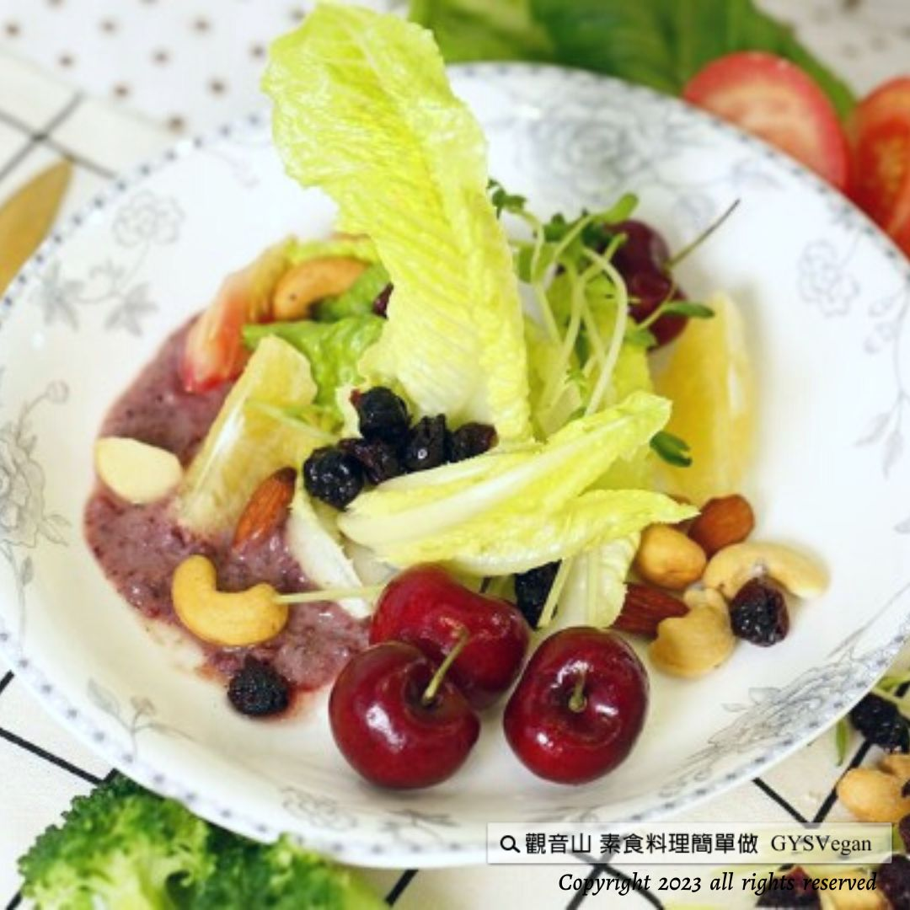

# 輕食料理  蔓越莓水果沙拉

## 📋 基本資訊 / Recipe Overview
- **料理名稱**：輕食料理  蔓越莓水果沙拉
- **原始標題**：輕食料理 ｜蔓越莓水果沙拉｜全素
- **素食流派 / Diet**：全素 Vegan
- **料理分類 / Category**：輕食點心
- **來源平台 / Source**：[觀音山 · 素食料理簡單做](https://vegan.gys.org.tw/cranberry-fruit-salad20230901/)

## 📖 食譜圖文詳情 (中英雙語對照)

輕食料理 ✨蔓越莓水果沙拉✨全素
最適合夏天的蔓越莓沙拉醬，獨特的酸甜口感，與香蕉、奇異果、櫻桃等多種新鮮水果的搭配，再加入香脆堅果提味，快速完成一道色彩繽紛、口感與營養兼具的料理盛宴。蔓越莓具有高抗氧化，特別對女性有婦科預防感染的效果，豐富的水果提供多種維生素與礦物質，讓你有滿滿活力的一天，快跟著觀音山主廚，一起素食料理簡單做吧！
​
◎食材及佐料〔Ingredients〕：
▪️蔓越莓乾 ​ 100克
▪️涼拌豆腐 ​ 1/2盒
▪️奇異果、香蕉 ​ 各2 ​ ​ ​ ​ ​ ​ ​ ​ ​ ​ ​ ​ ​ ​ ​ ​
▪️櫻桃 ​ 9顆
▪️綜合堅果、檸檬汁 ​ 適量
▪️熱水、飲用水 ​ 適量
​
​
◎烹飪步驟：
【刀工/前處理】
1.蔓越莓乾加入少量的熱水泡軟瀝乾備用。
2.奇異果去皮切塊。
3.香蕉去皮切塊。
​
【調理作法】
1.蔓越莓沙拉醬:
​ 準備果汁機，放入蔓越莓乾、豆腐、飲用水、砂 糖、檸檬汁，打勻備用。
2.準備一個餐盤，擺上香蕉、奇異果、櫻桃、綜合堅果，淋上蔓越莓沙拉醬，即可享用。
​
【特別說明】
水果種類可以依自己的喜好調整。
​
​
本食譜提供：台中觀音山蔬食館
​
​
▌慈悲的龍德上師 成立「觀音山蔬食館」提倡健康素食、慈悲護生，以”觀音山素食料理簡單做”的理念，提供多款素食食譜，讓您一學就會！
​
觀音山相關連結
➠
https://www.fazang.org/link/
​ ​
​
▌觀音山近期活動
💎9月9日 人天導師 本師 釋迦牟尼佛薈供大法會
✦ 登記「超薦蓮位、除障祿位」
https://reurl.cc/zY2MKp
✦ 護持「薈供供品」推廣素食愛心公益
https://reurl.cc/kX4789
(登記至2023年09月09日(六)中午12:00截止)
Light meals
Cranberry Fruit Salad Vegan
Cranberry salad dressing is the most suitable for summer. It has a unique sweet and sour taste. It is paired with various fresh fruits such as bananas, kiwis, cherries, etc., and crispy nuts are added to enhance the flavor. It can quickly complete a colorful, delicious, and nutritious culinary feast. Cranberries are high in antioxidants and are particularly effective in preventing gynecological infections in women. The rich fruit provides a variety of vitamins and minerals, allowing you to have an energetic day. Come and follow the chef of Guanyin Mountain to make simple vegetarian dishes. Come on!
​
◎Ingredients and condiments 【Ingredients】:
Dried cranberries 100g
Cold tofu 1/2 box
Kiwis, bananas, two each
Cherries 9 pcs
Mixed nuts, lemon juice, and an appropriate amount
Hot water and drinking water in proper amounts
​
◎Cooking steps:
【Knife craftsmanship/pre-processing】
1. Soak the dried cranberries in a small amount of hot water until soft and set aside.
2. Peel and cut kiwi fruit into pieces.
3. Peel the banana and cut it into pieces.
​
【Conditioning Method】
1. Cranberry Salad Dressing:
Prepare a juicer, add dried cranberries, tofu, drinking water, sugar, and lemon juice, beat well, and set aside.
2. Prepare a dinner plate; place bananas, kiwis, cherries, and mixed nuts, top with cranberry salad dressing, and enjoy.
​
【Special Note】
The types of fruits can be adjusted according to your preferences.
​ ​
​ ​
—
歡迎轉載，請註明出處： 觀音山素食料理簡單做 GYSVegan 素食環保愛地球，健康營養無負擔，慈悲護生一起來~

---
*食譜歸檔時間：2026-08-20 · 來源：觀音山素食料理簡單做 (vegan.gys.org.tw)*