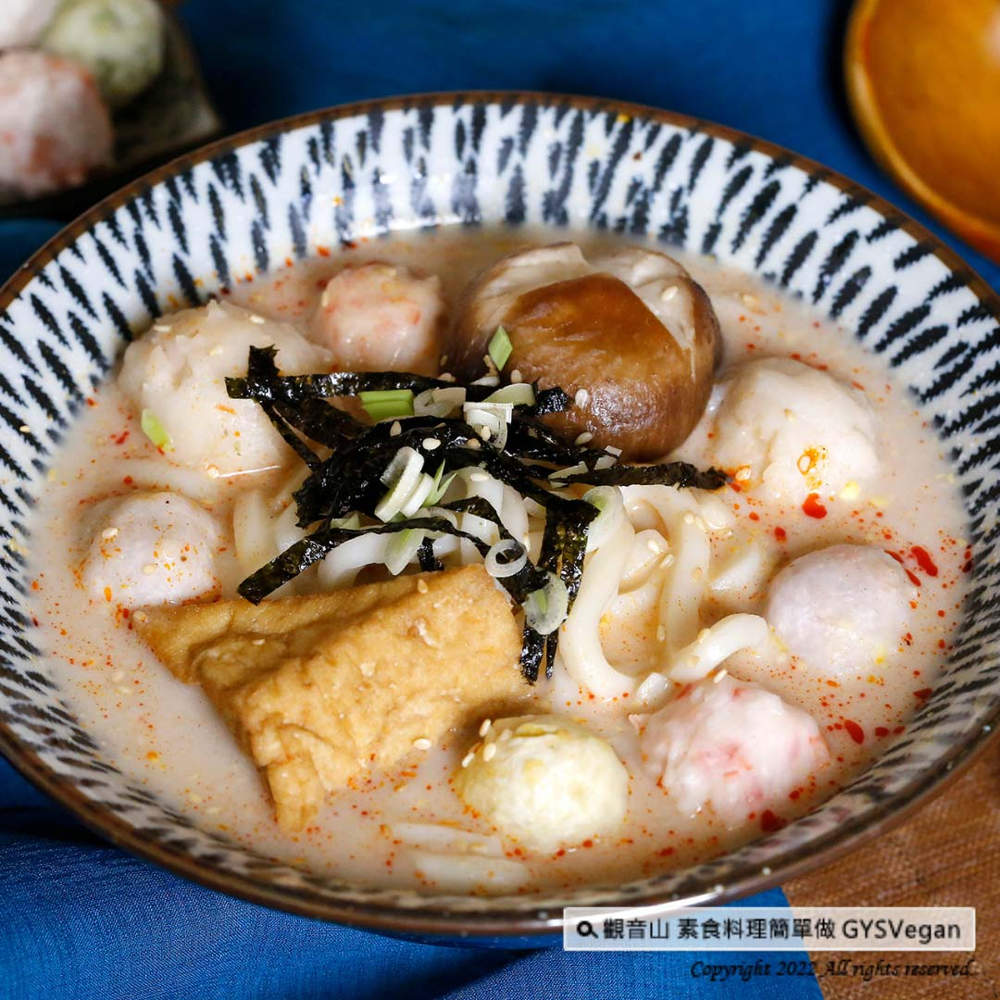

# 辣味燕麥奶烏龍麵

## 📋 基本資訊 / Recipe Overview
- **料理名稱**：辣味燕麥奶烏龍麵
- **原始標題**：燕麥奶系列｜辣味燕麥奶烏龍麵｜全素
- **素食流派 / Diet**：全素 Vegan
- **料理分類 / Category**：主食種類 / 米麵主食 (Staple Food)
- **來源平台 / Source**：[觀音山 · 素食料理簡單做](https://vegan.gys.org.tw/udon-noodles20220513/)

## 📖 食譜圖文詳情 (中英雙語對照)

用免熬煮的燕麥奶取代高湯，低熱量、香醇濃郁的香氣，烏龍麵充分吸收湯汁，麻辣口感勾出味蕾的層次，加上豐富的配菜，超出想像的美味，快跟著觀音山主廚，一起素食料理簡單做吧！​
​
食材及佐料〔Ingredients〕：(1人份)​
▪️◎無糖燕麥奶 ​ 500cc​
▪️烏龍麵 ​ 1包​
▪️油豆腐 ​ 1個 ​
▪️鮮香菇 ​ 1朵​
▪️碧玉筍 ​ ​ 1支​
▪️素料1-2種 ​ 適量​
▪️海苔絲、白芝麻、素食麻辣醬、鹽、砂糖 ​ 適量​
▪️全素奶油 ​ 少許​
​
◎烹飪步驟：​
【刀工/前處理】​
1.鮮香菇表面刻十字花。​
2.碧玉筍切細圈末。​
​
【調理作法】​
1.將燕麥奶倒入鍋中加熱至滾，放入適量麻辣醬、鹽、砂糖調味。​
2.加入食材:油豆腐、素料、鮮香菇煮熟，接著放入烏龍麵煮約2分鐘，加入少許奶油提味。​
3.盛裝入碗中，最後撒上海苔絲、白芝麻、碧玉筍，即可享用。​
​
本食譜提供：台中觀音山蔬食館​
​
✨慈悲的龍德上師 成立「觀音山蔬食館」提倡健康素食、慈悲護生，以”觀音山素食料理簡單做”的理念，提供多款素食食譜，讓您一學就會！​
​
​
「觀音山 社群」一鍵快速前往觀音山 官方相關連結！​
➠
https://www.fazang.org/link/​
​
​
🌱 觀音山 素食料理簡單做 🌱​
◎Facebook ｜好文按讚​
https://www.facebook.com/GYSVegan​
​
◎Instagram ｜料理追蹤​
https://www.instagram.com/gysvegan/​
​
◎Youtube ​ ​ ​ ｜加入訂閱​
https://reurl.cc/q8VEqy​
​
◎官方Blog ​ ​ ｜網站推薦​
https://vegan.gys.org.tw/​
​
​
—​
👑歡迎轉載，請註明出處： 觀音山 素食料理簡單做 GYSVegan 素食環保愛地球，健康營養無負擔，慈悲護生一起來~🥰

---
*食譜歸檔時間：2026-08-20 · 來源：觀音山素食料理簡單做 (vegan.gys.org.tw)*