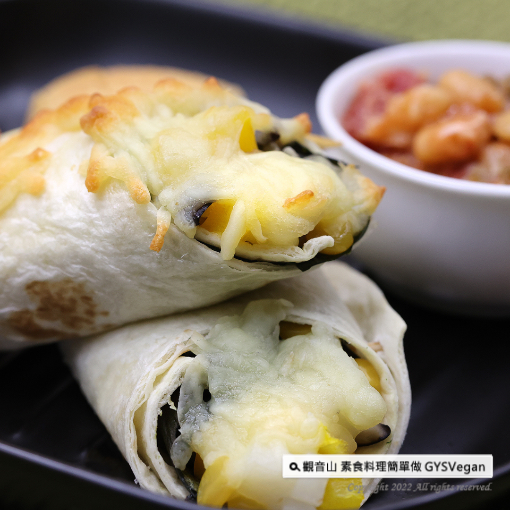

# 辣豆醬焗墨西哥捲餅

## 📋 基本資訊 / Recipe Overview
- **料理名稱**：辣豆醬焗墨西哥捲餅
- **原始標題**：異國蔬食｜辣豆醬焗墨西哥捲餅｜奶素
- **素食流派 / Diet**：奶素 Lacto-Vegetarian
- **來源平台 / Source**：[觀音山 · 素食料理簡單做](https://vegan.gys.org.tw/burritos220801/)

## 📖 食譜圖文詳情 (中英雙語對照)

必學異國蔬食料理–辣豆醬焗墨西哥捲餅，低碳的墨西哥捲餅，包著黃甜椒、玉米粒、馬鈴薯以及提升口感的菇類，有嚼勁的餅皮、內餡多層次的口感、獨特墨西哥風味醬料，征服全家人首選菜單，快跟著觀音山主廚，一起素食料理簡單做吧！​
​
◎食材及佐料〔Ingredients〕：​
▪️墨西哥餅皮 ​ 6片​
▪️鮮香菇、袖珍菇 ​ 各100克 ​ ​ ​
▪️黃甜椒、玉米粒罐頭 ​ 各100克 ​ ​ ​ ​ ​ ​ ​ ​ ​ ​ ​ ​ ​ ​ ​ ​ ​
▪️馬鈴薯 ​ 50克​
▪️番茄丁罐頭 ​ 200克​
▪️焗豆罐頭 ​ 1罐 ​
▪️九層塔、起司絲、醃漬墨西哥辣椒 ​ 適量​
▪️鹽、黑胡椒粒、孜然粉、砂糖 ​ 適量​
​
◎烹飪步驟：​
【刀工/前處理】​
1.鮮香菇切小塊，備用。​
2.黃甜椒、馬鈴薯切丁，備用。​
3.九層塔取葉子。​
4.墨西哥辣椒切碎。​
​
【調理作法】​
1.平底鍋加熱，倒入油，依序放入鮮香菇、袖珍菇炒至金黃色，加入適量鹽、黑胡椒粒調味，備用。​
2.準備一鍋水煮滾，放入馬鈴薯汆燙大約30秒，撈起備用​
3.取一餅皮，擺上餡料：炒好的菇、黃甜椒、玉米粒、馬鈴薯、九層塔適量，捲起來備用。​
4.製作辣豆醬:將炒鍋加熱，放入少許油，加入墨西哥辣椒略炒，倒入焗豆、番茄丁罐頭，小火煮滾後，加入適當的調味:鹽、糖、少許孜然粉、適量的起司絲拌勻即可。​
5.烤箱預熱180度，取一個焗烤盤，放入捲好捲餅，撒上起司絲，放入烤箱焗烤。大約10分鐘至起司表面呈金黃色，取出後淋上適量的辣豆醬即可享用！​
​
【特別說明】​
1.醃漬墨西哥辣椒、焗豆罐頭、番茄罐頭，可在超市或食品材料行購得。​
2.墨西哥辣椒辣度較高，用量可依自己喜好調整。​
3.全素者可使用純素起司絲。​
​
本食譜提供：台中觀音山蔬食館​
​
慈悲的龍德上師 成立「觀音山蔬食館」提倡健康素食、慈悲護生，以【觀音山素食料理簡單做】的理念，提供多款素食食譜，讓您一學就會！
◎觀音山相關連結​
➠
https://www.fazang.org/link/​
​
​
—​
◎歡迎轉載，請註明出處： 觀音山素食料理簡單做 GYSVegan 素食環保愛地球，健康營養無負擔，慈悲護生一起來​

---
*食譜歸檔時間：2026-08-20 · 來源：觀音山素食料理簡單做 (vegan.gys.org.tw)*