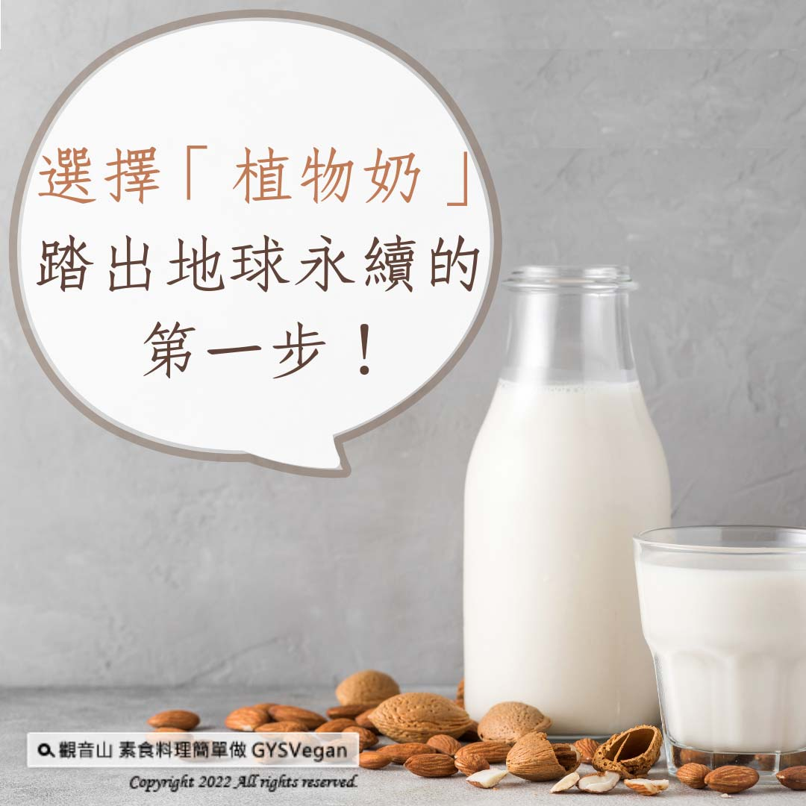

# 選擇「植物奶」，踏出地球永續的第一步！

## 📋 基本資訊 / Recipe Overview
- **料理名稱**：選擇「植物奶」，踏出地球永續的第一步！
- **原始標題**：選擇「植物奶」，踏出地球永續的第一步！
- **素食流派 / Diet**：全素 Vegan
- **來源平台 / Source**：[觀音山 · 素食料理簡單做](https://vegan.gys.org.tw/plant-milk20220124/)

## 📖 食譜圖文詳情 (中英雙語對照)

選擇「植物奶」，踏出地球永續的第一步！​
​
常聽到減緩氣候變遷的議題，卻不知道應該如何改變嗎❓ 讓我們從「碳足跡」來觀察，根據環保署的定義，碳排放(Carbon Footprint)指的是一項活動或產品的整個生命週期過程所直接與間接產生的二氧化碳排放量。​
​
近年來「植物奶」非常流行，分成環境生態、飲食習慣、個人體質，三個面向來了解，根據牛津大學(University of Oxford)研究顯示，生產一杯牛奶產生的溫室起體排放量，是植物奶的三倍之多，且無論需要的用水量、土地面積，都是位居榜首，所以選擇植物奶取代牛奶，就可以對地球更友善！​
​
牛奶裡面的蛋白質跟養分都是專門為了使小牛?成長而設計，並不符合人類生理機能需求，也因此人體的免疫系統會對這些不適合人體的蛋白質產生過敏的現象，而植物奶沒有這些副作用也不含乳糖，更適合人體吸收✅。​
​
所以選擇吃什麼、喝什麼對環境友善(碳足跡)的影響很大，一般而言，植物性飲食比肉食排碳明顯低很多，為了環境友善、愛護動物、關注健康的目標，選擇植物性飲食，讓世界因你更美好。​
​
​
✨慈悲的 龍德上師 成立「觀音山蔬食館」提倡健康素食、慈悲護生，以”觀音山素食料理簡單做”的理念，提供多款素食食譜，讓您一學就會！?​
​
​
? 觀音山 素食料理簡單做 ?
◎Facebook ｜好文按讚​
http://www.facebook.com/GYSVegan​
​
◎lnstagram ｜料理追蹤​
http://www.instagram.com/gysvegan/​
​
◎Youtube ｜加入訂閱​
https://reurl.cc/q8VEqy​
​
◎Telegram ｜頻道推薦​
https://t.me/GYSVegan
​
​
—​
?歡迎轉載，請註明出處： 觀音山素食料理簡單做 GYSVegan 素食環保愛地球，健康營養無負擔，慈悲護生一起來~?

---
*食譜歸檔時間：2026-08-20 · 來源：觀音山素食料理簡單做 (vegan.gys.org.tw)*