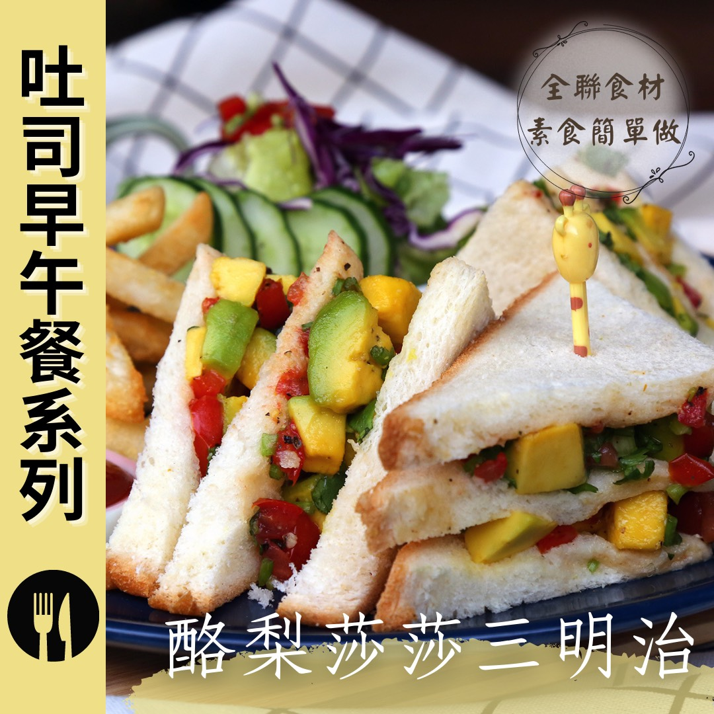

# 酪梨莎莎三明治 無奶蛋料理​ ​

## 📋 基本資訊 / Recipe Overview
- **料理名稱**：酪梨莎莎三明治 無奶蛋料理​ ​
- **原始標題**：酪梨莎莎三明治｜無奶蛋料理​ ​
- **素食流派 / Diet**：全素 Vegan
- **來源平台 / Source**：[觀音山 · 素食料理簡單做](https://vegan.gys.org.tw/avocado-salsa-sandwich20210906/)

## 📖 食譜圖文詳情 (中英雙語對照)

【觀音山素食料理簡單做】於9/6-9/10推出一周限定，用全聯食材 素食簡單做·吐司早午餐系列食譜，讓你在家也能輕鬆做出素食早午餐！疫情改變了我們飲食和採購習慣，在家吃早餐，預先規劃好食材一次購足，本系列食譜，所有食材皆可在全聯福利中心購得，跟著觀音山主廚，一起在家輕鬆做出美味早午餐吧！​
​
第一道食譜-酪梨莎莎三明治，鬆軟的吐司配上清爽微酸的莎莎醬，檸檬清新搭配酪梨的扎實的口感，喚起美好活力的一天！酪梨優質的好「脂肪」加上超過20種營養素，搭配曾被《TIME》評選為十大優質食物的番茄，豐富的茄紅素、β-胡蘿蔔素，美味營養輕鬆上手！​
​
◎食材及佐料〔Ingredients〕：(3人份)​
▪️酪梨、番茄 各1顆​
▪️香菜 30克​
▪️吐司 9片​
▪️糖、鹽、檸檬汁 適量​
▪️無蛋美乃滋、黑胡椒粒 適量​
▪️橄欖油 20C.C ​ ​
​
◎烹飪步驟：​
【刀工/前處理】​
1. 酪梨取果肉，切成0.8公分丁。​
2. 番茄去籽，切0.5公分丁。​
3. 香菜切末。​
​
【調理作法】​
1.取一乾淨容器，倒入酪梨、番茄、香菜末、檸檬汁、黑胡椒粒、橄欖油，適量的糖、鹽。攪拌均勻，冷藏靜置10分鐘。​
2.三片吐司均勻抹上美乃滋。​
3.依序組合三明治:吐司→酪梨莎莎→吐司→酪梨莎莎→吐司。​
4.依個人喜好，將三明治切成2等份，或4等份，即可享用。​
​
本食譜提供：台中 觀音山蔬食館 主廚 淨雅​
​
✨慈悲的 龍德上師 成立「觀音山蔬食館」提倡健康素食、慈悲護生，以”觀音山素食料理簡單做”的理念，提供多款素食食譜，讓您一學就會！
​
​
★9月7日 禪定勝王佛節日：善惡業增長1百倍​
​
✨殊勝功德增長日✨​
觀音山邀請您於9月7日響應素食、廣修供養、戒殺護生、誦經修法、行持諸種善行，獲福無量。​
​
​
【recipe】​
​
[Make Simple Green Dishes with Guanyinshan] We will launch one week-limit # Brunch- Toast recipes from 9/6 to 9/10. Since the epidemic has been dramatically changing our dietary and purchasing habits. More and more people tend to make a shopping list beforehand and purchase all they need in one shopping to avoid a crowd. We’ve got this to create a series of recipes: All you can get from # PX Mart. ​ Let’s follow the chef of Guanyinshan and cook delicious vegetarian brunch at home!​
​
A sandwich with the filling of creamy avocado combined with the slightly sour salsa, and the freshness of lemon taste, is the best way to boost your energy levels for a beautiful day! Avocado’s rich in good “fat” and more than other 20 kinds of nutrients. Moreover, tomatoes, high in lycopene and β-carotene, once have been selected as the top ten premium food by TIME. This sandwich is packed with flavor and nutrients! ​ ​
​
◎Ingredients : （For 3 people）​
▪️An avocado、A tomato ​
▪️Coriander 30g​
▪️Nine slices of toast ​
▪️Sugar、Salt、Lemon Juice ​ , adequate amount​
▪️Vegan mayonnaise、Black pepper ​ , adequate amount​
▪️Olive oil 20C.C ​ ​
​
◎Instructions: ​
【Cutting/PREP-Ahead】 ​
1. Cube avocado into 0.8 cm. ​
2. Remove the seeds from the tomatoes and cut into 0.5 cm cubes. ​
3. Mince coriander. ​ ​
​
【Directions】 ​
1. Place avocado, tomato, coriander, lemon juice, black pepper, olive oil, appropriate amount of sugar and salt in a clean mixing bowl. Stir evenly, refrigerate and let stand for 10 minutes. ​
2. Spread mayonnaise evenly on three slices of toast. ​
3. Make a sandwich: spread the avocado salad on one slice of toast and add another slice of bread and repeat this step again.​
4. According to your personal preference, cut the sandwich into 2 or 4 servings.​
​
This recipe is provided by Chef Jing Ya, Taichung  Guanyinshan Green Restaurant​
​
​
☆ 觀音山 素食料理簡單做 ☆  ​
Facebook ｜好文按讚
http://www.facebook.com/GYSVegan​
Instagram ｜料理追蹤
http://www.instagram.com/gysvegan/​
Youtube ｜加入訂閱
https://reurl.cc/q8VEqy​
Telegram ｜頻道推薦
https://t.me/GYSVegan​
​
​
—​
歡迎轉載，請註明出處： 觀音山 素食料理簡單做 GYSVegan 素食環保愛地球，健康營養無負擔，慈悲護生一起來~

---
*食譜歸檔時間：2026-08-20 · 來源：觀音山素食料理簡單做 (vegan.gys.org.tw)*