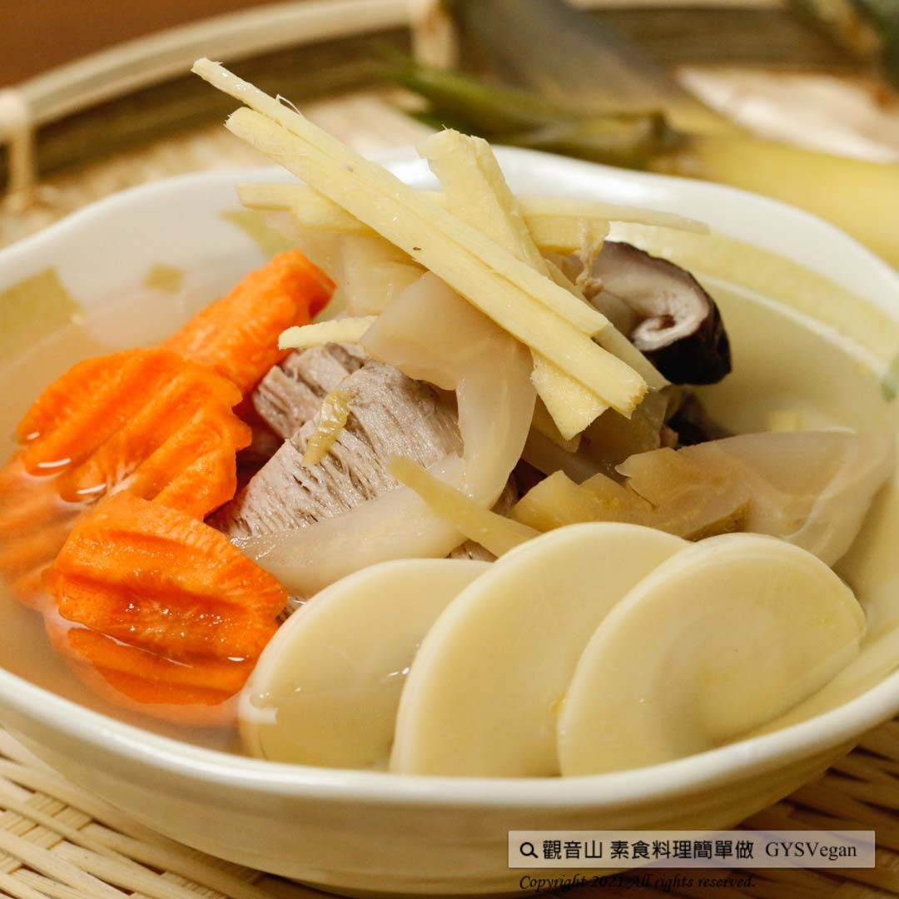

# 酸菜竹筍湯

## 📋 基本資訊 / Recipe Overview
- **料理名稱**：酸菜竹筍湯
- **原始標題**：酸菜竹筍湯｜全素
- **素食流派 / Diet**：全素 Vegan
- **料理分類 / Category**：湯品系列
- **來源平台 / Source**：[觀音山 · 素食料理簡單做](https://vegan.gys.org.tw/bamboo-shoot-soup20210709/)

## 📖 食譜圖文詳情 (中英雙語對照)

夏季筍片清甜鮮脆，搭配酸菜帶出的酸鹹層次感，美味營養又有飽足感，一入口就讓你立即開胃，高纖、低熱量的夏日養生湯品，快跟著觀音山主廚，一起素食料理簡單做吧！​
​
​
?食材及佐料〔Ingredients〕：(5人份)​
▪綠竹筍 ​ 3支​
▪酸菜 ​ 1/2顆​
▪乾香菇 ​ 5朵​
▪素羊若 ​ 60克​
▪紅蘿蔔 ​ 1/2顆​
▪薑絲 ​ 15克​
▪香菇粉、鹽 ​ 適量​
​
?烹飪步驟：​
【刀工/前處理】​
1.將綠竹筍洗淨，去殼切厚片，備用。​
2.酸菜切片。​
3.乾香菇泡熱水後切片。​
4.薑切絲。​
5.紅蘿蔔切厚片。​
​
​
【調理作法】​
1.將酸菜、乾香菇、素羊若、紅蘿蔔、綠竹筍及薑絲放入鍋內並加入適量水，蓋上鍋蓋。​
2.用中大火煮滾後，轉小火再煮約30-40分鐘，放入香菇粉、鹽調味，即可享用！​
​
​
【特別說明】​
1.若時間少，綠竹筍可切薄片，較易熟。​
2.酸菜洗淨泡水10分鐘後，再沖洗一次。​
3.酸菜最後放，可保留酸菜味。​
4.可加入素丸子增加風味。​
​
​
??本食譜提供：台中  觀音山蔬食館 主廚 樂敏​
⭐️慈悲的 龍德上師成立「觀音山蔬食館」提倡健康素食、慈悲護生，以”觀音山素食料理簡單做”的理念，提供多款素食食譜，讓您一學就會！?
​
​
★7月10日-8月8日 明淨月：善惡業一千萬倍增長​
​
✨殊勝功德增長日✨​
觀音山邀請您於7月10日-8月8日期間響應素食、廣修供養、戒殺護生、誦經修法、行持諸種善行，獲福無量。​
​
​
【recipe】​
​
? Summer bamboo shoots are sweet and crisp. ​ Cook them with the sour and salty sauerkraut can provide a multiple sensational taste. This soup is appetizing, delicious, nutritious and with high satisaty. ​ Quickly follow the chef of Guanyinshan. Let’s cook this high-fiber, low-calorie summer health soup together. ​
​
?Cooking Instructions: ​
【Cutting/PRE- Ahead】 ​
1. Wash Oldham bamboo shoots, remove the shells and cut into thick slices, and set aside. ​
2. Slice Sauerkraut. ​
3. Soak dried shiitake mushrooms in hot water and slice them. ​
4. Shred ginger. ​
5. Cut the carrot into thick slices. ​
​
【Cooking Steps】 ​
1. Put sauerkraut, dried shiitake mushrooms, vegetarian mutton, carrots, Oldham bamboo shoots and shredded ginger into the wok, add appropriate amount of water, and cover ​ and bring to a boil.​
2. After boiling over medium-high heat, turn to low heat and cook for about 30-40 minutes. Seasoning with shiitake mushroom powder and salt. It’s done! ​
​
【Special Notes】 ​
1. If you’re pressed for time, cut Oldham bamboo shoots into thin slices, which shorten the time to cook thoroughly. ​
2. Wash sauerkraut and soak in water for 10 minutes, and then rinse again. ​
3. Put the sauerkraut at last to retain the taste of sauerkraut. ​
4. Vegetarian meatballs can be added to increase the flavor. ​
​
??This recipe is provided byprovides: Chef Le Min, Taichung # Guanyinshan Green Restaurant​
​
​
? 觀音山 素食料理簡單做 Follow us ?​
Facebook ｜好文按讚
http://www.facebook.com/GYSVegan​
Instagram ｜料理追蹤
http://www.instagram.com/gysvegan/​
Youtube ​ ​ ​ ｜加入訂閱
https://reurl.cc/q8VEqy​
Telegram ​ ｜頻道推薦
https://t.me/GYSVegan​
​
​
? 歡迎轉載，請註明出處： ​ ​ 觀音山 素食料理簡單做 GYSVegan 素食環保愛地球，健康營養無負擔，慈悲護生一起來~?

---
*食譜歸檔時間：2026-08-20 · 來源：觀音山素食料理簡單做 (vegan.gys.org.tw)*