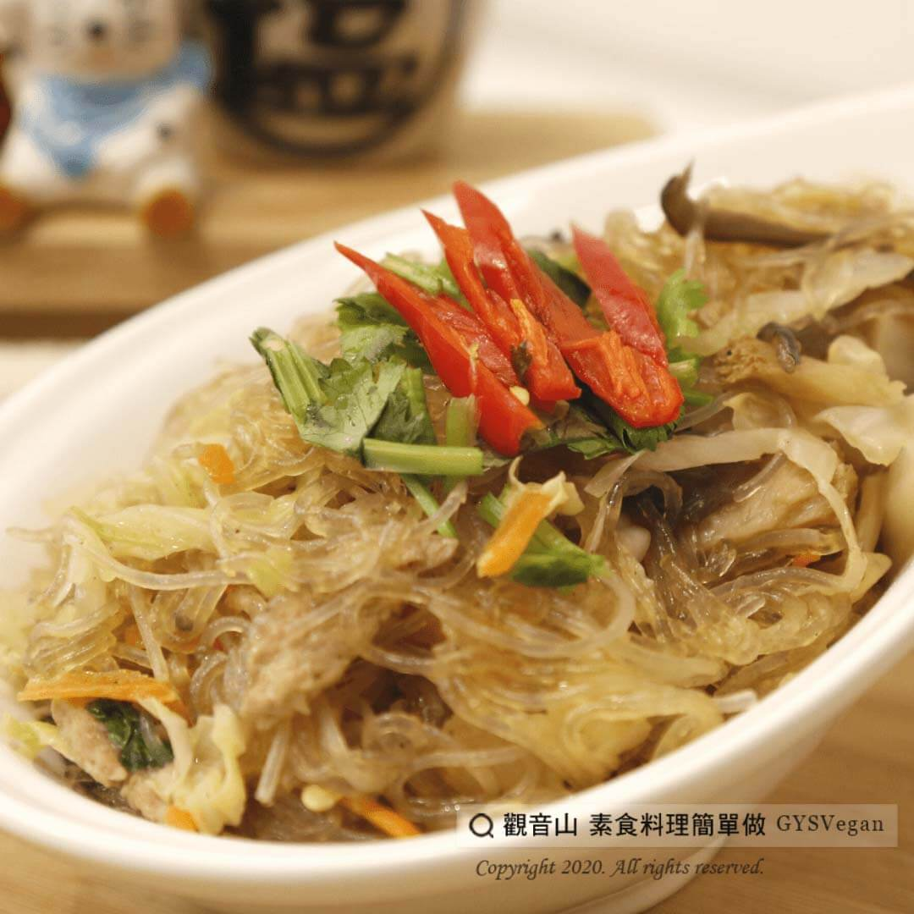

# 金玉冬粉

## 📋 基本資訊 / Recipe Overview
- **料理名稱**：金玉冬粉
- **原始標題**：金玉冬粉｜全素
- **素食流派 / Diet**：全素 Vegan
- **來源平台 / Source**：[觀音山 · 素食料理簡單做](https://vegan.gys.org.tw/%e9%87%91%e7%8e%89%e5%86%ac%e7%b2%89%ef%bd%9c%e5%85%a8%e7%b4%a0/)

## 📖 食譜圖文詳情 (中英雙語對照)

觀音山蔬食團主廚提供這道透著金黃色澤的『金玉冬粉』?，以冬粉Q彈滑膩的口感，搭配豐富新鮮的蔬菜食材?，每一口都富含著微微清甜的湯汁，單吃和配飯都很適合呢！?​
悶熱的天氣，和家人一起來試看看這道清爽冬粉製作的美味佳餚吧~?​
​
?準備食材與佐料：(4人份)​
冬粉3把、紅蘿蔔30g、乾香菇2-3朵、黑木耳40g、高麗菜適量、芹菜1大支、杏鮑菇1支、醬油1小匙、沙茶10g、鹽適量、味素適量、糖適量。​
​
?#素食料理簡單做，開始：​
1. 香菇泡軟切細絲；高麗菜切細；紅蘿蔔切細；杏鮑菇切細絲；芹菜切段；黑木耳切細；冬粉泡軟，備用。​
2. 將香菇、杏鮑菇、紅蘿蔔、黑木耳、高麗菜入鍋拌炒，加入水、醬油、沙茶、鹽、味素、糖進行調味，再放入芹菜拌炒均勻。​
3. 待食材熟後，再加入冬粉吸收湯汁，待冬粉充分飽滿後，試味道略做調味，即可盛盤。​
​
這道簡單又美味的料理就完成了~?​
​
☀️特別說明：​
由於冬粉非常吸水，烹飪過程水需要加多一點，待冬粉充分飽滿表示已經入味了喔。​
​
?‍?本食譜提供：高雄 #觀音山蔬食團 主廚 明玲​
​
✨慈悲的 龍德上師成立「觀音山蔬食館」提倡健康素食、慈悲護生，以”觀音山素食料理簡單做”的理念，提供多款素食食譜，讓您一學就會！?​
​
​
?觀音山 素食料理簡單做 ​ Follow us?​
Facebook ｜好文按讚
http://www.facebook.com/GYSVegan​
Instagram ｜料理追蹤
http://www.instagram.com/gysvegan/​
Youtube ​ ​ ​ ｜加入訂閱
https://reurl.cc/q8VEqy​
Telegram ​ ｜頻道推薦
https://t.me/GYSVegan​
​
​
? 歡迎轉載，請註明出處： ​ ​ 觀音山 素食料理簡單做GYSVegan按讚、留言設定搶先看! 素食環保愛地球，健康營養無負擔，慈悲護生一起來~?

---
*食譜歸檔時間：2026-08-20 · 來源：觀音山素食料理簡單做 (vegan.gys.org.tw)*