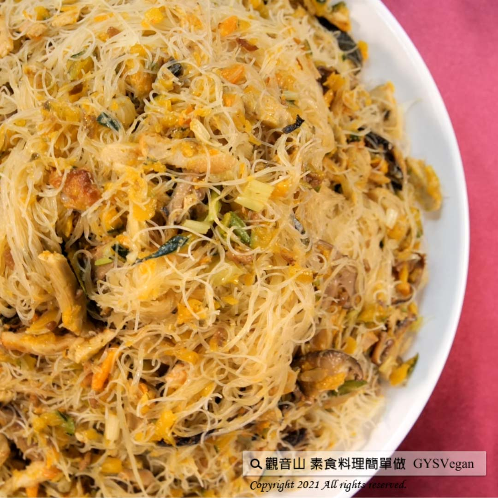

# 金瓜米粉

## 📋 基本資訊 / Recipe Overview
- **料理名稱**：金瓜米粉
- **原始標題**：金瓜米粉｜全素
- **素食流派 / Diet**：全素 Vegan
- **料理分類 / Category**：主食種類 / 米麵主食 (Staple Food)
- **來源平台 / Source**：[觀音山 · 素食料理簡單做](https://vegan.gys.org.tw/rice-flour20210514/)

## 📖 食譜圖文詳情 (中英雙語對照)

金黃色的金瓜具有獨特的瓜果香氣，口感綿密濃郁，具有抗化的保健功能，配合Q彈帶勁的米粉，加上豐富的配料，絕對是一道健康滿分的料理，快跟著觀音山主廚，一起素食料理簡單做吧！​
​
​
?食材及佐料〔Ingredients〕：(5人份)​
▪米粉 ​ 600克​
▪生香菇、黑木耳 ​ 100克​
▪素料、豆干 ​ 100克​
▪南瓜 ​ 500克​
▪芹菜 ​ 少許​
▪醬油、白胡椒粉 ​ 少許​
▪鹽、味精 ​ 2小匙​
▪糖 ​ 2大匙​
​
?烹飪步驟：​
【刀工/前處理】​
1.生香菇、黑木耳、素料、豆干， 洗淨後切條狀。​
2.南瓜刨成粗絲狀，不能太細，否則煮的時候容易散成南瓜泥。​
3.芹菜切珠。​
4.米粉泡水，泡軟後瀝乾。​
​
【調理作法】​
1.熱鍋下油，油量須夠多，才能充分爆炒食材。​
2.在另一個爐上，備一鍋水，煮至燒開，備用。​
3.在鍋中加入生香菇、黑木耳、素料、豆干，翻炒至表面酥脆。​
4.加入南瓜炒到熟，加入調味料(鹽3小匙、味精2小匙)稍微炒至入味，將燒開的水倒入鍋中，水的高度稍微低於食材高度，再加入2大匙糖、少許醬油。​
5.加入米粉，拌勻後再加少許白胡椒粉，試味道若可以，蓋上鍋蓋轉小火稍微悶一下收湯汁。​
6.打開鍋蓋放入芹菜珠拌勻，若湯汁已收乾則可關火，蓋上鍋蓋悶5分鐘; 若湯汁未收乾，則蓋上鍋蓋，煮至快收乾後關火，悶5分鐘後打開鍋蓋。​
7.起鍋，擺盤完成！​
​
【特別說明】​
1.糖的量必須放夠, 否則南瓜吃起來會澀。​
2.倒入鍋中的燒開的水量不能太多, 否則米粉會太濕。​
3.湯汁收乾時, 鍋蓋絕對不能馬上開, 要至少悶個5分鐘。​
4.素料可依個人喜好變化。​
​
??本食譜提供：澎湖 ​  觀音山蔬食館 主廚 明赫​
⭐️慈悲的 龍德上師成立「觀音山蔬食館」提倡健康素食、慈悲護生，以”觀音山素食料理簡單做”的理念，提供多款素食食譜，讓您一學就會！?
​
​【recipe】​
? Golden yellow pumpkins have a unique melon and fruit aroma, a dense and rich taste, and high in antioxidant. This springy and soft rice noodles with abundant ingredients definitely makes a healthy and perfect dish. Quickly follow the chef of Guanyinshan. Let’s cook vegetarian dishes together!
?Cooking Steps：​
【Cutting/PRE AHEAD】
1. Shred shiitake mushrooms, black fungus, vegetarian materials, and dried bean curd after washing.
2. Grate the pumpkin into thick stripes, not too thin, otherwise it will become pumpkin puree easily while cooking.
3. Dice the celery stalk finely.
4. Soak the rice noodles in water & drain after they turn soft.
【Cooking instructions】
1. Preheat the pan, and pour right amount of oil to fully sautee all the ingredients.
2. On another stove, prepare a pot of boiled water for later use.
3. Add shiitake mushrooms, black fungus, vegetarian ingredients, dried bean curd to a wok, and stir fry until the surface is slightly crispy.
4. Add pumpkin and stir fry until well-done; season to taste (3 tsp salt, 2 tsp gourmet powder) and stir-fry. Pour boiling water into the wok, and then add 2 large spoon of sugar and a little soy sauce. (The amount of the water is slightly lower than the height of the ingredients.)
5. Add the soften rice noodles; mix well with the ingredients and then add a little white pepper. Try if there’s enough seasonings. Cover the wok and turn to low heat for simmering until the broth gets thick.
6. Open the lid and add the fine chopped celery and mix well. If the broth has dried up at the right consistency, turn off the heat and cover the pot for 5 minutes; if not, cover the pot and extend cooking time until it is almost dry. Turn off the heat and open the lid 5 minutes after.
7. Dish up and the pumpkin rice noodles is complete!
【Special Notes】
1. The amount of sugar must be enough, otherwise the pumpkin will taste astringent
2. The amount of boiled water poured into the wok should not be too much, otherwise the rice noodles will be too wet & too soft.
3. When the broth is dry, cover the wok to keep the heat in for at least 5 minutes for melding the flavors.
4. Vegetarian ingredients can be varied according to personal preference.
??This recipe is provided by Chef Ming He, Penghu #Guanyinshan Green Restaurant.
​
​
? 觀音山 素食料理簡單做 Follow us ?
Facebook ｜好文按讚
http://www.facebook.com/GYSVegan​
Instagram ｜料理追蹤
http://www.instagram.com/gysvegan/​
Youtube ​ ​ ​ ｜加入訂閱
https://reurl.cc/q8VEqy​
Telegram ​ ｜頻道推薦
https://t.me/GYSVegan​
​
​
? 歡迎轉載，請註明出處： ​ ​ 觀音山 素食料理簡單做 GYSVegan 素食環保愛地球，健康營養無負擔，慈悲護生一起來~?

---
*食譜歸檔時間：2026-08-20 · 來源：觀音山素食料理簡單做 (vegan.gys.org.tw)*