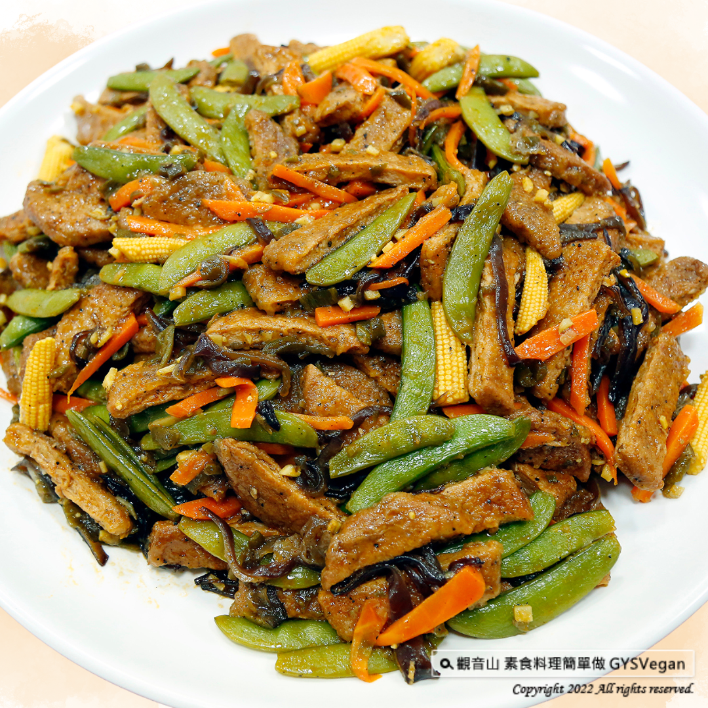

# 鐵板G柳

## 📋 基本資訊 / Recipe Overview
- **料理名稱**：鐵板G柳
- **原始標題**：家常料理｜鐵板G柳｜全素
- **素食流派 / Diet**：全素 Vegan
- **來源平台 / Source**：[觀音山 · 素食料理簡單做](https://vegan.gys.org.tw/http-bit-ly-3gqxxu20221125/)

## 📖 食譜圖文詳情 (中英雙語對照)

熱騰騰的快炒料理，黑木耳、玉米筍、紅蘿蔔等色彩鮮艷的配料、吸滿湯汁的G柳，配上一碗白飯，讓全家人吃的很滿足，湯汁帶有甜味讓人胃口大開，必學色香味俱全的家常料理，快跟著觀音山主廚，一起素食料理簡單做吧！
​
❒食材及佐料〔Ingredients〕：(3人份)
▪️黑胡椒素排 ​ 5片 ​ ​ ​ ​
▪️甜豆 ​ 適量
▪️黑木耳、紅蘿蔔 ​ 各50克
▪️玉米筍 ​ 3條
▪️剝皮辣椒、薑 ​ 少許
▪️香菇素蠔油、蕃茄醬、糖、鹽 ​ 適量
▪️黑胡椒粒、剝皮辣椒罐頭湯汁 ​ 適量
​
❒烹飪步驟：
【刀工/前處理】
1.紅蘿蔔削皮後切條。
2.黑木耳切條。
3.薑、剝皮辣椒切末。
4.玉米筍切斜刀。
5.素排炸好後1切4。
​
​
【調理作法】
1.甜豆:用少許油、鹽，燙好備用。
2.熱鍋下油，放入薑末爆香，加入玉米筍、紅蘿蔔條、黑木耳絲，稍微拌炒，放入素蠔油、蕃茄醬、剝皮辣椒及其湯汁少許，加一點水使其有湯汁，再放少許糖(偏糖醋口味) ，試到個人喜好覺得可以，再放入素排，待湯汁收乾，放入甜豆及黑胡椒粒，即可起鍋，擺盤享用!
​
本食譜提供：澎湖觀音山蔬食館
​
​
✼慈悲的龍德上師 成立「觀音山蔬食館」提倡健康素食、慈悲護生，以”觀音山素食料理簡單做”的理念，提供多款素食食譜，讓您一學就會！
​
觀音山相關連結
➠
https://www.fazang.org/link/
​
​
▌觀音山近期活動 ▌
12月10日 阿彌陀佛聖
誕 薈供法會
①登記「除障祿位」、「超薦蓮位」
►
http://bit.ly/3GQXXu2
②護持「薈供供品」供養三寶·愛心公益
►
http://bit.ly/3AJ4qU5
​
​
—
♛歡迎轉載，請註明出處： #觀音山素食料理簡單做 GYSVegan 素食環保愛地球，健康營養無負擔，慈悲護生一起來~[/vc_column_text]
[/vc_column][/vc_row]

---
*食譜歸檔時間：2026-08-20 · 來源：觀音山素食料理簡單做 (vegan.gys.org.tw)*