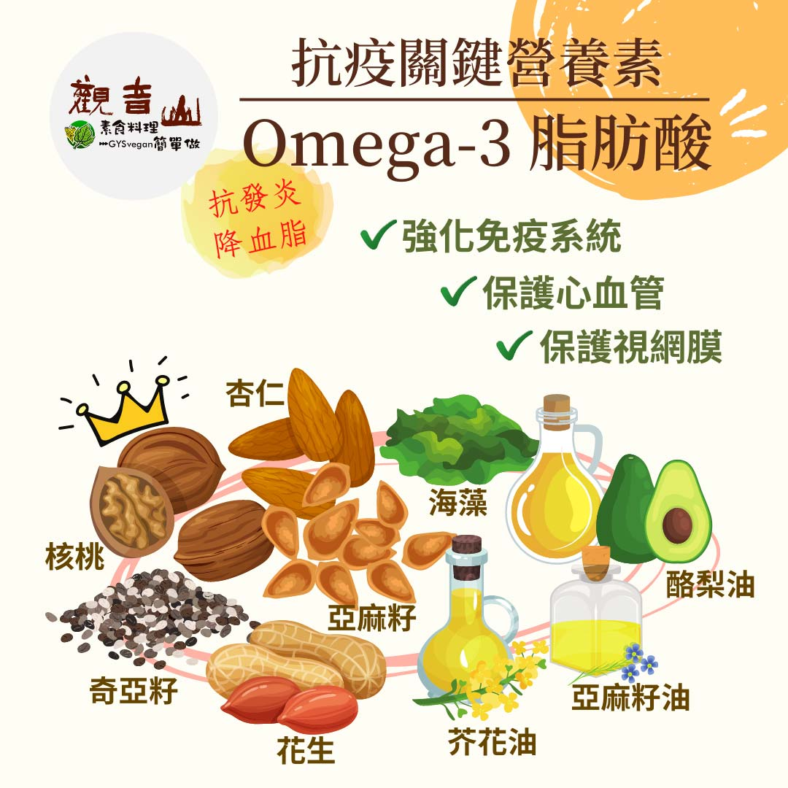

# 防疫營養素 ​- Omega-3 脂肪酸

## 📋 基本資訊 / Recipe Overview
- **料理名稱**：防疫營養素 ​- Omega-3 脂肪酸
- **原始標題**：防疫營養素 ​- Omega-3 脂肪酸
- **素食流派 / Diet**：全素 Vegan
- **來源平台 / Source**：[觀音山 · 素食料理簡單做](https://vegan.gys.org.tw/omega-320210627/)

## 📖 食譜圖文詳情 (中英雙語對照)

防疫新生活｜抗疫關鍵-必備營養素​
​
▎注意身體發出的警訊​
疫情期間許多人在家工作 、上課，飲食不規律、作息不正常，這些不良的習慣，容易讓身體處在一個慢性發炎的狀態，如感冒、皮膚發癢等感染症狀反覆難好，這些都是身體發出的求救訊號，除了要保持適量的運動?‍♂、植物性飲食、各色蔬果均衡攝取之外，Omega-3 脂肪酸的攝取，可以降低⬇ 身體發炎的程度，亦能預防慢性病的發生。​
​
▎關鍵營養素：Omega-3 脂肪酸​
Omega-3 脂肪酸是一種? 多元不飽和脂肪酸，⭐ 是人體的必須脂肪酸，但人體無法自行合成，因此必須從食物中獲取，主要的Omega-3 脂肪酸可以分成以下四種：α-亞麻酸(ALA)、二十碳五烯酸（EPA）、二十二碳五烯酸（DPA）、二十二碳六烯酸（DHA）其中ALA只存在植物中，經過人體的轉化，可以產生後面三種Omega-3 脂肪酸。​
​
植物性飲食所攝取的Omega-3 脂肪酸，除了抑制發炎反應，亦有研究發現，可降低?三酸甘油脂、預防心臟病發作、減少眼睛?方面的疾病，可以說是人體非常重要的營養素。推薦富含Omega-3 脂肪酸食材有：亞麻籽、核桃、小麥胚芽、奇亞籽、芥花油、亞麻籽油、海藻、海苔。​
​
在選食用油時，首先應該選擇植物性油品，並依油品的特性來搭配烹飪方式，推薦可以使用酪梨油、玄米油、芥花油，適合台灣高溫的煎炒炸等方式；而在吃生菜沙拉?時則可以搭配亞麻籽油等低溫油品，輕鬆攝取脂肪酸，讓營養不流失。​
​
觀音山素食料理簡單做​
推薦 Omega3脂肪酸 料理食譜 ​
​
​
⭐花生芝麻素小魚乾​
https://reurl.cc/Nr4m4x​
​⭐蜜糖杏仁小于乾​
https://reurl.cc/YOVrVx​
​⭐胡麻天貝酪梨沙拉​
https://reurl.cc/Ak4e4E​
★6月27日 觀音日：善惡業 1000萬倍增長
✨殊勝功德增長日✨
觀音山邀請您於今日響應素食、廣修供養、戒殺護生、誦經修法、行持諸種善行，獲福無量。
⭐️慈悲的 龍德上師成立「觀音山蔬食館」提倡健康素食、慈悲護生，以”觀音山素食料理簡單做”的理念，提供多款素食食譜，讓您一學就會！?
?​ 觀音山素食料理簡單做 ​ Follow us​ ?
​
Facebook ｜好文按讚 ➤
http://www.facebook.com/GYSVegan​
Instagram ｜料理追蹤 ➤
http://www.instagram.com/gysvegan/​
Youtube ​ ​ ​ ｜加入訂閱 ➤
https://reurl.cc/q8VEqy
​
官方Blog ​ ｜網站推薦 ➤
https://vegan.gys.org.tw/​
​
—​
? 歡迎轉載，請註明出處： # 觀音山素食料理簡單做 GYSVegan 素食環保愛地球，健康營養無負擔，慈悲護生一起來~?

---
*食譜歸檔時間：2026-08-20 · 來源：觀音山素食料理簡單做 (vegan.gys.org.tw)*