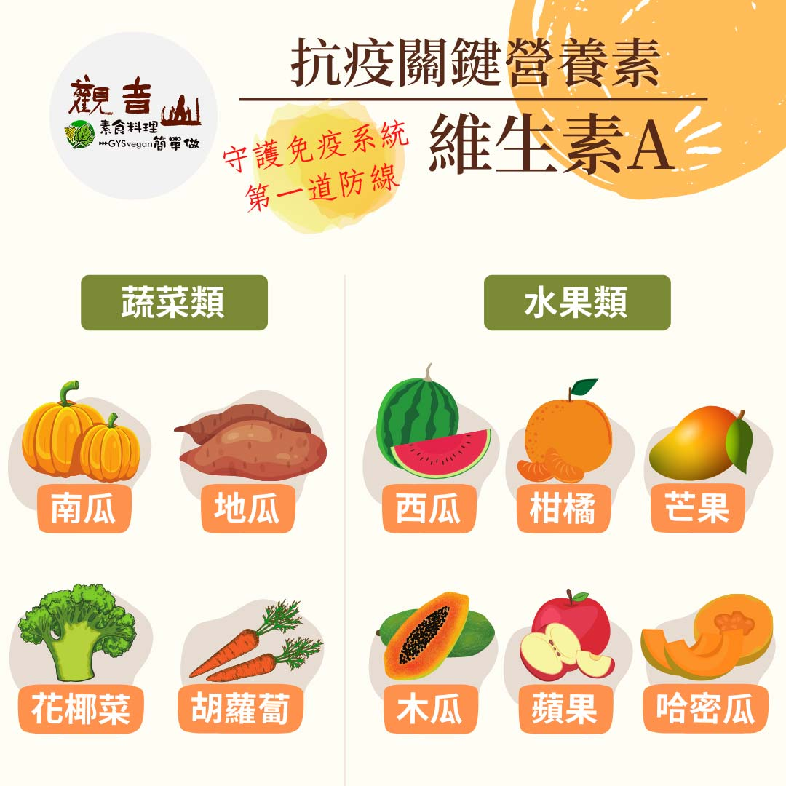

# 防疫營養素 ​- 維生素 A​

## 📋 基本資訊 / Recipe Overview
- **料理名稱**：防疫營養素 ​- 維生素 A​
- **原始標題**：防疫營養素 ​- 維生素 A​
- **素食流派 / Diet**：全素 Vegan
- **來源平台 / Source**：[觀音山 · 素食料理簡單做](https://vegan.gys.org.tw/vitamin-a20210620/)

## 📖 食譜圖文詳情 (中英雙語對照)

防疫新生活｜抗疫關鍵-必備營養素​
​
▎在家輕鬆煮，素食料理簡單做​
疫情期間無論是在家工作整天打電腦?、學生視訊遠端上課、還是緊盯手機關心即時新聞，防疫假在家多數人每天都長時間使用3C產品，容易造成眼睛乾澀、夜間視力退化、視力模糊，讓眼睛不適的人越來越多，建議你適時從天然的食材補充維生素A，? 提升眼睛防護力，跟著觀音山素食料理簡單做，讓你輕鬆照顧全家人的健康。​
​
▎關鍵營養素：維生素A​
維生素A又稱為維他命A，屬於脂溶性維生素，一般人在正常飲食的習慣下，不會缺乏維生素A，大多數人比較容易發生攝取過量⬆ 的問題。​
​
維生素A攝取來源可分為兩大類，一為動物性來源，攝取過量會導致嘔吐、頭痛、頭暈、視力模糊的症狀；另外一類為植物性食物來源，經由人體代謝後，轉化為維生素A，其中以β胡蘿蔔素轉化效率最高，攝取過量身體會自動調節，因此從植物性食物來源獲得維生素A，是最安全的攝取方式。​
​
維生素A對於維持視力、呼吸道、生殖及免疫系統很重要，人體缺乏時會產生夜盲症、乾眼症、皮膚乾燥症；蔬菜類有地瓜?、油菜、綠花椰菜?、胡蘿蔔?、南瓜等，水果類有芒果?、木瓜、哈密瓜、柑橘?、西瓜?、蘋果?；建議烹煮過程加入少許油，讓吸收率更加分。​
​
觀音山素食料理簡單做​
推薦  維生素A 料理食譜 ​
​
⭐豆包地瓜煎餅​
https://reurl.cc/Q9X25p​
​⭐焗烤南瓜​
https://reurl.cc/eEDpGW​
​⭐芒果西米露​
https://reurl.cc/dGD8Gz​
⭐️慈悲的 龍德上師成立「觀音山蔬食館」提倡健康素食、慈悲護生，以”觀音山素食料理簡單做”的理念，提供多款素食食譜，讓您一學就會！?
?​ 觀音山素食料理簡單做 ​ Follow us​ ?
​
Facebook ｜好文按讚 ➤
http://www.facebook.com/GYSVegan​
Instagram ｜料理追蹤 ➤
http://www.instagram.com/gysvegan/​
Youtube ​ ​ ​ ｜加入訂閱 ➤
https://reurl.cc/q8VEqy
​
官方Blog ​ ｜網站推薦 ➤
https://vegan.gys.org.tw/​
​
​
—​
?歡迎轉載，請註明出處： # 觀音山素食料理簡單做 GYSVegan 素食環保愛地球，健康營養無負擔，慈悲護生一起來~?

---
*食譜歸檔時間：2026-08-20 · 來源：觀音山素食料理簡單做 (vegan.gys.org.tw)*