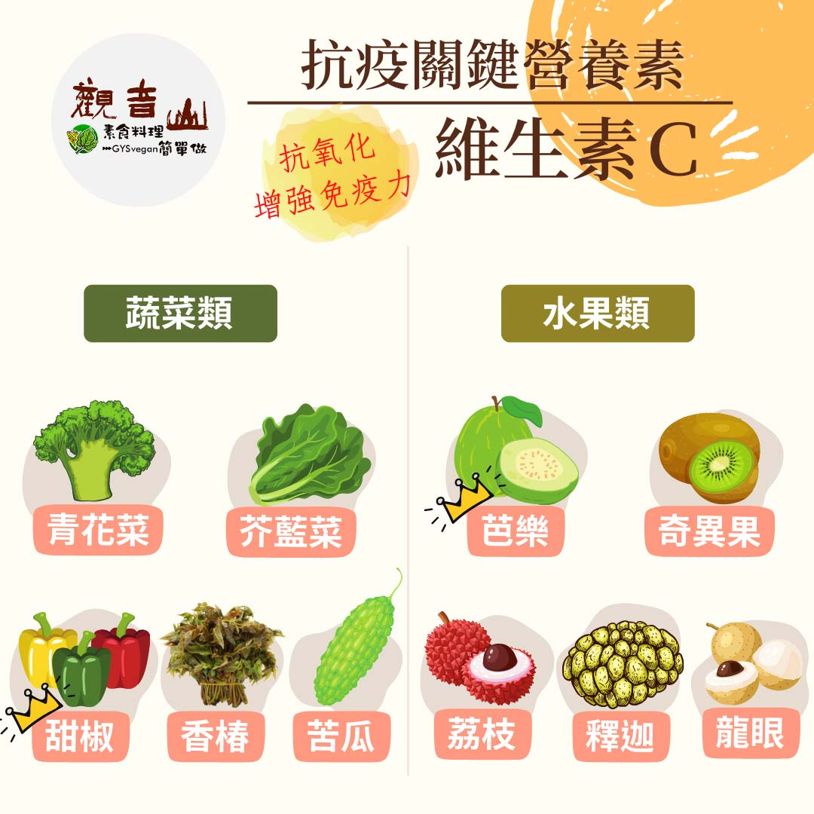

# 防疫營養素 ​- 維生素 C​

## 📋 基本資訊 / Recipe Overview
- **料理名稱**：防疫營養素 ​- 維生素 C​
- **原始標題**：防疫營養素 ​- 維生素 C​
- **素食流派 / Diet**：全素 Vegan
- **來源平台 / Source**：[觀音山 · 素食料理簡單做](https://vegan.gys.org.tw/vitamin-c%e2%80%8b20210704/)

## 📖 食譜圖文詳情 (中英雙語對照)

防疫新生活｜抗疫關鍵-必備營養素​
​
現代人生活匆忙，常忽略自身及家人的身體健康，認為飲食很難均衡，希望靠補充維他命產品來補充缺乏的營養素，其實許多營養、藥劑專家都強調，飲食均衡才是根本之道，從天然的蔬菜、水果中攝取人體所需，學習對身體無負擔的蔬食生活，強化免疫力。​
​
▎關鍵營養素：維生素C​
維生素C (維他命C)，屬於水溶性維生素，身體必須的營養素之一，人體無法自行製造，須由食物中攝取，維生素C以抗氧化聞名，對於免疫系統功能很重要，還兼具減少身體發炎、有益心血管健康❤、預防病毒細菌感染等功效。​
​
維生素 C 在人體的免疫力也扮演著重要的角色，攝取足量維他命 C 能夠幫助免疫系統的巨噬細胞及 T 細胞正常執行，增加對抗外來病菌的能力。多攝取富含維生素C的蔬果，蔬菜類富含維生素C的食材有香椿、青花菜?、甜椒類、苦瓜類、芥藍菜，水果類有芭樂、釋迦、奇異果?、龍眼、荔枝等。​
​
⭐ TIPS:如何吃才正確呢？​
人工添加物以及油炸物少吃，這會讓身體快速消耗維生素C；蔬菜盡量以蒸煮為主，可避免高溫讓維生素Ｃ散失。​
​
​
觀音山素食料理簡單做​
推薦 維生素C 料理食譜 ​
​
⭐香椿素燥
https://reurl.cc/MA3lYL​
⭐ 彩椒素干貝
https://reurl.cc/qgGEan​
⭐梅干苦瓜
https://reurl.cc/ZG4mE3​
​
​
★7月4日 空行母薈供日：善惡業10萬倍增長​
​
✨殊勝功德增長日✨​
觀音山邀請您於今日響應素食、廣修供養、戒殺護生、誦經修法、行持諸種善行，獲福無量。​
⭐️慈悲的 龍德上師成立「觀音山蔬食館」提倡健康素食、慈悲護生，以”觀音山素食料理簡單做”的理念，提供多款素食食譜，讓您一學就會！?
​
​
? 觀音山素食料理簡單做 ​ Follow us ?
​
Facebook ｜好文按讚 ➤
http://www.facebook.com/GYSVegan​
Instagram ｜料理追蹤 ➤
http://www.instagram.com/gysvegan/​
Youtube ​ ​ ​ ｜加入訂閱 ➤
https://reurl.cc/q8VEqy
​
官方Blog ​ ｜網站推薦 ➤
https://vegan.gys.org.tw/​
​
​
—​
? 歡迎轉載，請註明出處： # 觀音山素食料理簡單做 GYSVegan 素食環保愛地球，健康營養無負擔，慈悲護生一起來~?

---
*食譜歸檔時間：2026-08-20 · 來源：觀音山素食料理簡單做 (vegan.gys.org.tw)*