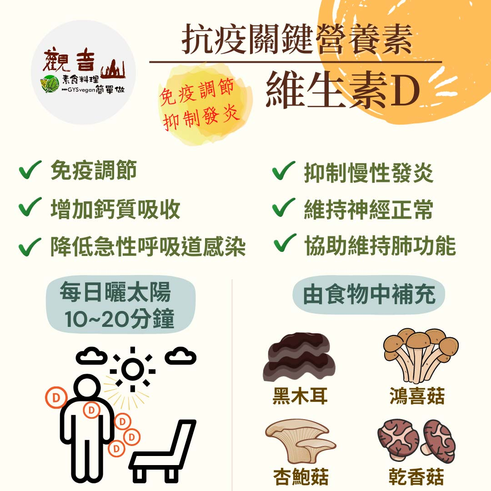

# 防疫營養素 ​- 維生素D​

## 📋 基本資訊 / Recipe Overview
- **料理名稱**：防疫營養素 ​- 維生素D​
- **原始標題**：防疫營養素 ​- 維生素D​
- **素食流派 / Diet**：全素 Vegan
- **來源平台 / Source**：[觀音山 · 素食料理簡單做](https://vegan.gys.org.tw/vitamin-d%e2%80%8b20210718/)

## 📖 食譜圖文詳情 (中英雙語對照)

防疫新生活｜抗疫關鍵-必備營養素​
現今許多的研究，探討維生素、礦物質對於新冠肺炎的預防或治療，都有正面的報告，可以確定的是，均衡飲食並盡量吃「原型食物」，選擇植物性飲食就能補足人體所需的礦物質及維生素，對於提升免疫力有非常大的幫助。​
​
▎關鍵營養素：維生素D​
歐洲食品安全局 (EFSA)認為，維生素D對於免疫系統的正常功能非常重要，維生素D對於侵入性細菌感染具有防禦的關鍵作用，並刺激肺部產生抗細菌及病毒的蛋白質，透過讓身體抵抗病毒的外來屏障更加堅固，顯著降低急性呼吸道感染⬇，如感冒、胸腔感染等風險。​
​
補充維生素D可透過曬太陽☀以及食物方面補充，建議一天10到20分鐘，讓陽光中的UVB光幫助體內合成，但是隔著窗戶是沒有效果的，因為UVB無法穿透玻璃；食材方面可以從黑木耳、乾香菇、杏鮑菇、鴻喜菇、猴頭菇等蕈菇類來攝取，日常注重營養素的攝取，打造防護基礎，才是最佳的保身之道。​
​
​
觀音山素食料理簡單做​
推薦  維生素D 料理食譜 ​
​
⭐宮保杏鮑菇​
https://reurl.cc/5r36EV
​
​⭐迷迭草佐香煎杏鮑菇​
https://reurl.cc/Enm3mg​
​⭐ 八珍猴頭菇麵線 ​
https://reurl.cc/KA2mq9
​
​
​
★7月19日 「明淨月．蓮師薈供日」：善惡業增長1000萬x10萬倍​
​
✨殊勝功德增長日✨​
觀音山邀請您於7月19日 響應素食、廣修供養、戒殺護生、誦經修法、行持諸種善行，獲福無量。​
​⭐️慈悲的 龍德上師成立「觀音山蔬食館」提倡健康素食、慈悲護生，以”觀音山素食料理簡單做”的理念，提供多款素食食譜，讓您一學就會！?
? 觀音山素食料理簡單做 ​ Follow us ​?
​
Facebook ｜好文按讚 ➤
http://www.facebook.com/GYSVegan​
Instagram ｜料理追蹤 ➤
http://www.instagram.com/gysvegan/​
Youtube ​ ​ ​ ｜加入訂閱 ➤
https://reurl.cc/q8VEqy​
官方Blog ​ ｜網站推薦 ➤
https://vegan.gys.org.tw/​
​
​
—​
? 歡迎轉載，請註明出處： # 觀音山素食料理簡單做 GYSVegan 素食環保愛地球，健康營養無負擔，慈悲護生一起來~?

---
*食譜歸檔時間：2026-08-20 · 來源：觀音山素食料理簡單做 (vegan.gys.org.tw)*