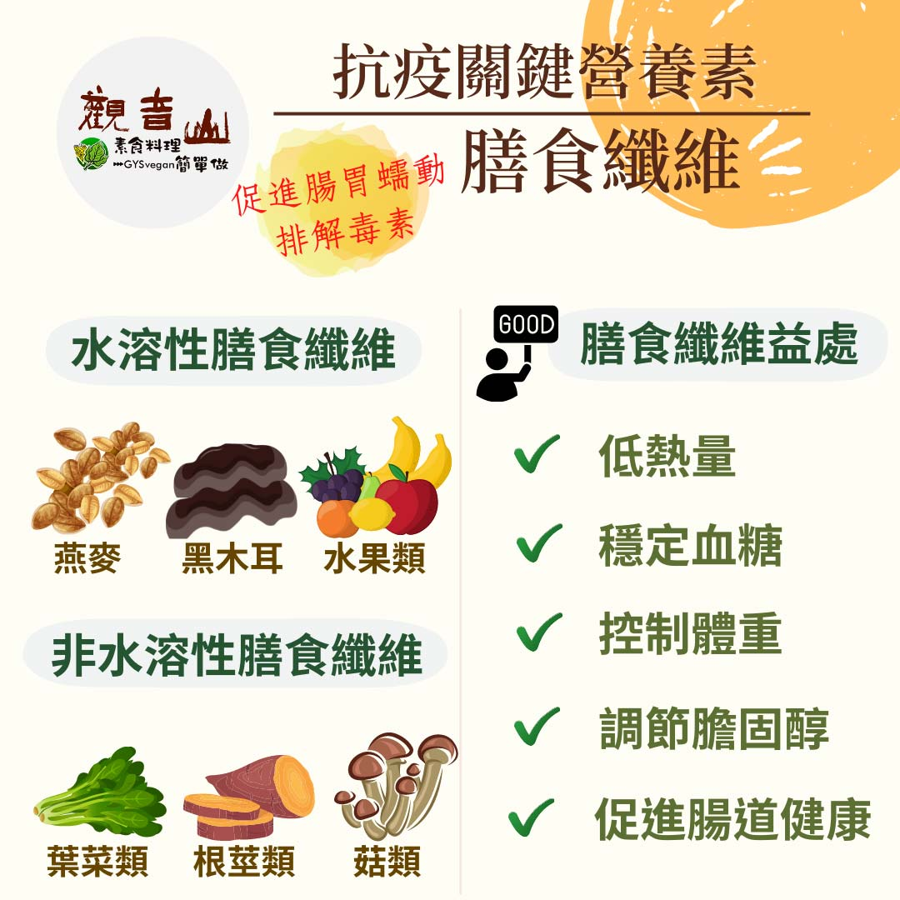

# 防疫營養素 ​- 膳食纖維

## 📋 基本資訊 / Recipe Overview
- **料理名稱**：防疫營養素 ​- 膳食纖維
- **原始標題**：防疫營養素 ​- 膳食纖維
- **素食流派 / Diet**：全素 Vegan
- **來源平台 / Source**：[觀音山 · 素食料理簡單做](https://vegan.gys.org.tw/dietary-fiber20210711/)

## 📖 食譜圖文詳情 (中英雙語對照)

防疫新生活｜抗疫關鍵-必備營養素​
疫情緊張，大家的心惶惶不安，讓我們以天然食物的力量，來安定身心，許多醫師、營養師紛紛提倡健康的蔬食生活，其實不論以健康、環保、地球暖化、護生的角度來看，「植物性飲食」才是最佳的選擇，正確的吃素，提升你「內在防疫系統」。​
​
▎關鍵營養素：膳食纖維​
膳食纖維是一種植物性的多醣類，主要分成「水溶性膳食纖維」、「非水溶性膳食纖維」兩種，兩種膳食纖維都對人體有好處，低熱量、可調節膽固醇、穩定血糖、促進腸道健康、控制體重。​
​
膳食纖維的來源並不只有蔬菜，高纖維食材的範圍包含蔬菜、水果以及全穀雜糧類。蔬菜類的來源有花椰菜?、南瓜、莢豆類、芹菜、豆苗、牛蒡、黑木耳；水果中有酪梨?、蘋果?、芭樂、柿子、橘子?、李子；全穀雜糧有玉米、燕麥、薏仁，以及豆類中的黃豆、黑豆、紅豆等也都是很好的來源。​
​
現代人常外食，膳食纖維常攝取不足，建議各類來源多元攝取，以及增加水分攝取，才能在均衡營養的同時達到每日身體的需求量。​
​
​
觀音山素食料理簡單做​
推薦 膳食纖維 料理食譜 ​
​
⭐​ 涼拌素雞​
https://reurl.cc/ogvkG3​
​⭐ 金瓜米粉​
https://reurl.cc/Lb2y8X​
​⭐胡麻天貝酪梨沙拉​
https://reurl.cc/eEpR1M​
​
​
★7月10日-8月8日 明淨月：善惡業一千萬倍增長​
​
✨殊勝功德增長日✨​
觀音山邀請您於7月10日-8月8日期間響應素食、廣修供養、戒殺護生、誦經修法、行持諸種善行，獲福無量。​
⭐️慈悲的 龍德上師成立「觀音山蔬食館」提倡健康素食、慈悲護生，以”觀音山素食料理簡單做”的理念，提供多款素食食譜，讓您一學就會！?
​
​
? 觀音山素食料理簡單做 ​ Follow us ​?
​
Facebook ｜好文按讚 ➤
http://www.facebook.com/GYSVegan​
Instagram ｜料理追蹤 ➤
http://www.instagram.com/gysvegan/​
Youtube ​ ​ ​ ｜加入訂閱 ➤
https://reurl.cc/q8VEqy​
官方Blog ​ ｜網站推薦 ➤
https://vegan.gys.org.tw/​
​
​
—​
?歡迎轉載，請註明出處： 觀音山素食料理簡單做 GYSVegan 素食環保愛地球，健康營養無負擔，慈悲護生一起來~?

---
*食譜歸檔時間：2026-08-20 · 來源：觀音山素食料理簡單做 (vegan.gys.org.tw)*