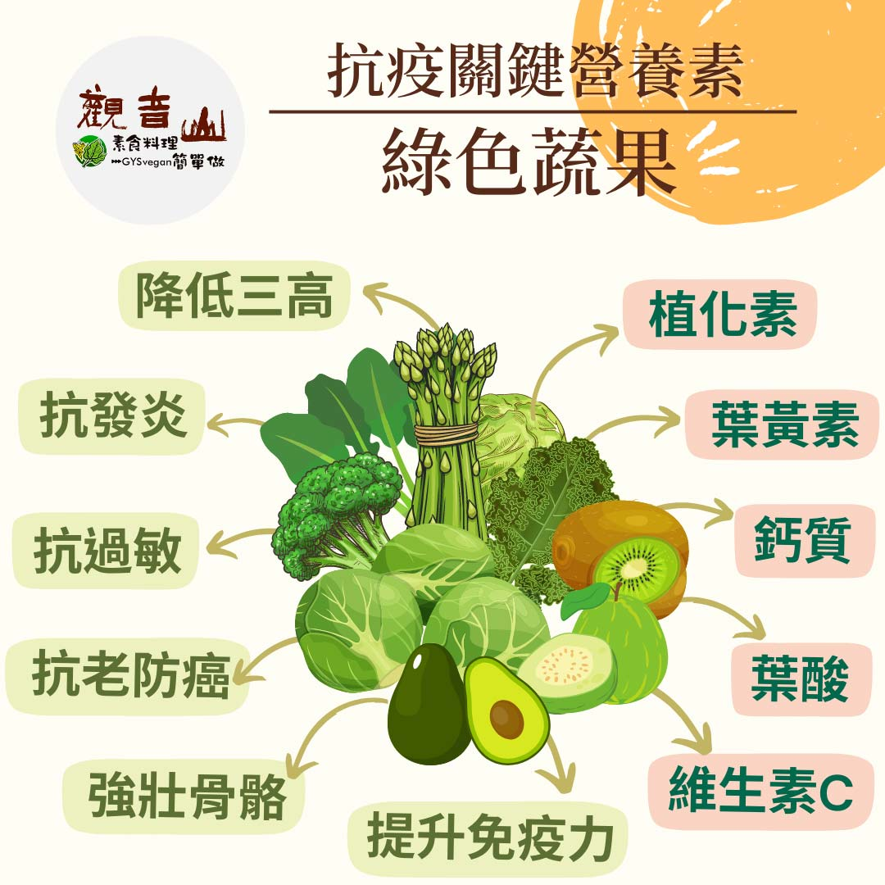

# 防疫營養素​ – ​綠色蔬果

## 📋 基本資訊 / Recipe Overview
- **料理名稱**：防疫營養素​ – ​綠色蔬果
- **原始標題**：防疫營養素​ – ​綠色蔬果
- **素食流派 / Diet**：全素 Vegan
- **來源平台 / Source**：[觀音山 · 素食料理簡單做](https://vegan.gys.org.tw/nutrients20210606/)

## 📖 食譜圖文詳情 (中英雙語對照)

防疫新生活｜抗疫關鍵-必備營養素​
​
越來越多的科學研究發現，植物性食材裡面除了有各種營養成分之外，還有各式的「植化素」，為身體築起免疫力防護網，可以✅ ​ 降低三高、抗發炎、抗過敏、抗老防癌等效果。​
​
▎關鍵營養素：綠色蔬果營養素​
​
天然的蔬果 不但富含我們熟知的礦物質以及維生素，更有許多藥廠至今尚無法製造出來的「植化素」，美國懷俄明大學營養學教授利柏曼：「綠葉蔬菜是我們隨手可得營養價值最高的食物」，更有研究發現一天一杯綠色蔬菜?，即可降低罹患心血管疾病風險。​
​
目前疫情許多重症患者，多是慢性病或心血管疾病的患者，平時飲食應以綠色蔬菜為主，⬇ ​ 減少肉食可避免動物性脂肪囤積體內，有效改善心血管疾病。​
​
「綠色」蔬果食材，含有豐富的葉黃素，可預防視網膜 黃斑部的退化，對於現在停課不停學，長時間居家使用電腦的學子，家長更是要注意其保健視力；綠色蔬果也是維生素C、葉酸、鈣質很好的來源，還有強壯骨骼等功效。​
​
常見的代表食材有：菠菜、莧菜、綠花椰菜?、綠蘆筍、芭樂、酪梨?、奇異果? ​ 等，? 提升免疫力少不了它。​
​
​
觀音山素食料理簡單做​
推薦  綠色蔬果 料理食譜 ​
​
⭐胡麻天貝酪梨沙拉​
https://reurl.cc/bXX1My​
​⭐澎湖高麗菜酸​
https://reurl.cc/O00xx3​
​⭐涼拌秋葵​
https://reurl.cc/xGGYDe​
⭐️慈悲的 龍德上師成立「觀音山蔬食館」提倡健康素食、慈悲護生，以”觀音山素食料理簡單做”的理念，提供多款素食食譜，讓您一學就會！?
? 觀音山素食料理簡單做 ​ Follow us​ ?
​
Facebook ｜好文按讚 ➤
http://www.facebook.com/GYSVegan​
Instagram ｜料理追蹤 ➤
http://www.instagram.com/gysvegan/​
Youtube ​ ​ ​ ｜加入訂閱 ➤
https://reurl.cc/q8VEqy​
官方Blog ​ ｜網站推薦 ➤
https://vegan.gys.org.tw/​
​
​
—​
? 歡迎轉載，請註明出處： # 觀音山素食料理簡單做 GYSVegan 素食環保愛地球，健康營養無負擔，慈悲護生一起來~?

---
*食譜歸檔時間：2026-08-20 · 來源：觀音山素食料理簡單做 (vegan.gys.org.tw)*