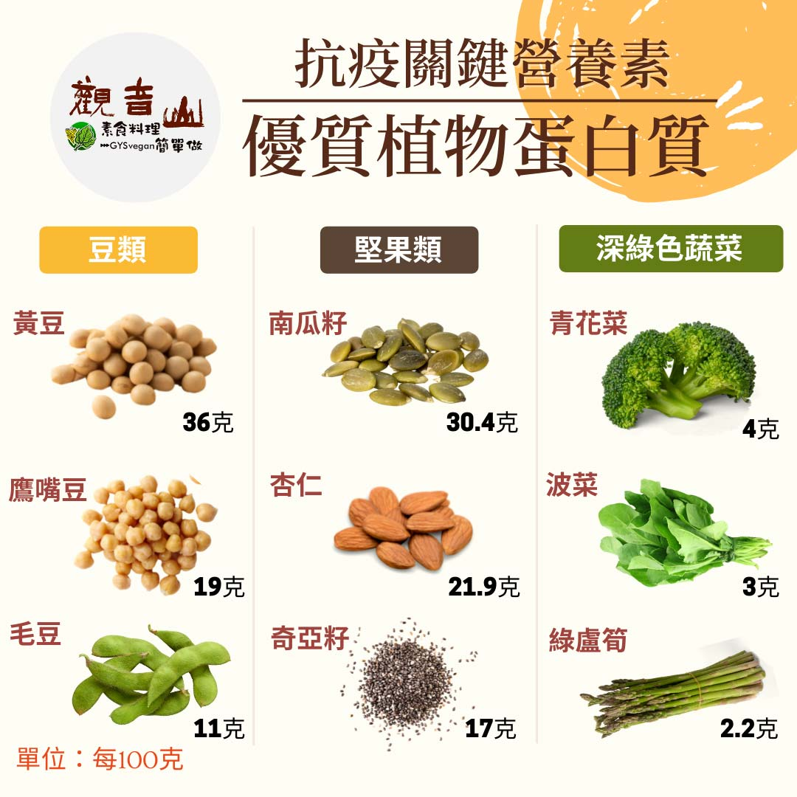

# 防疫營養素​ – 優質蛋白質

## 📋 基本資訊 / Recipe Overview
- **料理名稱**：防疫營養素​ – 優質蛋白質
- **原始標題**：防疫營養素​ – 優質蛋白質
- **素食流派 / Diet**：全素 Vegan
- **來源平台 / Source**：[觀音山 · 素食料理簡單做](https://vegan.gys.org.tw/protein20210530/)

## 📖 食譜圖文詳情 (中英雙語對照)

防疫新生活｜抗疫關鍵-必備營養素​
​
​
▎在家輕鬆煮，素食料理簡單做​
​ 新冠肺炎疫情嚴峻，無論是在家工作、停課的家人、甚至確診患者，對每個人
的生活都受到極大的影響。​ 警示上天和我們的對話，重新檢視自身，展開
防疫新生活！
​
​
​​ 吃素是斷惡修善，提升?身心免疫力的第一步，為自己和家人的健康把關，從
選擇素食開始。​
​
​ 觀音山素食料理簡單做，將於每周日中午新推出【防疫新生活-抗疫必備營養
素】，推薦✨重要營養素和相關食材的料理方式，讓您宅在家，也可以素食料
理簡單做！​
​
​
▎關鍵營養素：優質蛋白質  ​
​ 蛋白質與活力、白血球數目、抗體等都有關係，免疫細胞需要足夠的蛋白質來
協助抗戰，如果蛋白質攝取不足，會造成容易疲倦、免疫系統變差，反而會提
高細菌和病毒感染的風險；植物性蛋白質只要正確的多方攝取，其「含量、
品質」及「利用率」遠勝於動物性蛋白。 ​
​
​
​ 每種食物都含有多種營養素，從多元飲食的角度來看，素食者應多食用豆
類、堅果類、以及深色蔬菜三種類別，來攝取優良植物蛋白質，一般常見的食
材有：​
(1)豆類：黃豆、鷹嘴豆、毛豆、黑豆、豆腐、豆製品​
(2)堅果類：南瓜籽、杏仁、奇亞籽​
(3)深色蔬菜：青花菜、菠菜、綠蘆筍、豌豆、空心菜、地瓜葉​
​
​​ 若真的沒時間煮的情況下，豆類蛋白沖泡品也是增加蛋白質很好的選項！​
​
​
觀音山素食料理簡單做​
推薦  優質植物蛋白 料理食譜 ​
​
⭐時蔬豆腐煲
https://reurl.cc/0jo5Kb
​
​⭐蜜糖杏仁小于乾​
https://reurl.cc/XW6YGR​
​⭐田園時蔬卷​
https://reurl.cc/MAvxjL​
⭐️慈悲的 龍德上師成立「觀音山蔬食館」提倡健康素食、慈悲護生，以”觀音山素食料理簡單做”的理念，提供多款素食食譜，讓您一學就會！?
?  觀音山 素食料理簡單做 ​ Follow us​ ?
​
Facebook ｜好文按讚 ➤
http://www.facebook.com/GYSVegan​
Instagram ｜料理追蹤 ➤
http://www.instagram.com/gysvegan/​
Youtube ​ ​ ​ ｜加入訂閱 ➤
https://reurl.cc/q8VEqy​
官方Blog ​ ｜網站推薦 ➤
https://vegan.gys.org.tw/​
​
​
—​
? 歡迎轉載，請註明出處：  觀音山素食料理簡單做 GYSVegan 素食環保愛地球，健康營養無負擔，慈悲護生一起來~?

---
*食譜歸檔時間：2026-08-20 · 來源：觀音山素食料理簡單做 (vegan.gys.org.tw)*