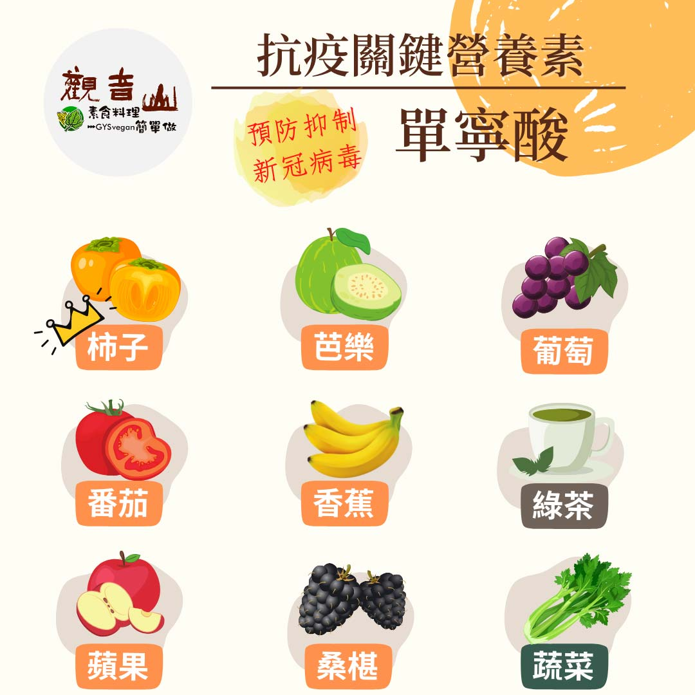

# 防疫營養素​ – 單寧酸

## 📋 基本資訊 / Recipe Overview
- **料理名稱**：防疫營養素​ – 單寧酸
- **原始標題**：防疫營養素​ – 單寧酸
- **素食流派 / Diet**：全素 Vegan
- **來源平台 / Source**：[觀音山 · 素食料理簡單做](https://vegan.gys.org.tw/tannin20210613/)

## 📖 食譜圖文詳情 (中英雙語對照)

防疫新生活｜抗疫關鍵-必備營養素 ​
新冠疫情嚴峻，確診患者數量不斷增加 ，一場看不見的戰爭，正在我們身邊展開，確實做好防疫、懂得照顧自身以及親人非常重要， 吃素就是最好的一個契機。研究證實自然界中的蔬果，所含有的「單寧酸」可以 抑制新冠病毒。​
​
▎關鍵營養素：單寧酸 ​
《美國癌症研究雜誌 (American Journal of Cancer Research)》發表由中國醫藥大學與中研院合作研究， 發現「單寧酸」可以雙重的防護新冠病毒的入侵 ，具有預防病毒的能力；「單寧酸」普遍存在於蔬菜與水果中，具有此營養素的蔬果，口感多半具有澀味，並有對抗癌細胞、抗發炎的效果 。 ​
​
這裡跟大家介紹富含 單寧酸的食物，讓您在面對嚴峻的疫情下，用正確的飲食習慣保護自己、提升免疫力:​
​
(1) 蔬菜類:芹菜、苦瓜、秋葵、綠花椰?。​
(2) 水果類:蘋果?、香蕉?、葡萄?、桑葚、芭樂、柿子、番茄?。​
(3) 其他：如綠茶?、烏龍茶、普洱茶。​
​
建議每天多吃各色 蔬菜水果，均衡飲食、適度運動打造抗疫防護力。 ​
本文授權自  觀音山營養師團隊
​
觀音山素食料理簡單做​
推薦  單寧酸 料理食譜 ​
​
⭐梅干苦瓜
https://reurl.cc/VEjZXY
​
​⭐番茄莎莎辣G恰巴達​
https://reurl.cc/XW403a​
​⭐涼拌秋葵​
https://reurl.cc/83Wgmj​
⭐️慈悲的 龍德上師成立「觀音山蔬食館」提倡健康素食、慈悲護生，以”觀音山素食料理簡單做”的理念，提供多款素食食譜，讓您一學就會！?
?​ 觀音山素食料理簡單做 ​ Follow us​ ?
​
Facebook ｜好文按讚 ➤
http://www.facebook.com/GYSVegan​
Instagram ｜料理追蹤 ➤
http://www.instagram.com/gysvegan/​
Youtube ​ ​ ​ ｜加入訂閱 ➤
https://reurl.cc/q8VEqy
​
官方Blog ​ ｜網站推薦 ➤
https://vegan.gys.org.tw/​
​
​
—​
? 歡迎轉載，請註明出處：   觀音山素食料理簡單做 GYSVegan 素食環保愛地球，健康營養無負擔，慈悲護生一起來~?

---
*食譜歸檔時間：2026-08-20 · 來源：觀音山素食料理簡單做 (vegan.gys.org.tw)*