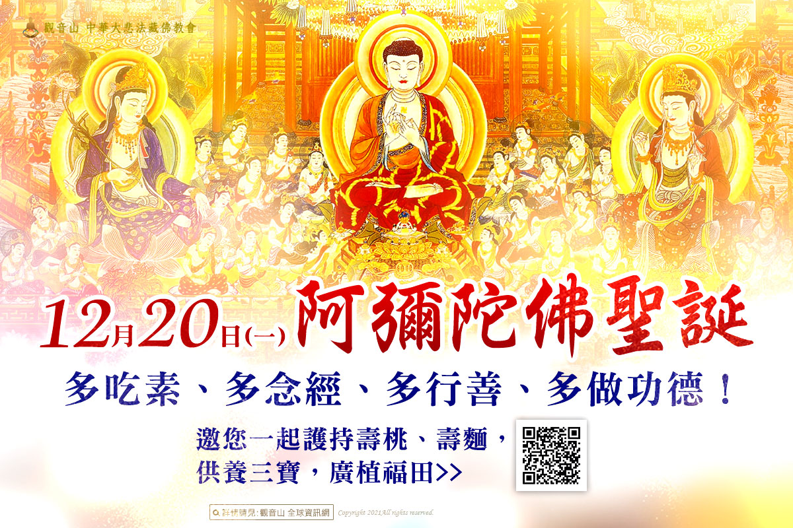

# 阿彌陀佛聖誕吉祥日 護持「壽桃、壽麵」供養三寶

## 📋 基本資訊 / Recipe Overview
- **料理名稱**：阿彌陀佛聖誕吉祥日 護持「壽桃、壽麵」供養三寶
- **原始標題**：阿彌陀佛聖誕吉祥日 護持「壽桃、壽麵」供養三寶
- **素食流派 / Diet**：全素 Vegan
- **來源平台 / Source**：[觀音山 · 素食料理簡單做](https://vegan.gys.org.tw/nourishing-the-three-jewels20211220/)

## 📖 食譜圖文詳情 (中英雙語對照)

? 12月20日 阿彌陀佛聖誕吉祥日? ​
＼＼護持「壽桃、壽麵」供養三寶 ／／​
▸
https://bit.ly/3cg8z5
j (登記至12/20 晚上12點前)​
​
阿彌陀佛，又名無量光佛、無量壽佛。其西方極樂淨土，國土無量、眷屬無量，壽命福報亦無量，乃是阿彌陀佛不可思議大願所成就的殊勝淨土。​
​
只要具足信願行、恆隨師學、發願往生，唯除五無間罪、捨法謗法之罪無法投生之外，任何其他的罪業，皆阻擋不了阿彌陀佛大悲願力的攝受，接引無數眾生離苦得樂，修行直至成佛，無有任何的違緣障礙。​
​
對現今煩惱深重、生活忙碌的眾生有極大的攝受力，只要依教奉行，決定往生極樂世界無疑，再也不受輪迴諸苦相逼。​
​
✨慈悲的龍德上師 成立「觀音山蔬食館」提倡健康素食、慈悲護生，以”觀音山素食料理簡單做”的理念，提供多款素食食譜，讓您一學就會！?​
​
​
12月20日(一)是「阿彌陀佛聖誕吉祥日」，把握吉祥日，吃素、布施、念佛、護生…等諸種善行，功德福報不可思議！​
​
──────────────​
?阿彌陀佛聖誕 薈供法會​
共同護持「壽桃、壽麵」供養三寶​
▸
https://bit.ly/3cg8z5j​
(登記至12/20 晚上12點前截止)​
──────────────​
​
本場薈供法會欣逢慶讚阿彌陀佛聖誕，特於佛前敬供壽桃、壽麵，祈願佛力加持每一位參加之同修、法友善信，慧命綿長、如意滿願；長壽健康、福慧圓滿。​
可為現世親友、公司行號、閤家、個人，或先亡祖先、冤親債主、無緣水兒、地基主等登記護持。​
​
更多請見「觀音山 全球資訊網」​
https://www.fazang.org/info/events.php​
—————————————​
? 歡迎轉載，請註明出處： 觀音山 法藏吉祥洲-好文分享 按讚設定搶先看，天天看，天天分享，心轉變好吉祥! (Be free to use with remarks for developing Buddhism. Amitabha.)​
—————————————​
◎觀音山吉祥洲官方部落格​
https://news.gys.org.tw/​
​
​
? 觀音山 素食料理簡單做 ?​
◎Facebook ｜好文按讚
http://w​ww.facebook.com/GYSVegan​
​
◎lnstagram ｜料理追蹤​
http://www.instagram.com/gysvegan/​
​
◎Youtube ｜加入訂閱​
https://reurl.cc/q8VEqy​
​
◎Telegram ｜頻道推薦​
https://t.me/GYSVegan​
​
​
—​
?歡迎轉載，請註明出處：觀音山素食料理簡單做 GYSVegan 素食環保愛地球，健康營養無負擔，慈悲護生一起來~?

---
*食譜歸檔時間：2026-08-20 · 來源：觀音山素食料理簡單做 (vegan.gys.org.tw)*