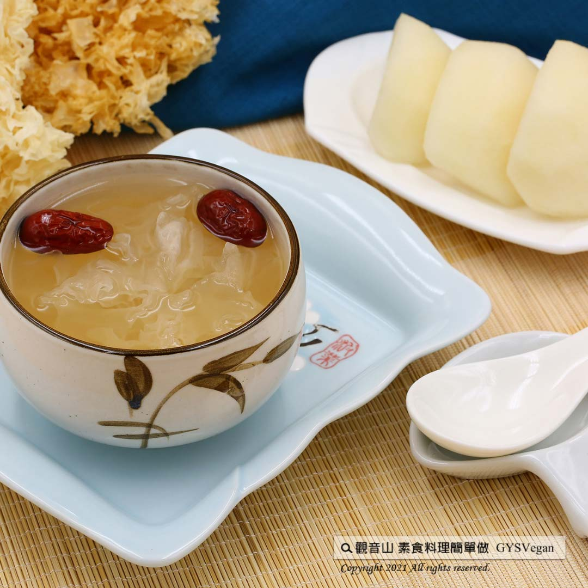

# 雪梨銀耳露

## 📋 基本資訊 / Recipe Overview
- **料理名稱**：雪梨銀耳露
- **原始標題**：電鍋料理｜雪梨銀耳露｜全素
- **素食流派 / Diet**：全素 Vegan
- **料理分類 / Category**：烘焙甜點
- **來源平台 / Source**：[觀音山 · 素食料理簡單做](https://vegan.gys.org.tw/sydney20211119/)

## 📖 食譜圖文詳情 (中英雙語對照)

秋冬膳食要以滋陰潤肺為基本原則，觀音山推出特別具代表性的秋冬養生料理「雪梨銀耳露」。銀耳中有豐富的多醣體、膳食纖維及滿滿的天然植物性膠質，搭配可以潤肺清燥、養陰生津的雪梨一起燉煮，一入口就感覺到全身得到滋養。簡單、美味又健康，快跟著觀音山主廚，一起素食料理簡單做吧！​
​
?食材及佐料〔Ingredients〕：(3人份)​
▪️梨子 ​ 3顆 ​ ​ ​ ​ ​ ​ ​ ​ ​ ​ ​ ​ ​ ​ ​ ​ ​ ​ ​ ​ ​ ​ ​ ​ ​ ​
▪️白木耳 ​ 20克​
▪️冰糖、水、紅棗 ​ 適量​
​
?烹飪步驟：​
【刀工/前處理】​
1.白木耳泡開，撕成小片狀。 ​
2.梨子去皮、去籽，切塊狀。​
​
【調理作法】​
1.將所有食材放入湯鍋中，加入冰糖、加水稍微淹過食材即可，放入電鍋中，外鍋加2杯水燉煮。​
2.冷卻後，將紅棗先取出，將蒸好的梨子銀耳，用果汁機打碎，最後將紅棗放回即可享用​
​
【特別說明】​
1.白木耳可依個人喜好調整，不打碎直接享用。​
​
​
??本食譜提供：台中觀音山蔬食館 ​
​
​
✨慈悲的龍德上師 成立「觀音山蔬食館」提倡健康素食、慈悲護生，以”觀音山素食料理簡單做”的理念，提供多款素食食譜，讓您一學就會！?
​
​
★10月7日~12月4日 ​ 佛陀天降月：善惡業增長10億倍​
​
✨殊勝功德增長日✨​
觀音山邀請您於10月7日~12月4日，響應素食、廣修供養、戒殺護生、誦經修法、行持諸種善行，獲福無量。​
​
​
【recipe】​
​
? For autumn-winter diet, the key is to consume foods that warm body up, generate fluid and moisten the lungs. Guanyinshan presents this particular autumn-winter recipe “Snow Fungus Soup”. White fungus is rich in polysaccharides, dietary fiber and full of natural plant gum. When it is stewed with pears, it is especially benefits for moistening lungs and clearing dryness. Once you shovel it into your mouth, your body will feel a great comfort. Simple, delicious and healthy, let’s follow the chef of Guanyinshan and make this soup together!​
​
?Ingredients : （For 3 people）​
▪️Three ​ pears ​ ​ ​ ​ ​ ​ ​ ​ ​ ​ ​ ​ ​ ​ ​ ​
▪️White fungus ​ 20g​
▪️Rock sugar、Water、Red dates ​ , adequate amount​
​
? Instructions:​
【Cutting/ PREP-Ahead】​
1. Soak white fungus and torn it into smaller pieces.​
2. Peel pears, remove seeds, and cut into pieces.​
​
【Cooking Steps】​
1. Put all the ingredients in a tall pot, add rock sugar, and water, slightly submerges the ingredients. Place the pot into a rice cooker, and add 2 cups of water to the outer pot and simmer.​
2. After cooling, first, take out the red dates. Put steamed pears and white fungus in a blender and process until smooth. Finally, put all the red dates back to enjoy.​
​
【Special Notes】​
1. If you wish, white fungus can be consumed without blending.​
​
??This recipe is provided byGuanyinshan Green Restaurant, Taichung.​
​
​
​
? 觀音山 素食料理簡單做 ?
◎Facebook ｜好文按讚​
http://www.facebook.com/GYSVegan​
​
◎lnstagram ｜料理追蹤​
http://www.instagram.com/gysvegan/​
​
◎Youtube ｜加入訂閱​
https://reurl.cc/q8VEqy​
​
◎Telegram ｜頻道推薦​
https://t.me/GYSVegan​
​
​
—​
?歡迎轉載，請註明出處： 觀音山 素食料理簡單做 GYSVegan 素食環保愛地球，健康營養無負擔，慈悲護生一起來~?​
​
​

---
*食譜歸檔時間：2026-08-20 · 來源：觀音山素食料理簡單做 (vegan.gys.org.tw)*