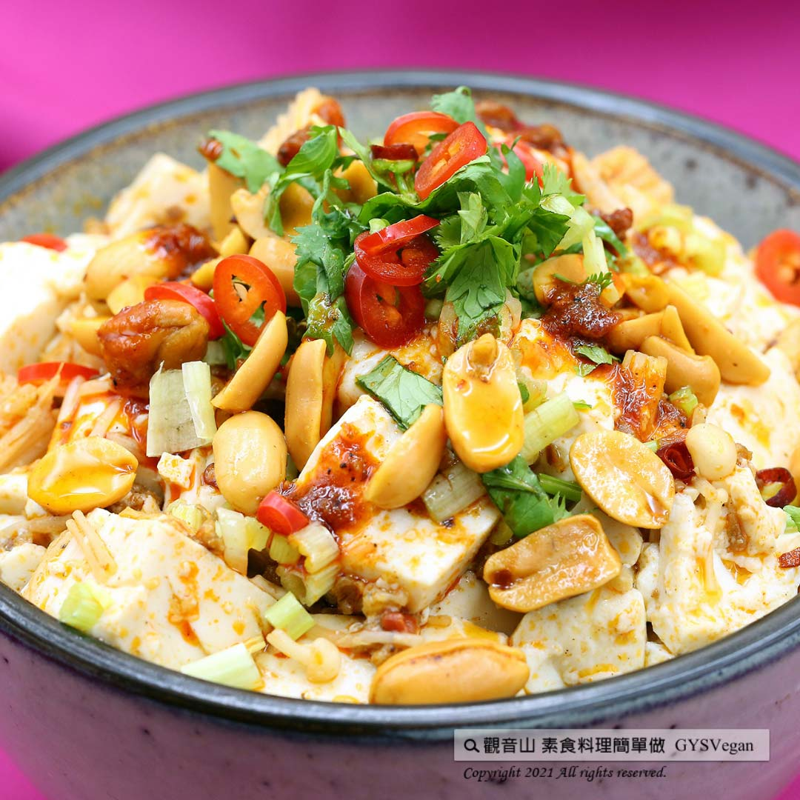

# 電鍋版麻婆豆腐

## 📋 基本資訊 / Recipe Overview
- **料理名稱**：電鍋版麻婆豆腐
- **原始標題**：電鍋料理｜電鍋版麻婆豆腐 ｜全素
- **素食流派 / Diet**：全素 Vegan
- **料理分類 / Category**：中式料理
- **來源平台 / Source**：[觀音山 · 素食料理簡單做](https://vegan.gys.org.tw/mapo-tofu20211203/)

## 📖 食譜圖文詳情 (中英雙語對照)

四川十大經典名菜「麻婆豆腐」，香鮮豆瓣醬與滑嫩豆腐的濃郁香氣結合，加上植物肉與金針菇的多層次口感，讓全家人的胃口大開。烹調新概念:清爽無油煙的電鍋料理法，就可以快速烹調一道開胃又下飯料理，快跟著觀音山主廚，一起素食料理簡單做吧！​
​
?食材及佐料〔Ingredients〕：(5人份)​
▪️嫩豆腐 ​ 1盒​
▪️植物肉、金針菇 ​ 各50克 ​ ​ ​ ​ ​ ​ ​ ​ ​ ​ ​ ​ ​ ​ ​ ​ ​ ​ ​ ​ ​ ​ ​ ​ ​ ​ ​
▪️薑末 ​ 20克​
▪️麻辣醬 ​ 1.5大匙 ​
▪️辣豆瓣醬 ​ 2大匙 ​
▪️醬油、太白粉 ​ 各1大匙 ​
▪️糖 ​ 0.5大匙​
▪️香菜末、芹菜末 ​ 適量​
​
?烹飪步驟：​
【刀工/前處理】​
1.豆腐切1公分丁。​
2.金針菇撕開，切一公分段。​
​
【調理作法】​
1.嫩豆腐切丁後鋪在碗底，放入金針菇。​
2.將植物肉放入薑末、調味料(醬油.糖.辣豆瓣醬.麻辣醬)、太白粉，攪拌均勻。​
3.將攪拌均勻的食材放入步驟1的碗裡。​
4.放入電鍋，外鍋放一杯水，蒸到開關跳起，輕輕攪拌均勻，撒上香菜及芹菜末即可享用。​
​
【特別說明】​
1.可依個人喜好添加鹹花生增添風味。​
2.若喜歡口味重一些，可以酌量增加麻辣醬或豆瓣醬。​
​
??本食譜提供：台中觀音山蔬食館 ​
​
✨慈悲的 龍德上師成立「觀音山蔬食館」提倡健康素食、慈悲護生，以”觀音山素食料理簡單做”的理念，提供多款素食食譜，讓您一學就會！?​
​
​
★12月4日 佛陀天降月．釋迦牟尼佛節日：善惡業增長10億倍x9億倍​
​
✨殊勝功德增長日✨​
觀音山邀請您於12月4日響應素食、廣修供養、戒殺護生、誦經修法、行持諸種善行，獲福無量。​
​
​
【recipe】​
​
? Sichuan’s top ten classic cuisine “Mapo Tofu” seasoning with vegetarian chili bean paste is very appetizing. The smooth tofu cooked with plant meat and enoki mushrooms creates a multi-layered taste. This recipe also goes with trend of the new cooking concept: wholesome and smoke-free. With this rice cooker recipe, you can quickly prepare a healthy and delicious meal for the whole family. Follow the chef of Guanyinshan, let’s cook vegetarian dish together!​
​
?Ingredients : （For 5 people）​
▪️A box of soft tofu ​ ​
▪️Plant meat、Enoki mushrooms ​ 50g ​ ​ ​ ​ ​ ​ ​ ​ ​ ​ ​ ​ ​ ​ ​ ​ ​ ​ ​ ​ ​ ​ ​ ​ ​ ​
▪️Ginger ​ 20g​
▪️Spicy sauce ​ 1.5 tbsp​
▪️Spicy bean paste ​ 2 tbsp​
▪️Soy sauce、cornstarch ​ 1tbsp ​
▪️Sugar ​ 0.5tbsp​
▪️Minced coriander、Minced celery ​ , adequate amount​
​
? Instructions:​
【Cutting/ PREP-Ahead】​
1. Dice tofu into 1 cm.​
2. Tear enoki mushrooms apart and cut into 1 cm. ​
​
【Cooking Steps】​
1. Spread diced tofu on the bottom of the bowl, and add enoki mushrooms.​
2. Add ginger, cornstarch into plant meat and season with soy sauce, sugar, spicy bean paste, spicy sauce, and stir well.​
3. Put the well-stirred ingredients (step2) into the bowl of step 1.​
4. Place it in a rice cooker and add a cup of water in the outer pot. Steam until the rice cooker switches off. Stir gently, and then enjoy​
​
[Special notes]​
1. Add salted peanuts to add flavor if you prefer.​
2. If you like a stronger taste, you can increase the spicy hot sauce or vegetarian chili bean sauce.​
​
​
? 觀音山 素食料理簡單做 ​?
◎Facebook ｜好文按讚​
http://www.facebook.com/GYSVegan​
​
◎lnstagram ｜料理追蹤​
http://www.instagram.com/gysvegan/​
​
◎Youtube ｜加入訂閱​
https://reurl.cc/q8VEqy​
​
◎Telegram ｜頻道推薦​
https://t.me/GYSVegan​
​
​
—​
? 歡迎轉載，請註明出處： 觀音山 素食料理簡單做 GYSVegan 素食環保愛地球，健康營養無負擔，慈悲護生一起來~?

---
*食譜歸檔時間：2026-08-20 · 來源：觀音山素食料理簡單做 (vegan.gys.org.tw)*