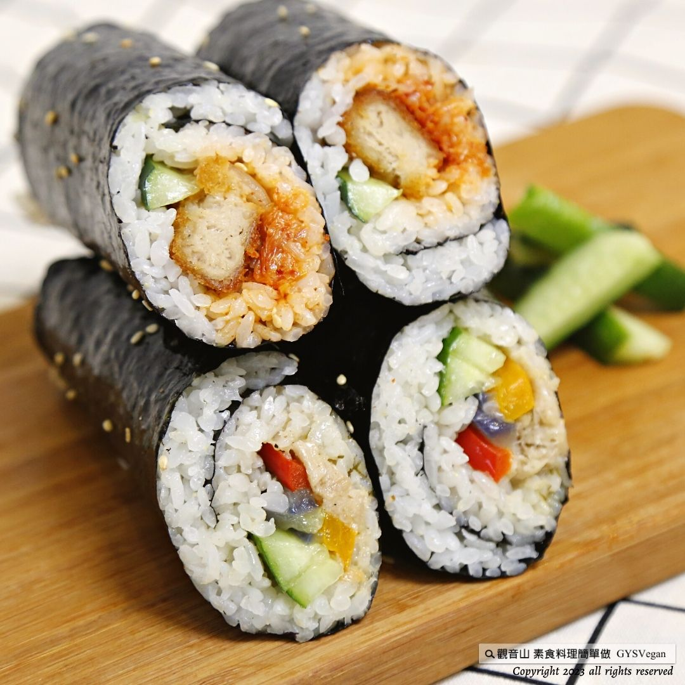

# 韓式武士飯捲 (泡菜、素鮪魚)
### Korean Warrior Gimbap (Kimchi & Vegan Tuna) / 韩式武士饭卷 (泡菜、素金枪鱼)

## 📋 基本資訊 / Basic Information
- **料理名稱**：韓式武士飯捲 (泡菜、素鮪魚)
- **简体名称**：韩式武士饭卷 (泡菜、素金枪鱼)
- **English Title**：Korean Warrior Gimbap (Kimchi & Vegan Tuna Rice Rolls)
- **素食流派**：全素 Vegan（純素者美乃滋請選用純植物大豆美乃滋，泡菜選用無五辛純素泡菜）
- **料理份量**：5 人份 (5 Servings)
- **料理分類**：米食、主食、韓式料理
- **食譜提供**：台中觀音山蔬食館
- **來源平台**：[觀音山 · 素食料理簡單做](https://vegan.gys.org.tw/rice-rolls20230609/)

---

## 📖 食譜圖文詳情 (中文繁體/簡體)

二十四節氣來到夏至，您是否也感受到酷暑的悶熱呢？炎熱的天氣容易讓人沒胃口吃不下，這時一道微酸清爽口感的韓式武士飯捲，最受大人小孩歡迎，快跟著觀音山主廚，一起素食料理簡單做吧！

### ❒ 食材及佐料〔Ingredients〕（5人份）
- ▪️ **熱白飯**：約 5 碗（約 800g ~ 1000g）
- ▪️ **小黃瓜**：2 條
- ▪️ **茼蒿**：100 克
- ▪️ **韓式泡菜**（全素無五辛）：適量
- ▪️ **素鮪魚**（植物肉素魚肉）：100 克
- ▪️ **素G塊**（純素植物雞塊）：6 個
- ▪️ **壽司海苔**（包飯捲專用大張海苔）：5 片
- ▪️ **白芝麻**（熟白芝麻）：適量
- ▪️ **美乃滋**（純素美乃滋 Vegan Mayo）：適量
- ▪️ **粗黑胡椒粒**：適量
- ▪️ **香油**（純芝麻香油）：適量

---

### ❒ 烹飪步驟與做法

#### 【刀工 / 前處理】
1. **小黃瓜**：徹底洗淨後縱向對半剖開去除瓜籽，切成適合包壽司長度的細長條狀備用。
2. **茼蒿**：洗淨瀝水，放入滾水中快速汆燙熟透，撈起後徹底瀝乾擠去多餘水分備用。
3. **素G塊**：下油鍋油炸（或氣炸）至表面金黃酥脆熟透，撈起放涼後，每塊縱向對半切成二等分長條狀備用。
4. **素鮪魚**：取素鮪魚肉放入調理碗中，加入適量粗黑胡椒粒，充分攪拌均勻調味備用。

#### 【調理作法與包捲步驟】
1. **鋪上海苔與米飯**：
   - 準備壽司竹捲簾，預先緊密包上一層保鮮膜（衛生且防米飯黏附）。
   - 將一張壽司海苔（光滑面朝下、粗糙面朝上）平鋪在捲簾上。
   - 雙手沾少許清水（防沾黏），取適量熱白飯均勻平鋪在海苔表面。
   - **關鍵手法**：海苔**上方頂端預留約 1 公分**不要鋪白飯；海苔**下方底端讓白飯超出海苔約 1 公分**。
2. **韓式泡菜口味組合**：
   - 在鋪好的米飯中段偏下位置，依序整齊擺上小黃瓜長條、適量全素韓式泡菜、以及 3 條切好的素G塊長條。
3. **素鮪魚口味組合**：
   - 在鋪好的米飯中段偏下位置，依序整齊擺上小黃瓜長條、黑胡椒拌勻的素鮪魚、擠上適量純素美乃滋、再鋪上燙熟瀝乾的茼蒿。
4. **捲飯與緊實塑形**：
   - 雙手提起捲簾，將竹簾由下往上捲起至約 2/3 處，確認所有內餡食材都在捲簾包覆範圍內。
   - 雙手手指隔著捲簾向內收緊壓實餡料，接著順勢將飯捲往前推滾至完全封口。
   - 最後使用捲簾將整條飯捲再次捏實塑形，確保飯捲緊實圓整。
5. **分切擺盤與上桌**：
   - 將捲好的飯捲放置在砧板上，使用鋒利的刀（刀刃可抹少許水或香油防沾），將飯捲均勻切成四等分（或六至八等分厚片）。
   - 齊整擺入盤中，表面刷上一層薄薄的純芝麻香油提香增亮，最後撒上少許熟白芝麻點綴，即可美味享用！

---

### 👨‍🍳 大廚美味技巧與特別說明
1. **竹簾包保鮮膜防沾黏**：壽司竹簾預先包覆一層保鮮膜，不僅清洗方便、乾淨衛生，捲製時米飯完全不會卡在竹條縫隙中。
2. **鋪飯頂留空、底超出一公分**：海苔上方預留空白有助於封口黏合，下方米飯超出 1 公分能在捲起第一圈時形成完美包芯，切開時料在正中央且緊實不鬆散。
3. **刀工分切技巧**：切飯捲時，每切一刀可用濕布擦拭刀刃，或抹上少許香油，拉鋸式輕輕切下，切面整齊漂亮不破皮。
4. **蔬菜水分管理**：茼蒿與泡菜在包入前應適度瀝乾或擠乾水分，避免過多水分滲透海苔使海苔變軟影響口感。
5. **全素 Vegan 認證把關**：全素者選購美乃滋時請指名純素（植物油、大豆蛋白製成無蛋配方）；韓式泡菜請選用無蔥蒜韭薤五辛、無魚露蝦醬之純素韓式泡菜。

---

## 🌐 English Recipe Details

### Korean Warrior Gimbap (Kimchi & Plant-based Tuna Rice Rolls) | Vegan

As the summer solstice arrives, are you also feeling the stifling heat of midsummer? Hot weather often diminishes the appetite. A refreshing, slightly tangy Korean warrior gimbap (rice roll) is widely loved by both adults and children. Follow the chef of Guanyinshan Green Restaurant to make simple and delicious vegetarian dishes!

### ❒ Ingredients (5 Servings)
- ▪️ **Cooked hot white rice**: ~5 bowls (~800g - 1000g)
- ▪️ **Cucumbers**: 2 pieces
- ▪️ **Crown daisy / Garland chrysanthemum**: 100g
- ▪️ **Korean kimchi** (Vegan, alliin-free / no alliums): Appropriate amount
- ▪️ **Vegan tuna** (Plant-based tuna): 100g
- ▪️ **Vegan chicken nuggets** (Plant-based nuggets): 6 pieces
- ▪️ **Sushi nori seaweed sheets**: 5 sheets
- ▪️ **Toasted white sesame seeds**: Appropriate amount
- ▪️ **Vegan mayonnaise**: Appropriate amount
- ▪️ **Coarse black pepper**: Appropriate amount
- ▪️ **Sesame oil**: Appropriate amount

---

### ❒ Cooking Instructions

#### 【Preparation & Knife Skills】
1. **Cucumbers**: Wash thoroughly, halve lengthwise to scrape out seeds, and cut into long strips suitable for sushi/gimbap rolling.
2. **Crown Daisy**: Wash clean, blanch briefly in boiling water until cooked, remove immediately and thoroughly squeeze out excess moisture.
3. **Vegan Nuggets**: Deep-fry or air-fry until golden brown and crispy. Once slightly cooled, cut each nugget lengthwise into halves (long strips).
4. **Vegan Tuna**: Place vegan tuna in a bowl, add an appropriate amount of coarse black pepper, and mix thoroughly.

#### 【Assembly & Rolling Method】
1. **Prepare Rolling Mat & Rice**:
   - Wrap a bamboo sushi mat tightly with plastic cling film for hygiene and easy non-stick rolling.
   - Lay a nori seaweed sheet flat on the mat with the shiny smooth side down and rough side up.
   - Moisten hands with a little water, take cooked warm rice and spread it evenly across the seaweed sheet.
   - *Key Technique*: Leave about **1 cm empty at the top edge** of the seaweed, and let the rice extend about **1 cm beyond the bottom edge** of the seaweed.
2. **Kimchi Flavor Assembly**:
   - In the lower-middle section of the rice, arrange cucumber strips, vegan Korean kimchi, and 3 strips of fried vegan nuggets.
3. **Vegan Tuna Flavor Assembly**:
   - In the lower-middle section of the rice, arrange cucumber strips, seasoned black pepper vegan tuna, squeeze vegan mayonnaise, and top with blanched crown daisy.
4. **Rolling and Shaping**:
   - Lift the bamboo mat from the bottom edge and roll upward to cover about 2/3 of the sheet, ensuring all filling ingredients are enclosed within the roll.
   - Use your fingers through the bamboo mat to gently tighten the roll inward, then push the roll forward to complete the cylinder.
   - Firmly shape the roll with the bamboo mat to make it tight and cylindrical.
5. **Slicing & Serving**:
   - Place the roll on a cutting board. Lightly moisten or oil a sharp knife with sesame oil, then slice the roll evenly into 4 pieces (or 6-8 thick rounds).
   - Arrange neatly on a serving platter, brush the top surface with a thin coat of pure sesame oil for gloss and aroma, and sprinkle with toasted white sesame seeds before serving.

---

### 💡 Chef's Secrets & Special Notes
1. **Wrap the Bamboo Mat with Cling Film**: Prevents sticky rice from adhering to the bamboo slats, making cleanup fast and rolling effortless.
2. **1 cm Rice Margin Rule**: Leaving 1 cm clear at the top and 1 cm extending at the bottom ensures a tight seal with perfectly centered fillings that won't fall apart when sliced.
3. **Clean Slicing**: Wiping the blade with a damp towel or lightly brushing it with sesame oil between cuts guarantees clean, neat slices without tearing the nori.
4. **Moisture Control**: Always squeeze excess water out of blanched crown daisy and kimchi to prevent the seaweed from becoming soggy.
5. **Vegan Certification**: Ensure the mayonnaise is 100% plant-based egg-free mayo, and the Korean kimchi is free of fish sauce, shrimp paste, and allium vegetables (garlic, onion, chives).

---

### 🏛️ 相關資訊與版權說明 / About & Credits

**本食譜提供**：台中觀音山蔬食館 (Provided by Taichung Guanyinshan Green Restaurant)

✨ 慈悲的 龍德上師 成立「觀音山蔬食館」提倡健康素食、慈悲護生，以”觀音山素食料理簡單做”的理念，提供多款素食食譜，讓您一學就會！

🔗 **觀音山官方相關連結**：
- 官方網站：[https://www.fazang.org/link/](https://www.fazang.org/link/)
- Facebook 粉絲專頁：[觀音山 素食料理簡單做 GYSVegan](http://www.facebook.com/GYSVegan)
- Instagram：[@gysvegan](http://www.instagram.com/gysvegan/)
- YouTube 頻道：[觀音山法藏](https://reurl.cc/q8VEqy)
- Telegram 頻道：[GYSVegan](https://t.me/GYSVegan)

—
歡迎轉載，請註明出處：觀音山素食料理簡單做 GYSVegan 素食環保愛地球，健康營養無負擔，慈悲護生一起來~

---
*食譜歸檔時間：2026-08-20 · 來源：觀音山素食料理簡單做 (vegan.gys.org.tw)*
