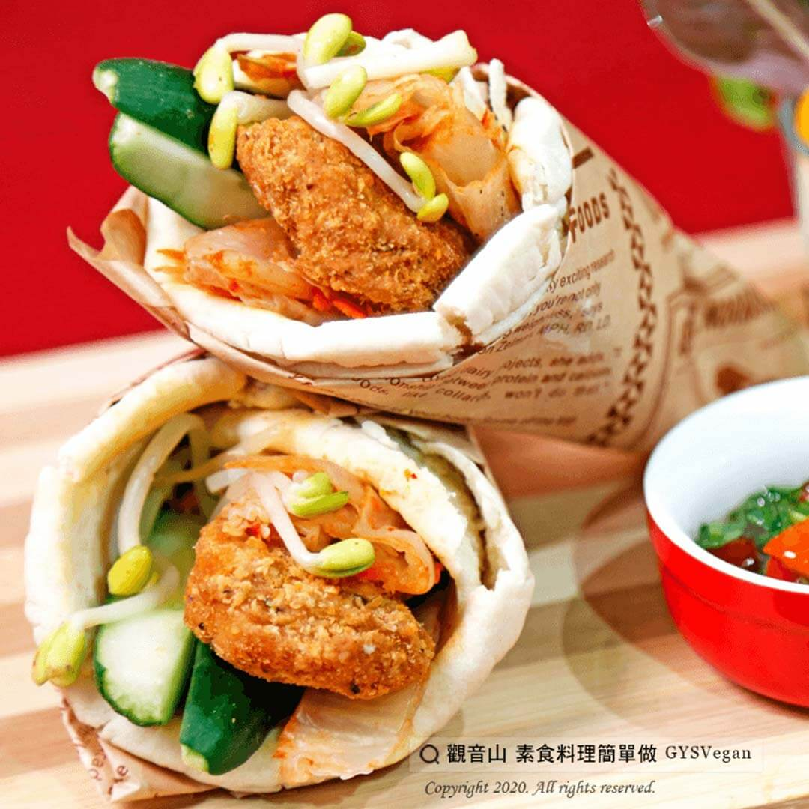

# 韓式泡菜素辣G卷餅

## 📋 基本資訊 / Recipe Overview
- **料理名稱**：韓式泡菜素辣G卷餅
- **原始標題**：韓式泡菜素辣G卷餅
- **素食流派 / Diet**：全素 Vegan
- **料理分類 / Category**：家常料理
- **來源平台 / Source**：[觀音山 · 素食料理簡單做](https://vegan.gys.org.tw/pickle20201018/)

## 📖 食譜圖文詳情 (中英雙語對照)

傳統墨西哥卷餅，是用餅皮夾入餡料、蔬菜等各式各樣的食材，是墨西哥餐桌上少不了一道菜。​
這道『韓式泡菜素辣G卷餅』，特別使用泡菜、素辣雞塊，搭配上清爽的黃豆芽、小黃瓜，簡單的料理步驟，讓您輕鬆上手！​
今天不知道該料理什麼嗎？​
快跟著觀音山主廚，一起素食料理簡單做吧！​
​
?食材及佐料〔Ingredients〕：(3人份)​
▪素辣雞塊9塊​
▪素韓式泡菜300克​
▪小黃瓜2條​
▪黃豆芽200克​
▪墨西哥餅皮3片​
​
?烹飪步驟：​
1.素辣雞塊炸過切對半。​
2.黃豆芽川燙後冰鎮。​
3.小黃瓜切條備用。​
4.取一張墨西哥餅皮，依序將黃豆芽、小黃瓜、素泡菜、素辣雞塊擺上，捲起來擺盤，完成！​
​
【特別說明】​
餅皮可用牙籤固定。​
​
?本食譜提供：台中 #觀音山蔬食館 主廚 淨雅​
​
✨慈悲的 龍德上師成立「觀音山蔬食館」提倡健康素食、慈悲護生，以”觀音山素食料理簡單做”的理念，提供多款素食食譜，讓您一學就會！?​
​
​
?觀音山 素食料理簡單做 ​ Follow us?​
Facebook ｜好文按讚
http://www.facebook.com/GYSVegan​
Instagram ｜料理追蹤
http://www.instagram.com/gysvegan/​
Youtube ​ ​ ​ ｜加入訂閱
https://reurl.cc/q8VEqy​
Telegram ​ ｜頻道推薦
https://t.me/GYSVegan​
​
​
? 歡迎轉載，請註明出處： ​ ​ 觀音山 素食料理簡單做GYSVegan按讚、留言設定搶先看! 素食環保愛地球，健康營養無負擔，慈悲護生一起來~?

---
*食譜歸檔時間：2026-08-20 · 來源：觀音山素食料理簡單做 (vegan.gys.org.tw)*