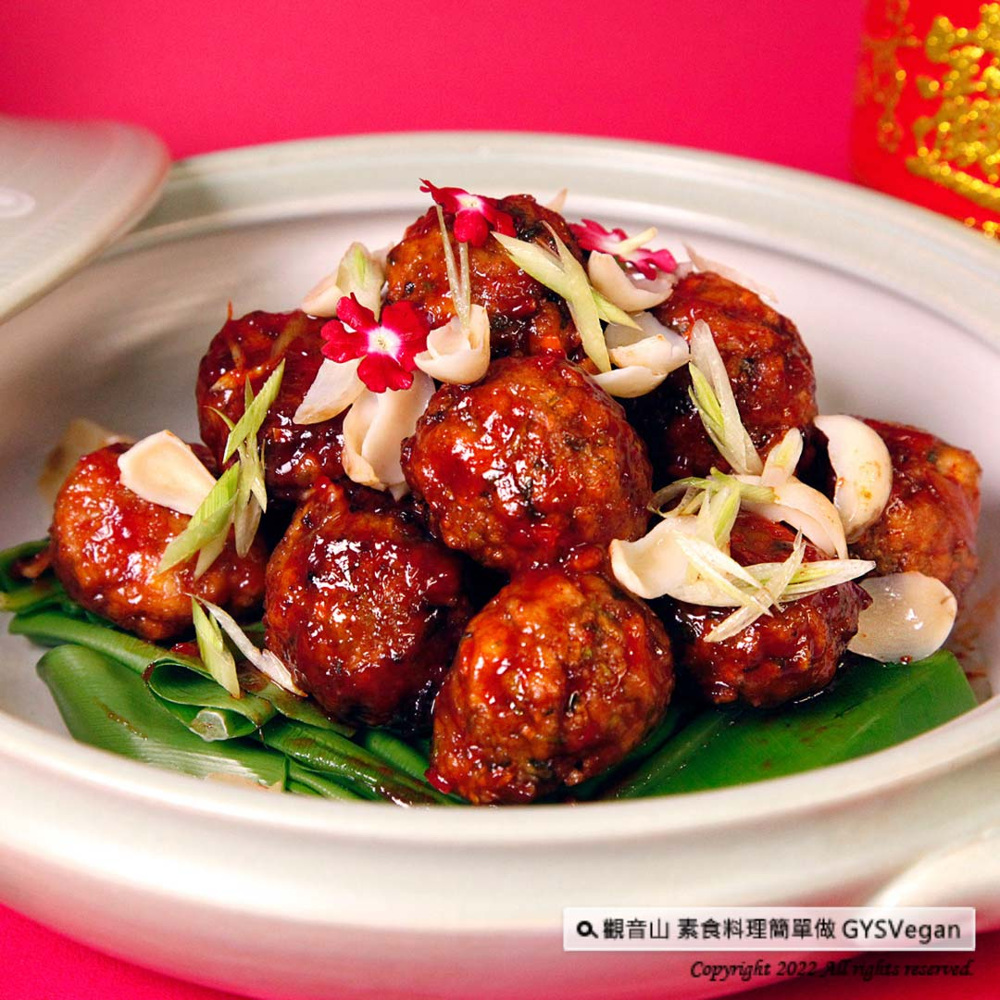

# 食譜 左宗棠燒獅子丸

## 📋 基本資訊 / Recipe Overview
- **料理名稱**：食譜 左宗棠燒獅子丸
- **原始標題**：素食年菜食譜｜左宗棠燒獅子丸｜全素
- **素食流派 / Diet**：全素 Vegan
- **來源平台 / Source**：[觀音山 · 素食料理簡單做](https://vegan.gys.org.tw/general-tsos-lions-head20220125/)

## 📖 食譜圖文詳情 (中英雙語對照)

新年新氣象，嚐嚐主廚們的特製手工菜～左宗棠燒獅子丸，炸至金黃色的外皮、內有豐富的新鮮內餡，外表再裹上特製酸甜醬料，口感Q彈超下飯，絕對是一道新年餐桌上的人氣料理，快跟著觀音山主廚，一起素食料理簡單做吧！​
​
食材及佐料〔Ingredients〕：（5人份）​
▪️新朱肉、百頁豆腐 ​ 各150克​
▪️猴頭菇、太白粉 ​ 各100克 ​
▪️紅蘿蔔、中芹、碧玉筍 ​ 各50克 ​ ​ ​ ​ ​ ​
▪️香菜、百合、辣椒 ​ 各30克 ​ ​ ​
▪️馬蹄 ​ 5顆​
▪️醬油 ​ 15cc ​
▪️白醋 ​ 10cc ​ ​
▪️番茄醬 ​ 20克 ​ ​ ​
▪️紅麴 ​ 10克​
▪️糖 ​ 5克​
▪️鹽、胡椒粉、香油、五香粉、油 ​ 適量​
​
烹飪步驟：​
【刀工/前處理】​
1.紅蘿蔔、中芹、香菜切末，備用。​
2.馬蹄切小丁、猴頭菇切小片，碧玉筍切斜片，備用。​
3.醬汁: 油、糖、白醋、番茄醬、紅麴攪拌均勻。​
​
【調理作法】​
1.百頁豆腐捏碎，加入新朱肉、紅蘿蔔、馬蹄、香菜、芹菜、猴頭菇，糖鹽、胡椒粉、香油、醬油、五香粉，充分拌勻。​
2.將丸子餡料搓成圓球狀，沾太白粉油炸至金黃色。​
3.碧玉筍汆燙過。​
4.熱鍋加油炒香辣椒，放入炸好的丸子，倒入已備好的醬汁，略煮收乾，加入碧玉筍、百合稍微拌炒即可起鍋。​
​
本食譜提供：台中觀音山蔬食館​
​
✨慈悲的龍德上師 成立「觀音山蔬食館」提倡健康素食、慈悲護生，以”觀音山素食料理簡單做”的理念，提供多款素食食譜，讓您一學就會！
​
​
【recipe】​
​
New year, new look, ​ try the chef’s special recipe~ General Tso’s Lion’s Head. These deep fried golden brown veggie balls are rich with fresh fillings and coated with special sweet and sour sauce. They taste slightly springy and very flavored. This would definitely be a popular dish on the New Year’s dinning table. Let’s follow the chef of Guanyinshan and make vegetarian dishes together! ​ ​
​
Ingredients : (For 5 people)​
▪️OmniPork、 Bai ye tofu ​ 150g​
▪️Lion’s Mane Mushroom、Potato starch ​ 100g ​
▪️Carrot、Celery、Daylily stem ​ ​ 50g ​ ​ ​ ​ ​ ​
▪️Coriander、Lilly bulbs、Chili ​ 30g ​
▪️Five chinese water chestnut ​ ​
▪️Soy sauce ​ 15cc ​
▪️White vinegar ​ 10cc ​ ​
▪️Ketchup ​ 20g ​ ​
▪️Red yeast rice ​ 10g​
▪️Sugar ​ 5g​
▪️Salt、Pepper、Sesame oil、Five spice powder、Oil ​ , adequate amount ​
​
Instructions:​
【Cutting/ PREP-Ahead】​
1. Mince carrots, celery and coriander, set aside. ​
2. Cut water chestnut into small pieces, slice lion’s mane mushroom, and cut daylily stems into oblique pieces, set aside. ​
3. Sauce: Stir in oil, sugar, white vinegar, ketchup, and red yeast rice.​
​
【Cooking Steps】 ​
1. Crush Baiye tofu, add OmniPork, carrot, water chestnut, coriand
全部文章
er, celery, lion’s mane mushroom, sugar, salt, pepper, sesame oil, soy sauce, five-spice powder, and mix well. ​
2. Roll the filling into a ball, dip it in potato starch and fry until golden brown. ​
3. Blanched daylily stems. ​
4. Add oil in a ​ pan and saute the chili, add the fried veggie balls, pour in the prepared sauce, cook for a while until coated, add in daylily stems & lily bulbs and stir-fry shortly. Then, it’s ready to be served.​
​
​This recipe is provided by Taichung # Guanyinshan Vegetable Restaurant​
觀音山 素食料理簡單做
◎Facebook ｜好文按讚​
http://www.facebook.com/GYSVegan​
​
◎lnstagram ｜料理追蹤​
http://www.instagram.com/gysvegan/​
​
◎Youtube ｜加入訂閱​
https://reurl.cc/q8VEqy​
​
◎Telegram ｜頻道推薦​
https://t.me/GYSVegan​
​
—​
歡迎轉載，請註明出處： 觀音山 素食料理簡單做 GYSVegan 素食環保愛地球，健康營養無負擔，慈悲護生一起來~

---
*食譜歸檔時間：2026-08-20 · 來源：觀音山素食料理簡單做 (vegan.gys.org.tw)*