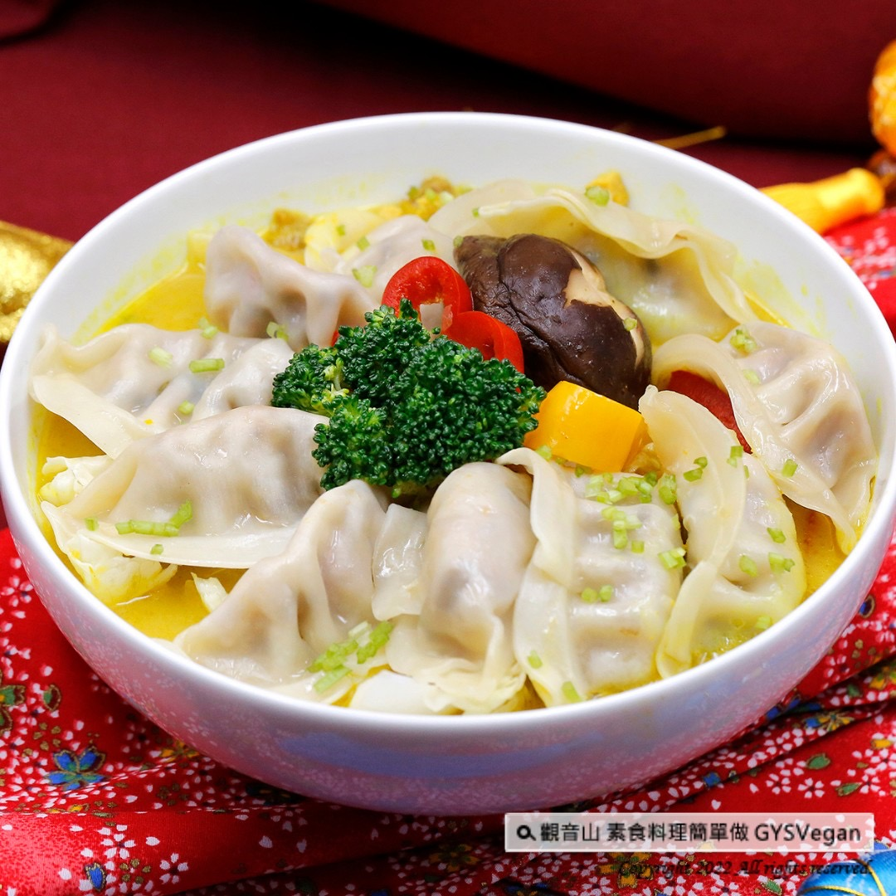

# 食譜 燕麥奶咖哩湯餃

## 📋 基本資訊 / Recipe Overview
- **料理名稱**：食譜 燕麥奶咖哩湯餃
- **原始標題**：素食年菜食譜｜燕麥奶咖哩湯餃｜全素
- **素食流派 / Diet**：全素 Vegan
- **來源平台 / Source**：[觀音山 · 素食料理簡單做](https://vegan.gys.org.tw/oat-milk-curry-soup-dumplings20220124/)

## 📖 食譜圖文詳情 (中英雙語對照)

迎接新年好兆頭，「餃子」象徵招財進寶，包住一整年的福氣，以時下最養生的燕麥奶搭配咖哩濃郁香氣，最吉祥的開運年菜-燕麥奶咖哩湯餃，讓你回味一整年，快跟著「觀音山蔬食館」的主廚，一起素食料理簡單做吧!​
​
食材及佐料〔Ingredients〕：​
▪️燕麥奶 ​ 300cc​
▪️素水餃 ​ 10顆​
▪️紅黃甜椒、綠花椰菜 ​ 各30克​
▪️鮮香菇 ​ 2朵​
▪️水或素高湯 ​ 150cc ​
▪️咖哩塊 ​ 20克​
▪️鹽、砂糖 ​ 適量​
▪️全素奶油 ​ 少許​
​
烹飪步驟：​
【刀工/前處理】​
1.紅黃甜椒去籽，切滾刀塊。​
2.鮮香菇表面刻十字花紋路。​
3.綠花椰去除粗纖維。​
​
【調理作法】​
1.一鍋水煮沸，將水餃燙熟備用。​
2.取另一個湯鍋，將水、燕麥奶、咖哩塊放入，煮滾後加入鮮香菇、紅黃甜椒、綠花椰菜煮熟。煮熟後可以先將食材撈起來備用。​
3.將做法2的湯底作最後的調味：加入適量的糖、鹽、少許奶油。​
4.取一個大湯碗，將煮好的水餃、蔬菜料擺入，加入湯底即可享用。​
​
【特別說明】​
咖哩塊可依個人喜好增減。​
​
本食譜提供：台中觀音山蔬食館​
​
✨慈悲的龍德上師 成立「觀音山蔬食館」提倡健康素食、慈悲護生，以”觀音山素食料理簡單做”的理念，提供多款素食食譜，讓您一學就會！
​
觀音山邀請您響應素食、廣修供養、戒殺護生、誦經修法、行持諸種善行，獲福無量。​
​
​
【recipe】​
​
To kick off the year to come and have good omens, having dumplings is your best choice. Dumplings symbolize fortune and treasure. They’re also a sign of wrapping up the blessings of the whole year. In this recipe, the broth is cooked by healthy oat milk and curry. The rich aroma of this dumpling soup would let you reminisce about the taste throughout the year. Let’s have the most auspicious start for the new year – follow the chef of Guanyinshan Green Restaurant to cook simple vegetarian dishes together !​
Ingredients : (For 3 people)​
▪️Oat milk ​ 300cc​
▪️Ten vegetarian dumplings ​
▪️Red bell pepper、Yellow ​ bell pepper、Broccoli ​ 30g​
▪️Two shiitake mushroom​
▪️Water or stock ​ 150cc ​
▪️Curry cubes ​ 20g​
▪️Salt、Sugar , adequate amount ​ ​
▪️Vegan butter ​ , a little​
​
Instructions:​
【Cutting/ PREP-Ahead】​
1. Remove seeds from red and yellow bell peppers and roll cut. ​
2. The surface of the fresh shiitake mushrooms are engraved with a cross pattern. ​
3. Peel broccoli. ​ ​
​
【Cooking Steps】 ​
1. Boil a pot of water and cook the dumplings for later use. ​
2. Take another soup pot, add water, oat milk and curry cubes, bring to a boil, add fresh mushrooms, red and yellow sweet peppers, and broccoli and cook until tender. Once tender, you can pick up the ingredients for later use. ​
3. Seasoning the broth (step 2): add an appropriate amount of sugar, salt, and a little cream. ​
4. Take a large soup bowl, put the cooked dumplings and vegetable ingredients in it, add the soup and enjoy. ​ ​
​
【Special notes】 ​
Depends on personal preference, the amount of curry cubes can be adopted.​
​
​
觀音山 素食料理簡單做
◎Facebook ｜好文按讚​
http://www.facebook.com/GYSVegan​
​
◎lnstagram ｜料理追蹤​
http://www.instagram.com/gysvegan/​
​
◎Youtube ｜加入訂閱​
https://reurl.cc/q8VEqy​
​
◎Telegram ｜頻道推薦​
https://t.me/GYSVegan​
​
歡迎轉載，請註明出處： 觀音山 素食料理簡單做 GYSVegan 素食環保愛地球，健康營養無負擔，慈悲護生一起來~

---
*食譜歸檔時間：2026-08-20 · 來源：觀音山素食料理簡單做 (vegan.gys.org.tw)*