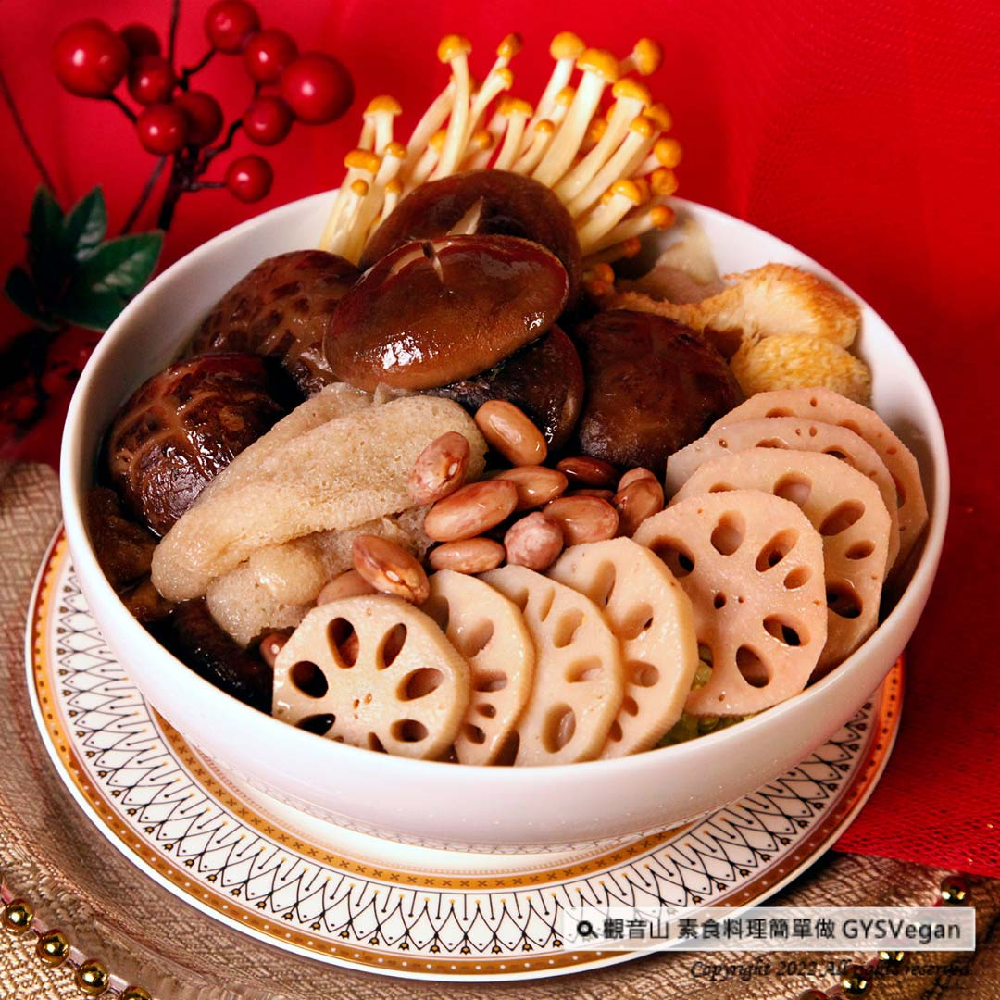

# 食譜 竹笙蓮藕冬菇湯

## 📋 基本資訊 / Recipe Overview
- **料理名稱**：食譜 竹笙蓮藕冬菇湯
- **原始標題**：素食年菜食譜｜竹笙蓮藕冬菇湯｜全素
- **素食流派 / Diet**：全素 Vegan
- **來源平台 / Source**：[觀音山 · 素食料理簡單做](https://vegan.gys.org.tw/bamboo-fungus20220128/)

## 📖 食譜圖文詳情 (中英雙語對照)

怕過年吃得太油膩嗎？推薦一道具有降血壓、降血脂的春節養生湯品
❖
竹笙冬菇湯
❖
。加入可預防心血管疾病的竹笙、冬菇、養心調氣的蓮藕、紅腰豆，湯頭甘甜鮮美，讓人一口接一口，新春期間不可少的絕佳養生湯品，快跟著觀音山主廚，一起素食料理簡單做吧！​
​
◎食材及佐料〔Ingredients〕：（5人份）​
▪️竹笙 ​ 40克​
▪️冬菇 ​ 5個​
▪️蓮藕 ​ 500克​
▪️紅腰豆 ​ 100克​
▪️鮮香菇 ​ 100克​
▪️水 ​ 2000CC​
▪️鹽 ​ 適量​
​
◎烹飪步驟：​
【刀工/前處理】​
1.竹笙用冷水泡軟，熱水汆燙備用。​
​
【調理作法】​
1.將竹笙浸泡20分鐘後換水一次，再浸泡20分鐘，瀝乾水份；冬菇、鮮香菇沖洗後瀝乾水份。​
2.蓮藕洗淨，去皮切塊；紅腰豆洗淨，浸泡1小時。​
3.取一鍋水滾後，放入全部食材，煲至再滾後，改慢火煲1小時。​
4.最後加入鹽調味即可。​
​
本食譜提供：台中觀音山蔬食館​
慈悲的龍德上師 成立「觀音山蔬食館」提倡健康素食、慈悲護生，以”觀音山素食料理簡單做”的理念，提供多款素食食譜，讓您一學就會！
​◎觀音山相關連結​
➠
https://www.fazang.org/link/​
​
【recipe】​
​
Try to avoid too much greasy food for the New Year? This one wouldn’t let you down! This soup can lower blood pressure and blood lipids ~ Bamboo Fungus and Mushroom Soup. ​ Bamboo fungus and mushrooms can prevent cardiovascular disease, while lotus root and red kidney beans do benefits for the heart and regulate circulation. Let’s make simple vegetarian dishes together!​
​
◎Ingredients : (For 5 people)​
▪️Bamboo fungus ​ 40g​
▪️Five dried mushrooms​
▪️Lotus root ​ 500g​
▪️Red kidney beans ​ 100g​
▪️Shiitake mushroom ​ 100g​
▪️Water ​ 2000CC​
▪️Salt , adequate amount ​
​
◎ Instructions:​
【Cutting/ PREP-Ahead】​
1. Soak bamboo fungus in cold water to soften, and then blanch in hot water for later use.​
​
【cooking Steps】​
1. Soak the bamboo fungus for 20 minutes, change the water once, soak for another 20 minutes, and drain the water; rinse the mushrooms and fresh shiitake mushrooms and drain the water.​
2. Wash lotus root, peel and cut into pieces; wash red kidney beans, soak for 1 hour.​
3. Take a pot of water to boil, add all the ingredients, cook until it boils again, turn to low heat and cook for 1 hour.​
4. Finally, season with salt to taste.​
​
—​
歡迎轉載，請註明出處： 觀音山 素食料理簡單做 GYSVegan 素食環保愛地球，健康營養無負擔，慈悲護生一起來~

---
*食譜歸檔時間：2026-08-20 · 來源：觀音山素食料理簡單做 (vegan.gys.org.tw)*