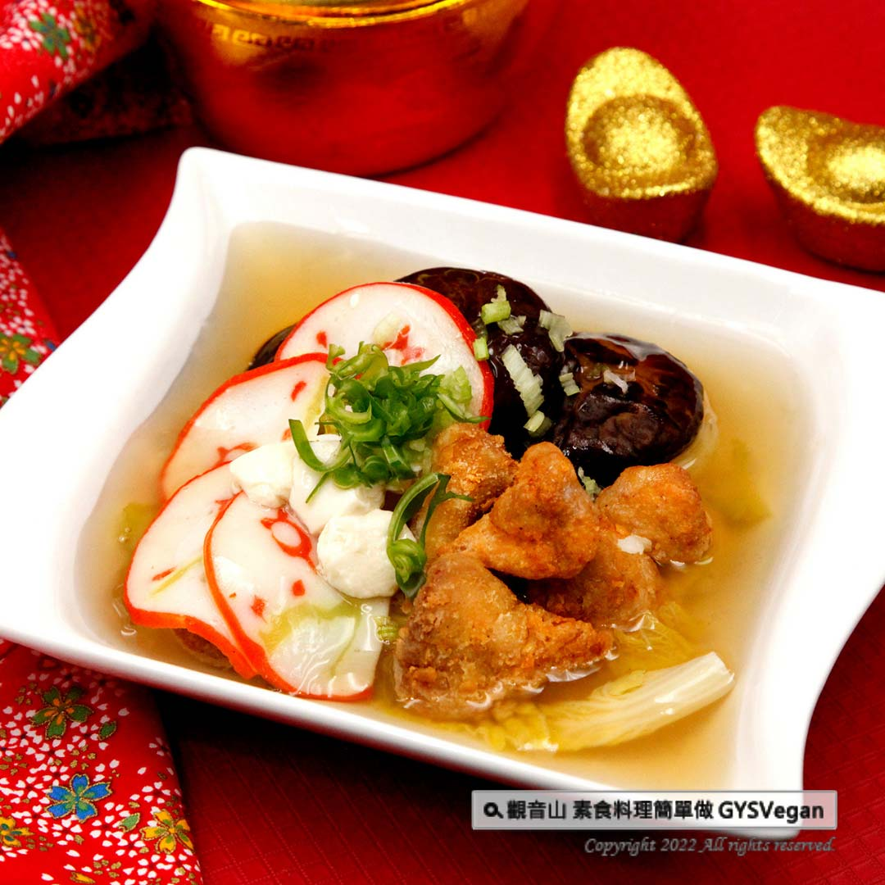

# 食譜 芙蓉香酥羹

## 📋 基本資訊 / Recipe Overview
- **料理名稱**：食譜 芙蓉香酥羹
- **原始標題**：素食年菜食譜｜芙蓉香酥羹｜全素
- **素食流派 / Diet**：全素 Vegan
- **來源平台 / Source**：[觀音山 · 素食料理簡單做](https://vegan.gys.org.tw/soft-tofu-thick-soup20220126/)

## 📖 食譜圖文詳情 (中英雙語對照)

新春年菜總少不了一道溫心暖胃的羹湯，這道滑順、香濃的
❖
芙蓉香酥羹
❖
，以豆漿為湯底，巧妙的搭配鮮嫩娃娃菜及酥炸猴頭菇，每一口都令人為之驚艷，快跟著觀音山主廚，一起素食料理簡單做吧！​
​
◎食材及佐料〔Ingredients〕：（5人份）​
▪️猴頭菇真空包 ​ 1包​
▪️花菇 ​ 3-5朵 ​
▪️豆漿 ​ 2000cc ​ ​ ​ ​ ​ ​
▪️豆花粉 ​ 1包​
▪️娃娃菜 ​ 5小顆​
▪️糖 ​ 20克 ​ ​ ​
▪️花片、芹菜、山蘇、酥漿粉、醬油、胡椒粉 、五香粉、地瓜粉、太白粉、鹽、香菇粉、水、油 ​ 適量​
​
◎烹飪步驟：​
【刀工/前處理】​
1.乾香菇泡軟、素料花片洗淨、娃娃菜洗淨對半剖，備用。​
2.太白粉加水稀釋，備用。​
3.山蘇切小段、芹菜切末，備用。​
4.酥漿粉加水稀釋，加入糖、醬油、胡椒粉、五香粉，裹上猴頭菇再沾地瓜粉油炸，備用。​
​
【調理作法】​
1.製作豆花：豆花粉加70cc水稀釋。​
2.將豆漿2000cc煮沸後關火，倒入稀釋豆花粉水，不需攪拌，蓋上鍋蓋15分鐘。​
3.製作高湯：取一鍋水煮沸，放入娃娃菜、香菇、素料花片，食材依序煮熟後起鍋，高湯加入適量鹽、香菇粉調味、太白粉水勾芡。​
4.取少許豆花，鋪上酥脆猴頭菇及以上食材，倒入高湯灑上少許山蘇及芹菜末點綴，即可享用！​
​
本食譜提供：台中觀音山蔬食館​
​
慈悲的龍德上師 成立「觀音山蔬食館」提倡健康素食、慈悲護生，以”觀音山素食料理簡單做”的理念，提供多款素食食譜，讓您一學就會！
​
​◎觀音山相關連結​
➠
https://www.fazang.org/link/​
​
【recipe】​
​
There’s always a heart-warming soup on Chinese New Year dinning table. This smooth and fragrant soft tofu thick soup uses soy milk as the soup base. It is cleverly matched with fresh baby cabbage and fried lion’s mane mushroom. Every bite is fabulous. Let’s follow the chef of Guanyinshan and make vegetarian dishes together! ​ ​
​
◎Ingredients : (For 5 people)​
▪️A pack of prepared frozen food of lion’s mane mushroom​
▪️Three to five shiitake mushroom ​ ​
▪️Soy milk ​ 2000cc ​ ​ ​ ​ ​ ​
▪️A pack of soybean pudding powder ​
▪️Five baby Cabbages​
▪️Sugar ​ 20g ​ ​ ​
▪️Vege fish cake slice、 Celery、Bird-nest fern、Crispy powder、Sweet potato powder、Potato starch、Soy sauce、Pepper 、Five spice powder、Salt、Mushroom powder、Water、Oil ​ , adequate amount ​
​
◎ Instructions:​
【Cutting/ PREP-Ahead】​
1. Soak the dried shiitake mushrooms until soft, wash vegetarian narutomaki slices, wash the baby cabbages and cut them in half, set aside. ​
2. Dissolve potato starch in water and set aside. ​
3. Cut the bird’s nest fern into small pieces, chop the celery and set aside. ​
4. Dissolve the crispy powder in water, add sugar, soy sauce, pepper powder, five-spice powder, coat lion’s mane mushroom in it, then dip in sweet potato powder and fry, set aside. ​ ​
​
【Cooking Steps】​
1. To make bean curd (soft tofu): dissolve soybean powder in 70cc of water.​
2. Bring 2000cc of soy milk to a boil, turn off the heat, pour in soybean powder dissolution, and cover the pot for 15 minutes without stirring. ​
3. Make broth: Bring a pot of water to boil, add baby cabbage, shiitake mushrooms, and vegetarian narutomaki. After the ingredients are cooked bring them out of the soup. Add appropriate amount of salt, mushroom powder to season the broth, and potato starch dissolution to thicken. ​
4. Scoop up a little soft tofu, spread the fried crispy lion’s mane mushroom and place the above ingredients. At last, pour into the broth, sprinkle with a little chopped bird’s nest fern and celery, and enjoy!​
​
​
​
—​
歡迎轉載，請註明出處： 觀音山 素食料理簡單做 GYSVegan 素食環保愛地球，健康營養無負擔，慈悲護生一起來~

---
*食譜歸檔時間：2026-08-20 · 來源：觀音山素食料理簡單做 (vegan.gys.org.tw)*