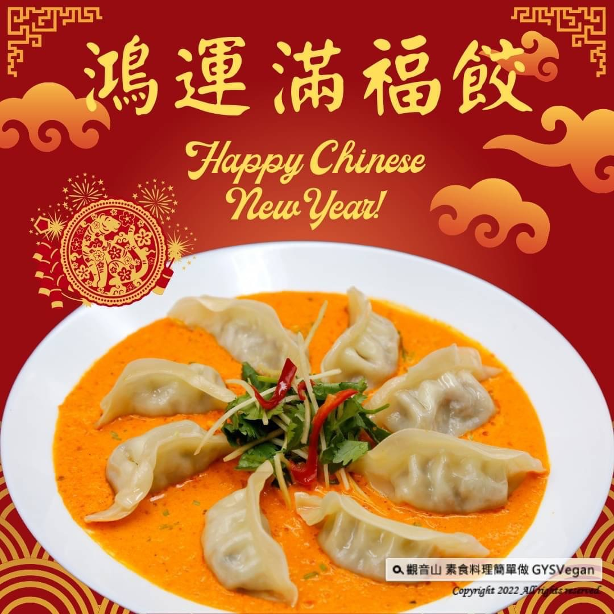

# 食譜 鴻運滿福餃

## 📋 基本資訊 / Recipe Overview
- **料理名稱**：食譜 鴻運滿福餃
- **原始標題**：素食年菜食譜｜鴻運滿福餃｜全素
- **素食流派 / Diet**：全素 Vegan
- **來源平台 / Source**：[觀音山 · 素食料理簡單做](https://vegan.gys.org.tw/fortune-dumplings20220131/)

## 📖 食譜圖文詳情 (中英雙語對照)

素食年菜食譜
❖
鴻運滿福餃
❖
全素
兔年鴻兔大展，讓你鴻運當頭的一道料理～鴻運滿福餃！將植物肉、四季豆、鮮香菇、黑木耳、冬粉等多種食材包入內餡中，採用最健康的蒸煮方式，搭配紅甜椒醬的巧思，整道料理美到不知如何下筷子，一口清新微甜的醬汁配上一顆滿福餃，絕對是年菜超高人氣料理，快跟著觀音山主廚，一起素食料理簡單做吧！​
​
◎食材及佐料〔Ingredients〕：(5人份)​
▪️植物肉 ​ 1包​
▪️四季豆 ​ 10支​
▪️鮮香菇 ​ 8朵​
▪️中芹 ​ 50克​
▪️黑木耳 ​ 5片​
▪️冬粉 ​ 1顆​
▪️紅甜椒 ​ 200克​
▪️水餃皮 ​ 1包​
▪️嫩薑絲 ​ 50克​
▪️香菜末 ​ 20克​
▪️橄欖油或蔬菜油 ​ 3大匙​
▪️素食麻辣醬 ​ 1大匙​
▪️鹽、砂糖、白胡椒粉、豆腐乳、香油 ​ 適量​
​
◎烹飪步驟：​
【刀工/前處理】​
1.將四季豆切0.5公分丁，鮮香菇切薄片，中芹切末，黑木耳切細絲，紅甜椒去籽切塊，備用。​
2.冬粉泡溫水(約1分鐘)，切0.5公分長，備用。​
​
【調理作法】​
1. 將四季豆、鮮香菇分別加入少許鹽，靜置10分鐘後擠乾水分備用。​
2.將食材放入容器中:植物肉、四季豆、鮮香菇、中芹、黑木耳、冬粉，充分拌勻。​
3.加入適當的調味料:鹽、砂糖、白胡椒粉、豆腐乳、香油，攪拌均勻備用​
4.取一張水餃皮，挖一小湯匙的內餡往水餃皮中心放，對折後皮邊邊壓實，避免煮的過程散開。​
5.取一個適當大小的盤子，放上蒸籠紙，將水餃間隔擺入，避免沾黏。​
6.放入電鍋中，外鍋加一杯水，將水餃蒸熟。​
7.製作醬料:紅甜椒用滾水汆燙約30秒，撈起來瀝乾水份備用。再將紅甜椒放入果汁機中，加入3大匙橄欖油，攪打成泥狀。將打好的紅椒醬倒至容器中，加入麻辣醬拌勻即完成。​
8.醬料倒在盤中，擺上蒸好的餃子，點綴嫩薑絲、香菜。即可享用。​
​
本食譜提供：台中觀音山蔬食館​
​
​
慈悲的龍德上師 成立「觀音山蔬食館」提倡健康素食、慈悲護生，以”觀音山素食料理簡單做”的理念，提供多款素食食譜，讓您一學就會！
​
【recipe】​
​
The Year of the Tiger is blessed with good omens. This recipe is sure to bring you luck and prosperity for the coming year~ Fortune Dumplings! Plant meat, green beans, fresh mushrooms, black fungus, glass noodles and so many other ingredients are made into the filling. And here, we choose the most healthy cooking method, steam, to cook the dumplings. As for the dipping sauce, it tastes fresh and slightly sweet which satisfied your taste buds and levels up the dumplings. This dish would definitely be a super popular dish that be polished off soon for New Year dishes. Follow the chef of Guanyinshan to make vegetarian dishes together!​
​
◎Instructions:​
【Cutting/ PREP-Ahead】​
1. Cut string beans into 0.5 cm cubes, slice fresh shiitake mushrooms, mince celery, shred black fungus, remove seeds and cut red bell peppers and set aside.​
2. Soak glass noodles in warm water (about 1 minute), cut into 0.5 cm lengths, set aside.​
​
◎【Cooking Steps】​
1. Add a pinch of salt to the string beans and fresh shiitake mushrooms, let stand for 10 minutes and squeeze out the water for later use.​
2. Put the ingredients into a mixing bowl: plant meat, string beans, fresh mushrooms, celery, black fungus, glass noodles, and mix well.​
3. Add appropriate seasonings: salt, sugar, white pepper, fermented tofu, & sesame oil, and stir well & set aside.​
4. Take a piece of dumpling wrapper and scoop a small tablespoon of filling. Put the filling in the center of the wrapper, and fold it in half and pleat the edges of the skin firmly to avoid the fillings coming out while cooking.​
5. Take an appropriate size plate, put a piece of steamer liner on it, and place the dumplings about 1-inch apart, giving them some room to expand and avoid sticking.​
6. Put it into the rice cooker, add a cup of water to the outer pot, and steam the dumplings until cooked through. ​
7. To make the dipping sauce: Blanch the red bell peppers in boiling water for about 30 seconds, remove and drain. Put the blanched red bell peppers in a blender, add 3 tablespoons of olive oil, and process. Pour the puree into the container, add the vegetarian spicy hot sauce and mix well.​
8. Pour the sauce on a plate, place the steamed dumplings, and garnish with shredded ginger and coriander. Enjoy!
​
—​
歡迎轉載，請註明出處：
觀音山 素食料理簡單做
GYSVegan 素食環保愛地球，健康營養無負擔，慈悲護生一起來~

---
*食譜歸檔時間：2026-08-20 · 來源：觀音山素食料理簡單做 (vegan.gys.org.tw)*