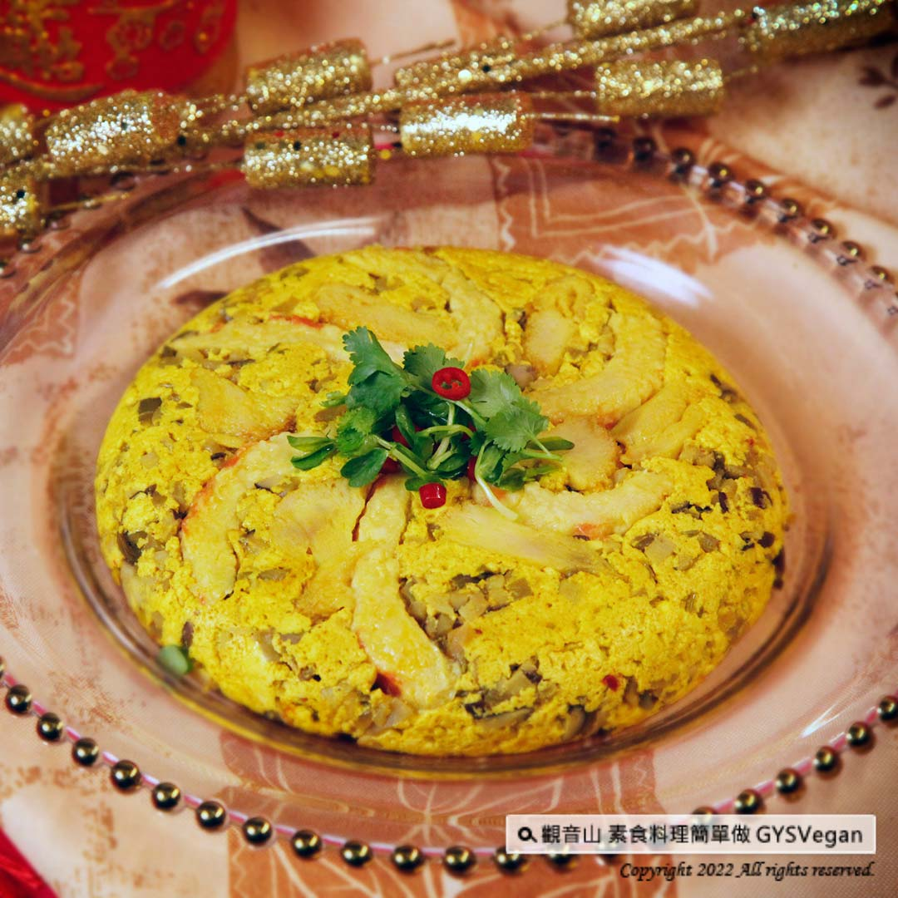

# 食譜 黃金富貴蒸旦

## 📋 基本資訊 / Recipe Overview
- **料理名稱**：食譜 黃金富貴蒸旦
- **原始標題**：素食年菜食譜｜黃金富貴蒸旦｜全素
- **素食流派 / Diet**：全素 Vegan
- **來源平台 / Source**：[觀音山 · 素食料理簡單做](https://vegan.gys.org.tw/golden-rich-steamed-tofu20220127/)

## 📖 食譜圖文詳情 (中英雙語對照)

新年即將到來，推薦一道充滿喜氣的料理
❖
黃金富貴蒸旦
❖
，以高鈣、高蛋白的豆腐為主角，加入多種食材爆香提味，以及極具養生價值的薑黃粉。​
​
用「蒸」煮方式鎖住食材的風味及營養，黃金一般的外表，嚐起來口感滑嫩鮮香！是一道富貴又吉祥的年菜料理。快跟著觀音山主廚，一起素食料理簡單做吧！​
​
◎食材及佐料〔Ingredients〕：（5人份）​
▪️板豆腐 ​ 2塊​
▪️榨菜 ​ 100克​
▪️鮮香菇、猴頭菇 ​ 200克​
▪️素蝦 ​ 3尾​
▪️薑末 ​ 50克​
▪️香菜梗 ​ 60克​
▪️鹽、白胡椒、薑黃粉、油、香油 ​ 適量​
​
◎烹飪步驟：​
【刀工/前處理】​
1.豆腐碾碎。​
2.榨菜切末。​
3.香菇切小丁。​
4.猴頭菇切片。​
5.素蝦剖半。​
​
【調理作法】​
1.熱油爆香薑末、香菇、榨菜。​
2.將做法1與豆腐泥、香菜梗、調味料(鹽、白胡椒、醬油、薑黃粉)拌勻。​
3.將素蝦、猴頭菇鋪在容器底部，倒入做法2拌好的食材，壓實壓平壓緊。​
4.大火蒸約10分，完成後淋上少許香油即可。​
​
本食譜提供：台中觀音山蔬食館​
​慈悲的龍德上師 成立「觀音山蔬食館」提倡健康素食、慈悲護生，以”觀音山素食料理簡單做”的理念，提供多款素食食譜，讓您一學就會！
​
​◎觀音山相關連結​
➠
https://www.fazang.org/link/​
​
【recipe】​
​
The New Year is around the corne. There’s a dish especially suitable for the festivity – golden rich steamed tofu. It uses tofu which is high calcium and high protein with a variety of ingredients sauteed with turmeric powder to enhance the flavor. Turmeric powder is also known by its high nutritional value.​
​
Use the “steaming” cooking method to retain both the flavor and nutrition of the ingredients. The golden appearance is tempting. The taste is smooth, tender and delicious! It is a rich and auspicious New Year dish. Follow the chef of Guanyinshan, and let’s make vegetarian dishes together!​
​
​◎Ingredients : (For 5 people)​
▪️Two pieces of hard beancurd ​
▪️Pickled mustard root ​ 100g​
▪️Shiitake mushroom、lion’s mane mushroom ​ 200g​
▪️Three vegan Shrimp ​ ​
▪️Minced ginger ​ 50g​
▪️Coriander stems ​ 60g​
▪️Salt、White pepper、Turmeric powder、Oil、Sesame oil ​ ​ , adequate amount​
​
◎ Instructions:​
【Cutting/ PREP-Ahead】​
1. Crush the tofu.​
2. Mince the pickled mustard roots.​
3. Cut the mushrooms into small cubes.​
4. Slice lion’s mane mushroom.​
5. Cut the vegetarian shrimps in halves.​
​
【cooking Steps】​
1. Heat the pan and sauté minced ginger, shiitake mushrooms and picked mustard roots until fragrant.​
2. Mix step 1 with smashed tofu, coriander stems, and season with salt, white pepper, soy sauce, turmeric powder.​
3. Spread the vegetarian shrimp and lion’s mane mushroom on the bottom of the container, pour in the ingredients mixed in step 2, and press down until firmly.​
4. Steam over high heat for about 10 minutes, and then drizzle with a little sesame oil.​
​
​
—​
歡迎轉載，請註明出處： 觀音山 素食料理簡單做 GYSVegan 素食環保愛地球，健康營養無負擔，慈悲護生一起來~

---
*食譜歸檔時間：2026-08-20 · 來源：觀音山素食料理簡單做 (vegan.gys.org.tw)*