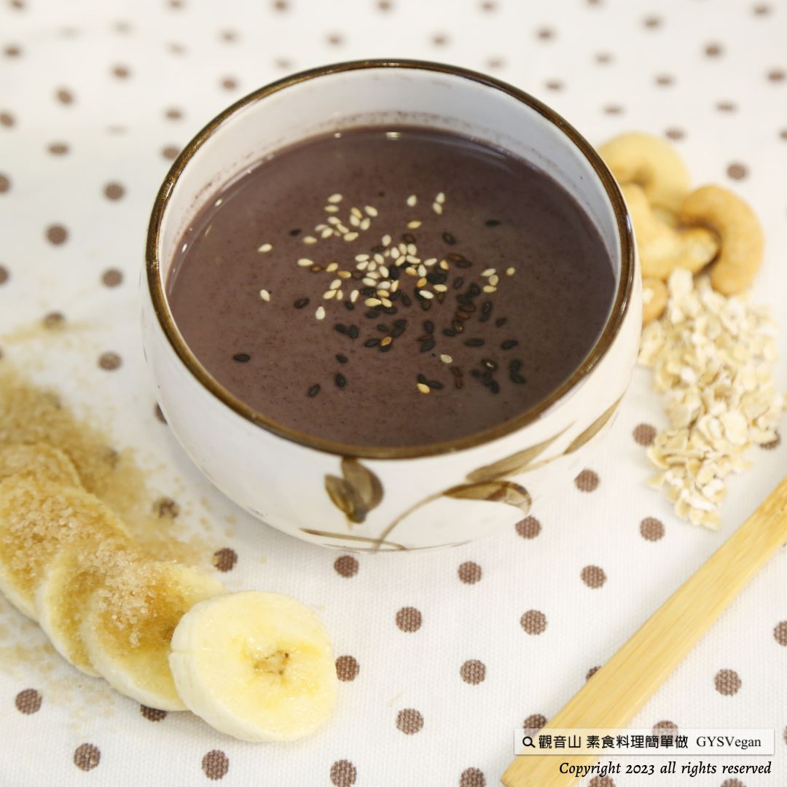

# 飲品料理  黑堅果飲

## 📋 基本資訊 / Recipe Overview
- **料理名稱**：飲品料理  黑堅果飲
- **原始標題**：飲品料理 ｜黑堅果飲｜全素
- **素食流派 / Diet**：全素 Vegan
- **來源平台 / Source**：[觀音山 · 素食料理簡單做](https://vegan.gys.org.tw/black-nut-drink20230804/)

## 📖 食譜圖文詳情 (中英雙語對照)

飲品料理 ｜黑堅果飲｜全素
自己動手做的最養生，兼具飽足感與健康的最佳飲品「黑堅果飲」，濃郁的芝麻、堅果香氣，與椰奶搭配出滑順的口感；堅果與黑芝麻具有豐富的不飽和脂肪酸，對心血管有益處，此外富含的鈣質、鐵質，讓你預防骨質疏鬆與貧血，加上補充身體所需膳食纖維的紫米飯，是忙碌時刻的能量飲，快跟著觀音山主廚，一起素食料理簡單做吧！
​
​
◎食材及佐料〔Ingredients〕：
▪️黑芝麻粉 ​ ​ ​ ​ ​ ​ 50克
▪️熟紫米飯 ​ ​ ​ ​ ​ 100克
▪️熟堅果 ​ ​ ​ ​ ​ 50克
▪️椰奶 ​ ​ ​ ​ ​ 100毫升
▪️飲用水 ​ ​ ​ ​ ​ 約600毫升
​
​
◎烹飪步驟：
【調理作法】
1.準備乾淨的果汁機，放入紫米、黑芝麻、堅果、椰奶、飲用水、砂糖打勻，即可享用。
​
【特別說明】
食材皆可依喜好調整比例。
​
本食譜提供：台中觀音山蔬食館
​
​
▌慈悲的龍德上師 成立「觀音山蔬食館」提倡健康素食、慈悲護生，以”觀音山素食料理簡單做”的理念，提供多款素食食譜，讓您一學就會！
​
觀音山相關連結
➠
https://www.fazang.org/link/
​ ​
​
▌觀音山近期活動
8月23日 蓮師薈供法會
✦ 登記「超薦蓮位、除障祿位」
https://bit.ly/3bH7Z46
✦ 護持「薈供供品」推廣素食愛心公益
https://bit.ly/3bHzJ8H
(登記至8月23日晚上7:00截止)
​ ​
​ ​
—
歡迎轉載，請註明出處： 觀音山素食料理簡單做 GYSVegan 素食環保愛地球，健康營養無負擔，慈悲護生一起來~

---
*食譜歸檔時間：2026-08-20 · 來源：觀音山素食料理簡單做 (vegan.gys.org.tw)*