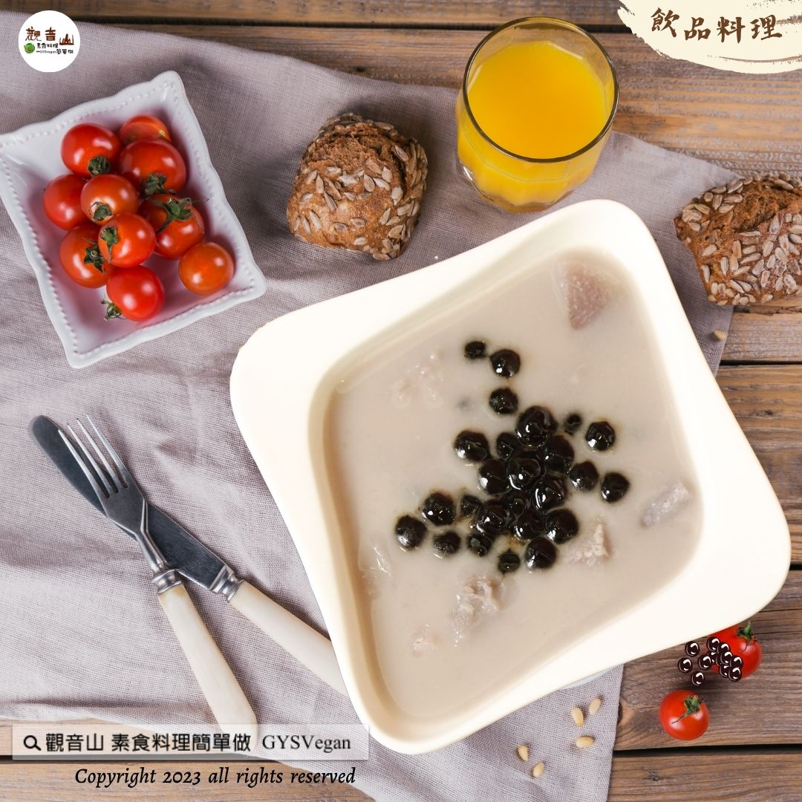

# 飲品料理 芋見全植珍奶

## 📋 基本資訊 / Recipe Overview
- **料理名稱**：飲品料理 芋見全植珍奶
- **原始標題**：飲品料理｜芋見全植珍奶｜全素
- **素食流派 / Diet**：全素 Vegan
- **來源平台 / Source**：[觀音山 · 素食料理簡單做](https://vegan.gys.org.tw/%e9%a3%b2%e5%93%81%e6%96%99%e7%90%86%ef%bd%9c%e8%8a%8b%e8%a6%8b%e5%85%a8%e6%a4%8d%e7%8f%8d%e5%a5%b6%ef%bd%9c%e5%85%a8%e7%b4%a0/)

## 📖 食譜圖文詳情 (中英雙語對照)

飲品料理✨芋見全植珍奶✨全素
芋頭盛產的季節到了，想要變化不同的作法，一定要學會這道「喝」的料理「芋見全植珍奶」，綿密順滑的芋泥，自帶濃郁的香氣，加上富含的天然抗性澱粉與膳食纖維，不僅對身體有幫助，豐富的抗氧化劑與多種的維生素，教你吃出芋頭的營養，快跟著觀音山主廚，一起素食料理簡單做吧！
​
◎食材及佐料〔Ingredients〕：
▪️芋頭 ​ 2顆
▪️椰奶 ​ 1罐
▪️煮熟的珍珠 ​ 300克
▪️水、砂糖 ​ 適量
​
◎烹飪步驟：
【刀工/前處理】
1.芋頭洗淨去皮備用。
​
【調理作法】
1.將芋頭加水(稍微淹過芋頭)，放入鍋中煮至芋頭軟化備用。
2.準備果汁機將作法1.加入椰奶、砂糖打成泥(不用打得非常細，可保留少許顆粒口感較佳)。濃稠度可以依自己的喜好加飲用水做調整。
3.準備容器放入熟珍珠，倒入打好的芋頭奶，即可享用。 ​ ​ ​ ​ ​ ​ ​ ​ ​ ​ ​ ​ ​ ​ ​ ​ ​ ​ ​ ​ ​ ​ ​ ​ ​ ​ ​ ​ ​ ​ ​ ​ ​ ​ ​ ​ ​ ​ ​ ​ ​ ​ ​ ​ ​ ​ ​ ​ ​ ​ ​ ​ ​ ​ ​ ​ ​ ​ ​ ​ ​ ​ ​ ​ ​ ​ ​ ​ ​ ​ ​ ​ ​ ​ ​ ​ ​ ​ ​ ​ ​ ​ ​ ​ ​ ​ ​ ​ ​ ​ ​ ​ ​ ​ ​ ​ ​ ​ ​ ​ ​ ​ ​ ​ ​ ​ ​
​
本食譜提供：台中 觀音山蔬食館
​
​
▌慈悲的 龍德上師 成立「觀音山蔬食館」提倡健康素食、慈悲護生，以”觀音山素食料理簡單做”的理念，提供多款素食食譜，讓您一學就會！
​
📣觀音山相關連結
➠
https://www.fazang.org/link/
​ ​
​
▌觀音山近期活動
12月2日 三寶總集薈供法會
✦ 超薦蓮位、除障祿位、護持薈供供品
https://reurl.cc/K3Lden
​
──────────────
觀音山 2023年佛陀天降日系列活動
詳細介紹：
https://bit.ly/463BG69
──────────────
​ ​
​ ​
歡迎轉載，請註明出處： 觀音山素食料理簡單做 GYSVegan 素食環保愛地球，健康營養無負擔，慈悲護生一起來~

---
*食譜歸檔時間：2026-08-20 · 來源：觀音山素食料理簡單做 (vegan.gys.org.tw)*